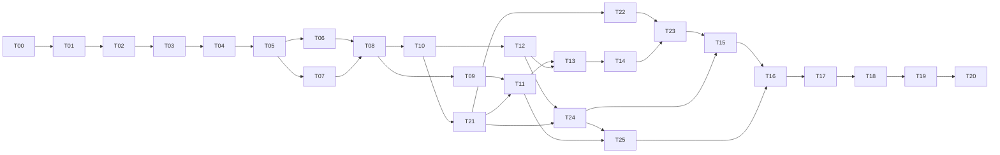

# 可逐项执行的实施任务单 v1.2

返回 [总方案](index.md)。顺序以 [task-plan.json](examples/task-plan.json) 为准，完整接口见 [contracts.md](contracts.md) 与 [RAG/环境/调试扩展](rag-environment-debug.md)。共26个任务，T21–T25按依赖插入执行，不能在T20交接后才开始。

这些路径、脚本和测试名是“需要实现”的目标，除明确标为现有的命令外不能假定已存在。
一期应用的本地/私有内网切片已落地；本文仍是交给实施模型的任务契约和后续生产化边界。实时进度见 `products/dsh-cloud-implementation/implementation-status.json`。

当前已完成的本地子步：T01 的 platform 开发入口、T02 的 environment/profile 与 AR manifest 校验、T03.A 的 Gateway Authority envelope 世代护栏、免登录官方 DSH AR 页面（run/阶段/事件/人工输入、P0 环境预检、词法 RAG 和只读产物/设备探测）、Connector WSS/SSHFS 路径，以及 Connector remote-tools MCP 协议切片。Connector 还提供本地 operation journal、Origin/TLS/mTLS 策略、配对凭据撤销/轮换和可选断线命令回放。它们证明本地定向契约测试通过；T00 真实宿主执行、T03.B 真实 RPC、生产密钥服务、多租户、真实 CLI 账号和三环境 AR 验收仍按状态文件标记为待完成。

## 统一执行规则

1. 首先读取仓库 AGENTS.md（若存在）、任务指定文件和本方案，不覆盖用户未提交修改。
2. 先完成依赖任务的完成证据，再开当前任务；每个任务可以拆成 A/B/C 子步，但必须保持接口契约。
3. 对状态机、协议、安全、指标先写有失败意义的测试；禁止写“调用函数就算通过”的镜像测试。
4. 一个修改批次默认不超过 8 个源码文件或 500 行非生成变更；超过时在任务下拆子步。这是控制模型上下文的工作粒度，不是总功能上限。
5. 外部 SDK 只按固定版本的实际类型/OpenAPI 写调用。找不到 API 就先做小探测，不发明方法。
6. 每次完成记录变更文件、实际命令、结果、证据路径、剩余风险；未运行写 not_run，缺环境写 blocked。
7. 原有 gate/consent/P8 规则不可放宽；成功只由原真相层和正式验收定义。
8. 不自动部署到用户云、不自动 push PR、不注册真实账号，除非实施时已有对应授权。当前请求只授权设计文件。
9. 不复制巨大上下文：按阶段拿必需 skills、模板、契约段落；保留关键护栏，不为缩短上下文删 gate。
10. 第一次失败先定位；同一故障连续两次无进展生成 blocker 与可复现信息，停止盲目重试。
11. 自动恢复策略不以“换模型”代替修复协议或权限问题。模型/执行器切换必须记录新 attempt 与上下文身份。
12. 产出机器报告：task_id/status/dependencies_verified/changed_files/checks/evidence_refs/open_blockers/next_task。

## 开发和检查命令

现有命令（从本仓根目录执行，Node >=24，Python 可用）：

```bash
cd runtime/dsh-ohos
OHOS_DSH_TEST_PYTHON=python3 node --test
```

T01 必须创建以下新命令，创建前不得声称已经运行：

```bash
# 工作目录：本仓根目录；仅安装/检查平台开发包，不触及 OHOS 源码。
npm --prefix platform ci
npm --prefix platform run lint
npm --prefix platform run typecheck
npm --prefix platform test
npm --prefix platform run build
npm --prefix connector ci
npm --prefix connector test
npm --prefix workspace-gateway ci
npm --prefix workspace-gateway test
```

任务新增测试放在对应 package，集成测试明确真实 OS/DB/SSH 或 fixture。
原 Python 套件先发现其现有运行入口和依赖，再记录精确回归命令，不臆造测试 runner。
文档与生成 schema/类型、示例、OpenAPI 同步。

## 任务依赖图



图为主要路径；机器任务清单保存全部依赖。新增环境初始化必须早于正式AR，RAG与调试必须早于完整网页/上线验收。

## T00 固定版本与双宿主 SSH 可行性原型

里程碑：M0；依赖：无；人日估算：4–7。

修改/新增位置：

- `platform/compatibility/versions.lock.json`
- `platform/compatibility/capability-matrix.json`
- `platform/compatibility/probes/`

实施步骤：阅读现有 runtime/skills 与本方案；记录 Git HEAD 和用户未提交改动。固定 DSH 源码提交或包版本及镜像 digest、Node 24、OpenCode、Claude SDK/CLI、Python、系统版本。分别用两个真实本地 codeagent 调用测试用 SSH 工作区的远端 read/patch/exec，证明 codeagent PID 位于本地；验证本地原生工具禁用、权限往返、取消、session 恢复和 usage 来源。DSH 真启动加载最小插件并接收一个结构化结果。探测程序仅写专用临时工作区。 另做三类环境的只读源码识别探测，列出HarmonyOS占位值、P0固定build.sh检查及Gerrit未实现项；不能以OpenHarmony成功替代。

完成条件：产出原始结构化响应/脱敏日志/进程位置/远端文件 hash。任何关键能力 unknown/unsupported 不得标为已实现；替代路径写 ADR，不能用远端 codeagent 冒充本地模式。

验收引用：AC01、AC02、AC03、AC04、AC47（见 [验收矩阵](acceptance.md)）。

## T01 工作区骨架与开发入口

里程碑：M0；依赖：T00；人日估算：1–2。

修改/新增位置：

- `platform/package.json`
- `platform/apps/`
- `platform/packages/`
- `connector/package.json`
- `workspace-gateway/package.json`

实施步骤：建立 TS 包和共享开发规范，现有 runtime 保留 JS 和原测试。实现统一 lint/typecheck/test/build 脚本、Node 版本检测、配置 schema 和示例配置。建立 testkit 的虚构 evidence 水印与真实验收目录隔离。所有新服务打印 ready/health，不在 import 时启动副作用。

完成条件：干净检出可安装锁定依赖并执行空骨架检查；现有 runtime 测试未回退；不把空网页记为平台功能。

验收引用：AC05（见 [验收矩阵](acceptance.md)）。

## T02 共享契约和 workflow 注册表

里程碑：M0；依赖：T01；人日估算：3–4。

修改/新增位置：

- `platform/packages/contracts/`
- `platform/packages/workflow-registry/`
- `workflow-packs/ar-delivery/1.0.0/`

实施步骤：按 contracts.md 产正式 schema/types/OpenAPI 和正反例；实现 manifest 内容哈希、管理员签名、能力、阶段 DAG 与固定版本校验。AR manifest 从现有 stages.js 导入约束，固定九个物理阶段/P8两个任务/四个人工点。草案 null digest loader 必须拒绝；普通用户只能提交 schema 参数。增加只做文件检查的独立演示 workflow 用于验证可扩展性，标明它不是 AR。 manifest增加project/environment_profile绑定、RAG可选配置和调试能力需求，执行profile由单一authority解析。

完成条件：相同内容得到相同 digest；循环、缺依赖、路径逃逸、无效签名、AR consent 删除均被拒绝；版本升级不改变已启动 run。

验收引用：AC06、AC07（见 [验收矩阵](acceptance.md)）。

## T03 远端 Authority API 与兼容边界

里程碑：M1；依赖：T02；人日估算：4–6。

修改/新增位置：

- `workspace-gateway/src/authority/`
- `workspace-gateway/src/rpc/`
- `runtime/dsh-ohos/src/runtime.js`
- `runtime/dsh-ohos/src/core/task-controller.js`

实施步骤：在 SSH 主机包装已有 runtime，暴露固定 schema 的 authority 方法。每 workspace 独立 SQLite 与 pipeline 路径；创建 cloud_run/authority_run 映射。保留原工具名/状态机，新增平台调用身份。迁移 native_subagent 为可验证 isolated_execution_context 的平台执行准入，legacy host_native 保护保持。实现 revision/epoch 校验、inspect snapshot 和签名 AuthorityReceipt。worker credential 只限领取任务，禁止 parent/consent/publish。

完成条件：原有 local MCP 协议仍通过；云只持有投影；错误租户/工作区/旧 revision/假能力均拒绝；AuthorityReceipt 不能由 worker 制造。

验收引用：AC05、AC08、AC09（见 [验收矩阵](acceptance.md)）。

## T04 持久 Supervisor 与共享执行锁

里程碑：M1；依赖：T03；人日估算：6–9。

修改/新增位置：

- `workspace-gateway/src/supervisor/`
- `workspace-gateway/src/security/`
- `runtime/dsh-ohos/src/core/store/`
- `skills/ohos-ar-dev-phases/scripts/advance.py`
- `skills/ohos-ar-dev-phases/scripts/lib/gatelib.py`

实施步骤：分 T04.A 意图+资源锁迁移、T04.B 受限 OS 作业启动/查询、T04.C 进程树停止/退出证明、T04.D legacy CLI 与 gate 统一锁。SQLite 短事务保存 intent 和预算后启动确定 operation 对应的作业；记录 boot_id/PID starttime/受管 unit 或 cgroup。资源由可信配置推导并处理路径别名/包含关系/设备/构建输出。平台模式禁止绕过 wrapper 写 pipeline 或获得 HMAC/发布凭据；新增 gate operation/输入指纹签名字段并兼容旧证据只读。取消未知不释放锁。

完成条件：注入启动前/后、结果落盘前崩溃均不重复启动；旧 epoch 不能写入；CLI 与 API 争抢同资源只有一个获得；后代进程停止才可重领。此任务是云化硬前置。

验收引用：AC10、AC11、AC12、AC13、AC14（见 [验收矩阵](acceptance.md)）。

## T05 SSH 工作区工具与快照

里程碑：M1；依赖：T04；人日估算：4–6。

修改/新增位置：

- `workspace-gateway/src/workspace/`
- `workspace-gateway/src/artifacts/`
- `connector/src/ssh/`
- `connector/src/mcp/`

实施步骤：实现远端 list/read/search/patch/diff/exec/status/cancel；所有路径解析在 Gateway 边界完成，限制源码根及只读技能目录。patch 对 expected hash 做 CAS，使用安全目录句柄防符号链接竞态。exec 使用受限身份与 Supervisor，不拼 shell；多 Git 仓快照记录相关 repo 的 head/dirty/untracked。Gate 使用独立受保护入口，artifact 收集生成不可变清单。实现 SSH known_hosts/ProxyJump、连接重建和固定 stdio 网关命令。

完成条件：sentinel 只在 SSH 主机被改；本地无源码副本；越界路径/软链接/陈旧 patch 被拒绝；构建前后源码漂移使验证失效。

验收引用：AC03、AC13、AC15（见 [验收矩阵](acceptance.md)）。

## T06 OpenCode 本地适配器

里程碑：M1；依赖：T05；人日估算：3–5。

修改/新增位置：

- `connector/src/adapters/opencode/`
- `connector/test/opencode/`

实施步骤：当前代码已提供 OpenCode argv 适配和 remote-tools MCP 配置生成（`OPENCODE_CONFIG`、官方 flat `mcp.dsh_remote` 形态及显式 v2 兼容开关），并通过 fixture/协议测试；本任务剩余部分以 T00 固定版本为准启动受认证 loopback server，独立 run session/config，调用实际 OpenAPI 的会话/消息/事件/权限接口。只开放 remote MCP 工作区工具和必要交互；模型来源取真实会话。映射文本/工具/permission/question/usage/result，保留 provider IDs 和 raw usage。实现 cancel 与 checkpoint，未验证 resume 返回明确 unsupported。记录所有嵌套 session 或禁止未托管子代理。

完成条件：真实本地 OpenCode 完成一次远端修改与命令；UI 权限拒绝确实阻止动作；重复事件不双算，服务端取消后进程/远端操作均可对账。

验收引用：AC02、AC03、AC04、AC16（见 [验收矩阵](acceptance.md)）。

## T07 Claude Code 本地适配器

里程碑：M1；依赖：T05；人日估算：3–5。

修改/新增位置：

- `connector/src/adapters/claude-code/`
- `connector/test/claude-code/`

实施步骤：当前代码已提供 Claude Code argv 适配、`--strict-mcp-config --mcp-config` 加载及 remote-tools 工具限制，并通过 fixture/协议测试；本任务剩余部分用本地 Agent SDK 驱动用户安装，显式指定工具、MCP 与技能来源。实现 canUseTool/用户追问的结构化等待与回应；不给 bypassPermissions。按 T00 固定版本采集 message/result usage，记录 coverage，不能同时加 parent/child 汇总。实现启动、取消、进程树监督、resume/checkpoint 与本地模型标识读取。兼容目录权限但不让 codeagent 读 authority 密钥。

完成条件：同 OpenCode 的统一适配器契约测试加真实调用；中断时缺失 output 计量标 partial；权限请求不能被模型自答。

验收引用：AC02、AC03、AC04、AC16（见 [验收矩阵](acceptance.md)）。

## T08 Connector 注册、出站 WSS 与可靠传输

里程碑：M1；依赖：T06、T07；人日估算：4–6。

修改/新增位置：

- `connector/src/`
- `platform/apps/connector-gateway/`
- `platform/packages/contracts/`

实施步骤：实现本地 CLI 安装/配对/注册 workspace/probe/serve/revoke，用户确认本地可调用范围。设备密钥留本地；云端发一次性配对码与短期凭据。实现 connection epoch、签名 envelope、SQLite inbox/outbox、持续序号、ACK 与重放；命令持久后应答；本地 agent start 必须幂等。WSS 心跳离线与 operation 状态分开。设置日志 spool 上限和背压；吊销拒绝新动作。

完成条件：用户电脑无公网入站端口，浏览器关闭 Connector 仍运行；重连 100 次重复包不双起任务；云端跨设备/旧 epoch 命令被拒绝；断线可补齐审核与 usage。

验收引用：AC17、AC18、AC19（见 [验收矩阵](acceptance.md)）。

## T09 DSH 云插件与持久调度

里程碑：M2；依赖：T08；人日估算：4–6。

修改/新增位置：

- `platform/packages/dsh-bridge/`
- `platform/apps/scheduler/`
- `platform/deploy/dsh/`

实施步骤：插件只注册受限 platform tools，经 Cloud Bridge 路由 Connector，不调用云端 createRuntime() 操作源码。一个 run 一个隔离 DSH session/profile/store；固定版本插件真实加载/卸载。数据库调度 intent 与 DSH invocation 绑定；DSH 会话重启从 checkpoint + authority snapshot 重建，awaiting_review 时不持续轮询模型。生成最小阶段上下文，限制重试/费用/上下文；human.decide 不暴露给模型。

完成条件：真实 DSH 调用本地 Agent，能获取远端状态和返回产物；重启 DSH 不新建重复构建；工具返回成功不会直接让阶段 PASS。

验收引用：AC01、AC20、AC21（见 [验收矩阵](acceptance.md)）。

## T10 多用户 API 与租户隔离

里程碑：M2；依赖：T08、T02；人日估算：4–6。

修改/新增位置：

- `platform/apps/api/`
- `platform/migrations/`
- `platform/tests/integration/tenant-isolation/`

实施步骤：接入 OIDC/登录 session、tenant 与角色；实现设备/workspace/workflow/run/操作 API、幂等与 expected_revision。数据库复合 tenant FK、RLS/授权策略、后台 job tenant context；对象签名 URL 需重复授权。普通用户不能安装任意插件或选择他人设备。保护 CSRF、WebSocket Origin/重放与 SSRF。实现跨 tenant 负向请求脚本。

完成条件：两个真实登录用户不能枚举/读写/下载/审批彼此资源；后台队列与 DSH worker 也不串租户；POST 重试只生成一个 run intent。

验收引用：AC22、AC23、AC24（见 [验收矩阵](acceptance.md)）。

## T12 不可变产物与全文预览

里程碑：M3；依赖：T10、T05；人日估算：3–5。

修改/新增位置：

- `platform/apps/api/src/artifacts/`
- `platform/apps/web/src/artifacts/`
- `workspace-gateway/src/artifacts/`

实施步骤：实现分块上传、hash/字节长度、artifact roles、bundle seal、重传与原文/脱敏视图映射。实现 Markdown/diff/XML/JSON/text/image/PDF 预览及下载，严格沙箱；禁止 XML XXE/HTML JS。文件树覆盖全部 required files，不完整显示缺失。长文件分页返回全文总长度和范围，支持用户获取完整内容。读取权限与审批角色独立校验。

完成条件：任意必需文件缺失/被改/上传半截均不能形成可审 bundle；预览与下载同 hash；恶意 HTML/XML 不执行。

验收引用：AC26、AC27、AC28（见 [验收矩阵](acceptance.md)）。

## T21 工程环境识别与三分支初始化

里程碑：M2；依赖：T04、T10；人日估算：5–7。

修改/新增位置：

- `workspace-gateway/src/environment/`
- `platform/apps/api/src/projects/`
- `skills/ohos-ar-dev-phases/scripts/lib/environments.py`
- `skills/ohos-ar-dev-phases/scripts/gate_env_init.py`
- `skills/ohos-ar-dev-phases/scripts/advance.py`

实施步骤：按rag-environment-debug.md实现只读识别→人工明确确认三类环境→完整profile→真实P0。统一profile解析供全部gate消费；补HarmonyOS真实product/out_dir/root_markers，不用样例猜值。修P0固定build.sh检查，编译probe缓存绑定profile/源码/产品/ABI/工具链/target。工程与run保存profile_digest；新平台run拒绝缺environment，legacy挂云须显式确认。切环境停止旧作业并重新P0，不走窄repair掩盖变化。

完成条件：三分支显示并实际选择正确编译/验证路由；ambiguous/占位/profile冲突阻断；init输出PDIR不算环境就绪；错配缓存不可复用。

验收引用：AC47、AC48、AC49、AC52（见 [验收矩阵](acceptance.md)）。

## T11 AR P0–P8 控制与恢复闭环

里程碑：M2；依赖：T09、T10、T21；人日估算：4–6。

修改/新增位置：

- `workflow-packs/ar-delivery/1.0.0/`
- `platform/apps/scheduler/`
- `workspace-gateway/src/authority/`
- `runtime/dsh-ohos/src/workflows/ar-delivery/`

实施步骤：初始化表单参数映射原 delivery_start；按权威 dispatch_needed 派发，claim/context/heartbeat/submit/validate，完整映射 P0–P8。分离 P8 预检与发布，预检 HOLD 不算运行失败。实现 sync/attach/repair/reset 后新 revision 与旧输入失效，保留历史。引入源/构建/设备资源准入与预算，代码修改仅在原流程允许阶段。真实 P0/P1 设计到待审作为本轮演示。 run必须引用已确认的project/profile_digest，P0真实预检后才就绪；编译、native/ArkTS、产物、设备部署及发布按三类profile路由，不能写死GitCode。

完成条件：原 gate 无法跳过；P1 consent 前不派发 P2；P6/P7 等人；无 receipt 不可能进入 P8 publish；权威不一致时 needs_reconcile。

验收引用：AC08、AC21、AC25、AC48、AC52（见 [验收矩阵](acceptance.md)）。

## T13 人工输入与可信审批服务

里程碑：M3；依赖：T11、T12；人日估算：4–6。

修改/新增位置：

- `platform/apps/api/src/reviews/`
- `platform/apps/api/src/inputs/`
- `workspace-gateway/src/authority/approval/`
- `runtime/dsh-ohos/src/workflows/ar-delivery/`
- `skills/ohos-ar-dev-phases/scripts/advance.py`

实施步骤：实现 question/input/修订历史与角色授权；Review 准备/开放/决定/应用分开。后端生成签名 ApprovalReceipt，绑定 reviewed bundle/source/gate/revision；Gateway 一次消费，按 intent→inspect 对账。平台模式补原 Python consent 来源认证，CLI 只接不透明 decision ID，不传用户正文/登录 token。OpenCode/Claude permission 回包独立于 AR consent。退回按行为变化选择 repair/reset，自动使旧审批失效。

完成条件：真实用户看到的产物变更后审批 409；模型调用/伪造 token/跨 run receipt/重复 nonce 均失败；审批应用后重启不会再推进两次。

验收引用：AC29、AC30、AC31、AC32（见 [验收矩阵](acceptance.md)）。

## T14 事件账本、阶段指标和 usage

里程碑：M3；依赖：T08、T11、T13；人日估算：4–6。

修改/新增位置：

- `platform/packages/telemetry/`
- `platform/apps/projector/`
- `platform/apps/api/src/metrics/`
- `workspace-gateway/src/authority/metrics/`

实施步骤：先持久事件再异步投影；实现 authority cursor 和 phase epoch、wait 并集、三个成功计数、原始/规范化失败计数。导入原 schema v2 做兼容视图，不双记 consent/intervention；正文存有权限的对象。接两种适配器及 DSH usage：版本化覆盖集合去重、delta/snapshot 分开、缓存包含关系、partial/unknown。新增 blocker 来源关联与 next action；不依赖模型总结。导出 JSON/CSV 时防公式注入。 新增environment/component_type/profile、RAG索引/查询/embedding/reranker计量，以及设备/产物匹配/调试操作事件；embedding token与生成token分账。

完成条件：时间例 600/240/360 正确；100 次重放计数不变；reset 保留成本；P8 HOLD 无误报；usage 部分缺失界面准确显示。

验收引用：AC33、AC34、AC35、AC36、AC37、AC58（见 [验收矩阵](acceptance.md)）。

## T22 云RAG模型服务与源码增量索引

里程碑：M3；依赖：T21、T02、T05、T10；人日估算：5–8。

修改/新增位置：

- `platform/apps/rag-worker/`
- `platform/packages/rag/`
- `platform/apps/api/src/rag/`
- `workspace-gateway/src/indexing/`
- `platform/migrations/`

实施步骤：固定Qwen3-Embedding-0.6B和Reranker-0.6B权重/推理版本，实测接口并提供可替换profile。授权范围源码快照→符号/语法chunk→敏感检查→embedding→pgvector/全文/符号索引；tenant/workspace/profile/source_revision全绑定。实现增量rename/delete/dirty、building到active原子切换、取消、配额及数据撤销。local_only/disabled不上传源码或向量。模型更换建新索引。建立真实问题集与基线。

完成条件：真实模型和授权源码建索引成功；增量结果与全量一致；ACL撤销立即生效；缺数据或解析能力明确显示；版本/配额/模型资源有实测。

验收引用：AC53、AC54、AC55、AC57（见 [验收矩阵](acceptance.md)）。

## T23 代码检索工具与知识库入口

里程碑：M3；依赖：T22、T09、T14；人日估算：4–6。

修改/新增位置：

- `platform/packages/dsh-bridge/`
- `connector/src/mcp/`
- `platform/apps/web/src/rag/`
- `platform/apps/web/src/model-services/`
- `platform/packages/telemetry/`

实施步骤：混合精确符号/词法/向量召回、融合和重排；DSH及两个codeagent共享code.search/verify入口。结果带源码位置/hash/profile/index版本，使用前回SSH核验，stale/gone重搜。实现知识库/模型配置/索引任务/检索试用/本次代码上下文页面。RAG失败回直接源码工具，不能决定environment或gate PASS。采集查询/命中/验证/延迟和独立embedding/rerank用量。

完成条件：检索结果经当前代码核验才成为实现依据；可看到实际入口和全文来源；模型端点受控、跨租户不召回；冻结评测达到目标或显式未完成。

验收引用：AC53、AC55、AC56、AC57、AC58、AC63（见 [验收矩阵](acceptance.md)）。

## T24 本地调试设备与产物识别

里程碑：M3；依赖：T21、T05、T08、T12；人日估算：5–8。

修改/新增位置：

- `connector/src/debug/`
- `workspace-gateway/src/debug/`
- `platform/apps/api/src/debug/`
- `platform/apps/web/src/debug/`

实施步骤：复用device.sh发现本地Windows/WSL/Linux及SSH设备，0/多设备明确处理；采集真实OS/ABI/product/build并按profile匹配。按contract/P4索引与内容识别产物类型/架构/来源/sha256，导入本地产物标未验证。实现artifact-device binding、传输hash验证、受管部署与正式gate兼容hdc路径，保留nonce/uptime/加载证据。界面串起源码→产物→设备→运行结果，识别不得自动触发部署。

完成条件：不自动选择多设备，不部署ABI/产品/profile/内核签名未知或错配产物；手动导入不冒充P4；本地设备调试能与SSH端正式P6/P7证据关联。

验收引用：AC59、AC60、AC61、AC62、AC63（见 [验收矩阵](acceptance.md)）。

## T15 完整网页产品流程

里程碑：M3；依赖：T12、T13、T14、T23、T24；人日估算：4–6。

修改/新增位置：

- `platform/apps/web/src/`

实施步骤：按总方案实现登录/绑定/工作区能力/创建 run 向导、workflow 选择、P0–P8 时间线、操作日志、当前 blocker、人工输入历史、审核工作台与统计看板。按钮由服务端 next_actions 派生；弱网显示 stale、重连和上次验证时间。指标可筛选版本/模型/时间，并同时显示样本量/完整性。提供暂停/取消/继续/改执行器但解释尚未停止状态。引导完整审核文件再提交绑定版本。 增加工程初始化三类选择向导、代码知识库、模型服务配置、代码上下文和本地调试中心入口；所有入口对接真实操作与状态。

完成条件：Playwright 走两个用户与两种 agent 配置，完整查看长报告和 diff、拒绝后修改再审批；刷新页面不丢历史，不把静态 demo 冒充实际运行。

验收引用：AC38、AC39、AC63（见 [验收矩阵](acceptance.md)）。

## T25 HarmonyOS验证与Gerrit发布分支补齐

里程碑：M4；依赖：T21、T11、T24；人日估算：5–8。

修改/新增位置：

- `skills/ohos-ar-dev-phases/scripts/gate_test_ut.py`
- `skills/ohos-ar-dev-phases/scripts/gate_upload_ci.py`
- `runtime/dsh-ohos/src/workflows/ar-delivery/`
- `workspace-gateway/src/environment/`
- `platform/packages/contracts/`

实施步骤：按真实system/chip profile补齐native/ArkTS runner及报告规则、产物/设备部署和质量验证。实现Gerrit现有placeholder分支：precheck完整diff/目标/Change-Id→真实审批→refs/for发布→Change/Patchset查询→项目CI/审核政策→最终gate/advance。PublicationRef泛化，不能在云协议强制HarmonyOS提供GitCode PR字段；同意/CI绑定具体patchset/commit，回包不明先查不重复发。未核实项目规则保持阻塞。

完成条件：HarmonyOS两分支不会调用GitCode或沿用rk3568目录/runner；所有测试种类真实验证；Gerrit审批/发布/验证含源码绑定和故障对账；三环境真实总验收在T19。

验收引用：AC48、AC50、AC51、AC52、AC64（见 [验收矩阵](acceptance.md)）。

## T16 部署、安装与版本升级

里程碑：M4；依赖：T15、T25；人日估算：3–5。

修改/新增位置：

- `platform/deploy/compose/`
- `connector/install/`
- `workspace-gateway/install/`
- `docs/operations/dsh-cloud/`

实施步骤：生成固定 digest Compose、环境变量模板、OIDC/TLS/对象存储配置与健康检查。当前版本已提供 `platform/deploy/doctor.mjs`、systemd 单元、环境模板和 `dsh-doctor` 包装器；doctor 先输出 P0/P8 阻断与路径/权限证据。Linux/WSL2 用户服务、SSH 端 authority/worker/publisher 分权安装脚本；先 dry-run 输出路径/权限，安装需明确目标。实现 drain/升级/回滚与协议兼容检查。编写从零部署、添加用户/本地连接、绑定 SSH 的连续手册。secret 通过文件/secret store 注入，不写 git。部署RAG worker/模型服务/pgvector并限额；提供三个环境profile部署与验证配置，不能填虚假HarmonyOS值。systemd/cgroup 模板必须在真实云主机授予委派后才能把 best_effort 切为 required。

完成条件：新云节点可按手册安装；仅 443 公网暴露；新用户无需云管理员 SSH 权限；版本不兼容拒绝新 run，旧 run 不被无提示升级。

验收引用：AC40、AC41（见 [验收矩阵](acceptance.md)）。

## T17 备份、恢复与运行监控

里程碑：M4；依赖：T16；人日估算：2–4。

修改/新增位置：

- `platform/deploy/monitoring/`
- `docs/operations/dsh-cloud/backup-restore.md`
- `platform/tests/recovery/`

实施步骤：监控连接、积压、作业未知、锁、审批应用、artifact 失败和 usage 完整性，指标不含输入正文。备份云 DB/objects 与远端 SQLite/pipeline，密钥独立保管。实现空白环境恢复、cursor 对账和投影重建；禁止把较旧云快照覆写远端新状态。记录实际 RPO/RTO 与恢复 hash。

完成条件：执行一次异机/空目录恢复演练；恢复后已发布操作只对账不重发；目标 RPO/RTO 有实测日志。

验收引用：AC42、AC43（见 [验收矩阵](acceptance.md)）。

## T18 系统故障与攻击面验收

里程碑：M4；依赖：T16、T17；人日估算：4–6。

修改/新增位置：

- `platform/tests/faults/`
- `platform/tests/security/`
- `connector/test/faults/`
- `workspace-gateway/test/faults/`

实施步骤：逐一注入 WSS/SSH/模型/DB/对象存储断开、Connector/DSH/Gateway/host 重启、事件乱序、磁盘满、审批竞态和发布结果丢失。验证路径逃逸、SSRF、跨租户、伪造 receipt、worker 直调 consent/修改 HMAC 与旧 epoch。测试真实 OS 进程与 SQLite，不只 mock。每项保留前置、事件、文件状态、资源锁和预期结果。

完成条件：acceptance 中全部故障与权限项通过，零未知进程被自动重派；测试跳过与风险清单明确阻止上线。

验收引用：AC10、AC11、AC12、AC14、AC18、AC23、AC24、AC30、AC31、AC43（见 [验收矩阵](acceptance.md)）。

## T19 真实 AR 双适配器端到端验收

里程碑：M4；依赖：T18、T23、T24、T25；人日估算：5–8。

修改/新增位置：

- `products/dsh-cloud-acceptance/`
- `docs/operations/dsh-cloud/acceptance-record.md`

实施步骤：用户选定有真实测试/设备/发布目标的小 AR。OpenCode 和 Claude Code 各用独立工作区/run 跑完整 P0–P8，真实网页审核四次。记录本地 PID、SSH repo 指纹、gate/manifest、build/UT/设备质量、PR/CI SHA、usage 与人工输入。加一条运行中断连后恢复、阶段边界切换 agent 的场景。对敏感证据使用现有脱敏归档器，原可验签证据留安全 run-state。 v1.1要求至少三条独立真实run覆盖OpenHarmony、HarmonyOS-system、HarmonyOS-chip，且两种本地codeagent各至少完成一条；不要求默认跑全部2×3，但必须列真实覆盖矩阵。新增RAG使用前核验及本地设备/SSH产物正式P6证据路径验收。

完成条件：三类环境各有真实run complete，两种本地Agent均有完整交付；GitCode PR/CI或Gerrit Change/Patchset验证与源码一致，四审核及全部指标齐全。缺HarmonyOS源码/profile/设备/Gerrit则标blocked，不用OHOS替代。

验收引用：AC44、AC45、AC46、AC64（见 [验收矩阵](acceptance.md)）。

## T20 上线交接与模型实施报告

里程碑：M4；依赖：T19；人日估算：1–2。

修改/新增位置：

- `docs/operations/dsh-cloud/`
- `products/dsh-cloud-release/`

实施步骤：形成部署版本矩阵、API/配置/权限/运维手册、已知限制与容量实测、全部 AC01–AC64 到证据映射。执行回归及受控试用发布，正式域名/账户/数据迁移等外部操作沿用用户授权范围。交接报告区分已实测/未实测，不把开发日志当业务成功。固定下一版本 backlog。

完成条件：干净安装、升级/回滚、恢复与真实 AR 证据完整，可由另一位开发者照手册复现。

验收引用：AC40、AC42、AC44、AC46（见 [验收矩阵](acceptance.md)）。

## 每个任务的完成报告模板

```json
{
  "task_id": "T04",
  "status": "in_progress",
  "dependencies_verified": ["T03"],
  "changed_files": [],
  "checks": [
    {
      "command": "实际执行命令",
      "environment": "实际 OS/Node/Python/SSH 版本",
      "result": "not_run",
      "evidence_ref": null
    }
  ],
  "acceptance_ids": ["AC10", "AC11"],
  "open_blockers": [],
  "next_action": "当前唯一最小下一步"
}
```

status 枚举：not_started / in_progress / blocked / verified。只有指定测试和完成证据具备时才用 verified。
产品未形成真实调用链时，不以 screenshot/mock/demo 作为真实验收完成。
