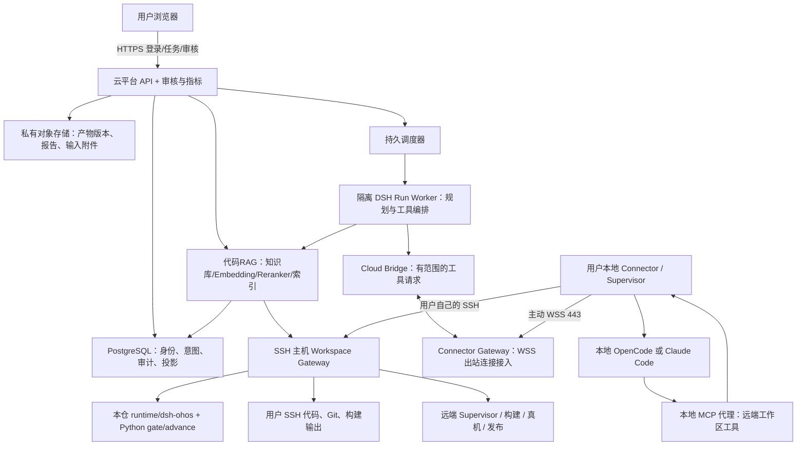

# DSH 云端 Agent 编排平台：一期完整实施方案

版本：1.2 · 日期：2026-09-15 · 状态：架构设计与实施基线；官方 DSH AR 面板、远端 Gateway/RAG/调试、维测投影，“本地 Connector + SSHFS 挂载/remote-tools MCP + 本地 CodeAgent”执行切片，以及部署 doctor/systemd/cgroup admission 已实现并通过定向本地测试；Connector 连接边界已加入 Origin/TLS/mTLS 策略、配对撤销/轮换和断线命令回放。多租户、真实证书部署、真实宿主验收和真实 CLI/SSH/设备 P0–P8 验收仍未完成。

面向实施者：Qwen3.8 等同类型模型、项目开发者、测试与运维人员。文中技术选型是本方案的设计决定；上游接口事实以引用资料及任务 T00 的固定版本实测为准。不得把设计、现有夹具测试或本文示例当作上线验收证据。

## 1. 目标与交付物

部署一套多人使用的 DSH 云服务。用户登录网页、绑定自己的本地 Connector 和 codeagent，选择自己的 SSH 工作区及 workflow，即可在网页上启动任务、观察进展、输入补充信息、审核完整产物并授权继续。codeagent 使用用户本地的 OpenCode 或 Claude Code 安装与其合法可用的模型凭据；SSH 私钥留在用户端。一期运行本仓 AR 开发 P0–P8，完成后以对应环境的真实发布验证（OpenHarmony PR/CI或HarmonyOS Gerrit Change/Patchset）和签名证据判定成功。

交付必须同时包含可部署服务、可安装 Connector、SSH 端 Workspace Gateway、两个 codeagent 适配器、AR workflow 包、维测与审核网页、升级备份手册及真实验收记录。

| 文件 | 用途 |
|---|---|
| [扩展：RAG、环境分支、调试与 remote-tools](rag-environment-debug.md) | 云端模型/知识库入口、工程三分支、产物与设备识别、本地 MCP 访问 SSH 代码 |
| [DSH 官方 Web UI 接入边界](dsh-integration.md) | 官方 Session/Tool/Approval 页面、AR runtime 工具和本地启动方式 |
| [迁移到计算云部署手册](deploy-to-compute-cloud.md) | 从 WSL 单机验证迁移到 Linux 计算云、CodeAgent、SSH、反向代理和验收 |
| [平台使用手册](usage-guide.md) | 最终用户从 CodeAgent、工程初始化到 AR P0–P8、审核、产物、维测和 API 的操作步骤 |
| [本文](index.md) | 产品边界、部署拓扑、模块职责、状态权威和关键决策 |
| [接口与数据契约](contracts.md) | API、消息、实体、状态、审批、指标字段与幂等语义 |
| [实施任务单](implementation-tasks.md) | T00–T25 的依赖、文件、步骤、测试和完成条件 |
| [验收矩阵](acceptance.md) | 功能、真实宿主、故障、安全和上线验收 |
| [模型交接提示词](model-handoff.md) | 可直接交给实施模型的工作指令 |
| [机器可读任务清单](examples/task-plan.json) | 任务顺序和验收引用 |
| [workflow 示例](examples/ar-delivery.workflow.json) | 平台自定义 manifest 的字段示范，T02 后才可装载 |
| [消息示例](examples/operation-start.json) | 平台协议示范，非 DSH 上游 API |

当前实施状态记录在 `products/dsh-cloud-implementation/implementation-status.json`。已落地的基础代码在 `platform/README.md`，免登录运行入口说明在 `platform/apps/local-console/README.md`；本轮新增 Connector WebSocket upgrade、出站客户端、在线工作区目录、受限 `agent.start/status/cancel`、本地 CodeAgent 执行器、SSHFS 相对路径绑定、不挂载源码的 remote-tools MCP broker、本地 operation journal 和安全连接策略。两种 Connector 模式都可以让本地 Claude Code/OpenCode/Codex 修改 SSH 代码，远端 Gateway 继续执行 gate；云端 hub 启用 `replayPending` 和绝对 `outboxFilePath` 后会保留断线中的幂等命令，在同一设备重连或云端进程重启后按 `operation_id` 重绑并回放结果。仍不代表多租户、真实证书/密钥服务、云模型 RAG、OS 硬隔离或三环境真实 AR 验收已完成。

v1.2将**云端代码RAG及入口、本地产物/设备识别、工程三环境分支初始化、本地 Connector remote-tools MCP**纳入一期，共26个实施任务、64项验收。新增详细设计见 [扩展章节](rag-environment-debug.md)。

## 2. 需求基线

### 2.1 一期范围

| ID | 用户需求与验收结果 |
|---|---|
| FR01 | 一个云端入口服务多个用户；用户不能访问其他用户设备、代码、任务、输入及产物 |
| FR02 | 本地 Connector 主动建立出站连接；用户电脑不开放公网端口 |
| FR03 | 本地 OpenCode、Claude Code 分别实际接收任务、读写 SSH 代码并回报结果 |
| FR04 | SSH 工作区的读写、搜索、Git、构建、测试及门控使用同一工作区身份 |
| FR05 | 管理员可装载版本化 workflow；一期交付 AR delivery，后续 workflow 无须改云平台核心 |
| FR06 | 展示 P0–P8、P8 预检/发布子步骤、重试历史、当前阻塞原因及下一可执行动作 |
| FR07 | 按阶段记录墙钟、人工等待、有效耗时、执行时长、人工介入、token、成功/失败计数 |
| FR08 | 保存用户原始输入、追问、回复、纠偏、审批意见和其版本；允许授权用户检索与导出 |
| FR09 | 展示审核产物全文、文件树、diff、报告、原始证据链接与版本哈希；审核绑定用户看到的版本 |
| FR10 | 断网/重启不重复构建或发布；运行状态未知时隔离并对账，不虚报失败或成功 |
| FR11 | 继续复用 Python gate + advance.py 的证据权威及 P1/P6/P7/P8 人工确认 |
| FR12 | 实际 token 不可得时显示未知/部分可用；云端规划和本地执行分开，支持按模型汇总 |
| FR13 | 云端RAG模型与代码知识库入口，DSH和两种codeagent检索后核验当前源码 |
| FR14 | 发现本地/SSH设备及产物，核验产品/ABI/profile/hash后调试并关联正式证据 |
| FR15 | 工程初始化先确认OpenHarmony或HarmonyOS-system/chip，再按固定profile走编译验证分支 |

### 2.2 明确的一期默认值

- 云：单 Linux 计算节点，Docker Compose；后续可拆分计算与数据库。
- 用户端：Linux、Windows + WSL2 首发。Windows 安装器启动 WSL2 中 Connector 与 codeagent；原生 Windows 和 macOS 可另行扩展。
- SSH端：Linux，已有OpenHarmony或HarmonyOS源码/编译环境/设备能力；完整源码树留SSH端。RAG仅索引明确授权片段，local_only/disabled不上传私有源码或向量。
- codeagent 进程默认在用户本地运行；远端只部署文件/命令/门控网关。
- 一个 run 固定一个 workspace、一个 workflow 版本、一套 policy；codeagent 在阶段边界可切换，必须先停旧进程并重新派生上下文。
- 默认一个工作区同时仅有一个可变更的 run；大仓编译输出和设备也加独立资源锁。
- 工程创建先明确确认OpenHarmony、HarmonyOS-system或HarmonyOS-chip，再选经验证的profile；未知环境不默认归OpenHarmony。RAG与本地调试入口纳入一期。
- 本期完整交付AR P0–P8，覆盖三类环境编译/验证分支。Requirement R1–R9 保持原实现兼容，作为后续 workflow；通过 AR.md 显式交接，不能混用门禁。
- 不包含自动进化策略、自动替换门控规则或承诺模型能力提升；修复先走现有 repair/reset 和预算。
- 云模型调用使用云服务配置的独立凭据；codeagent 模型调用使用本地凭据。两者费用归属、可用模型和配额分开展示。

### 2.3 建议上线目标

以下是待验证的容量目标，不是已测性能或采购保证：

| 指标 | 一期目标 |
|---|---|
| 用户/连接 | 50 注册用户、20 在线 Connector、5 个并行 run（不同工作区） |
| 交互 | 控制 API p95 < 500 ms；不包含模型、SSH、构建耗时 |
| 事件可见性 | 网络正常时，采集到页面可见 p95 < 2 s |
| 审批传递 | 正常网络下，确认到网关验证并开始执行 p95 < 3 s |
| 断线恢复 | 连接恢复后 30 s 内开始对账与事件补传；进程未知不承诺自动恢复执行 |
| 初始云资源 | 控制面建议从8 vCPU/16 GiB/100 GiB起测；RAG模型及索引单独限额压测，GPU需求按实测确定 |
| 备份目标 | RPO <= 15 min，RTO <= 4 h；通过异机恢复演练才能验收 |

## 3. 本仓事实与复用边界

### 3.1 检查基线

设计启动时从真实 WSL 仓库读取：`/home/mgces/code/AI-AR-workflow`，基线提交为
`e65dd9a5afd9d736d261bceb95b60d4eda123cf1`；当前本地实现验证以 `ac885b9` 为参考提交，
工作树仍包含未提交的实现改动。读取时已有用户修改：`docs/reference/dsh-fusion-implementation-status.md`；
已有未跟踪目录：`products/20260908-harmony-ai-video-script/`。本方案不修改这些内容。
本轮仍没有执行真实 OHOS/HarmonyOS 编译、设备操作、代码发布或三环境 DSH 业务验收。

| 已有模块/资料 | 核实的能力 | 本期处理 |
|---|---|---|
| `runtime/dsh-ohos/README.md` | shared runtime、SQLite、MCP、任务租约、AR 与 Requirement 控制器 | 作为远端工作流权威适配基础 |
| `runtime/dsh-ohos/src/workflows/ar-delivery/stages.js` | P0–P8 图，P8-precheck / P8-publish 分开 | 保留阶段与签名门控对应 |
| `runtime/dsh-ohos/src/workflows/ar-delivery/workflow.js` | start / validate / consent / sync | 加持久操作、审批真实性和跨进程对账 |
| `runtime/dsh-ohos/src/workflows/ar-delivery/python-adapter.js` | 调用现有 Python gate/advance 和 inspect bridge | 留在源码所在 SSH 主机执行 |
| `runtime/dsh-ohos/src/core/store/sqlite-store.js` | runs / tasks / attempts / operations / events | 保持远端本地盘 SQLite；不能挂到 SSHFS/NFS |
| `runtime/dsh-ohos/src/dsh/plugin.js` | createRuntime() 后注册工具 | 云端不能直接照搬：会误把云端文件系统当源码环境 |
| [维测说明](../../workflow/observability-usage.md) | schema v2、阶段耗时、等待并集、三类人工介入、gate 次数 | 原字段保留，云端补充 usage、输入与事件投影 |
| [融合实施状态](../dsh-fusion-implementation-status.md) | observe 模式记录历史融合状态 | 以当前实现状态和本报告的可重复测试证据为准；历史条目不当新验收 |
| `dsh-workflow/README.md` | 另一套参考实现 | 不导入其数据库，不形成第二套 AR 状态机 |

### 3.2 必须解决的实际缺口

1. 现有资源互斥主要覆盖共用 SQLite 的协作任务；不能保证 Python CLI、孤儿构建和所有控制操作共同排他。
2. 现有 operations 保存幂等结果，不等于“落盘启动意图 → OS 进程 → 结果对账”的完整作业系统。
3. 现有 consent 接收字符串 token，不能独立证明网页真实用户已经审阅某版本；原 principal 工具分面也不是 OS 隔离。
4. 当前宿主绑定含 native_subagent 等能力；本地 SDK 直启的执行会话不能把这项能力虚标为 true，须迁移到实际可探测的执行上下文能力。
5. 现有 schema v2 没有完整的真实 token 账本与人工输入正文记录。
6. 现有 DSH 插件是本地边界，尚缺公网身份隔离、反向连接、租户路由与云端审核 UI。
7. 构建前源码身份尚未完整绑定 operation，无法可靠地把一次 FAIL/PASS 归因到修复版本。
8. 云上 HMAC 校验不能仅靠上传摘要。保留远端 gate HMAC 原链；新增网关签名验证回执让云端验证来源，不上传 HMAC 私钥。

9. HarmonyOS 的真实 product/out_dir/root_markers、测试 runner、设备和 Gerrit 规则仍需由目标工程 profile 提供；当前 P0 已按 profile 解析 build/test 入口并绑定 profile digest，但未核实的值仍会 fail-closed。
10. 当前P4成功横幅是诊断信息，实际判定按退出码/错误横幅/产物等；P0编译probe有独立横幅要求，UI不可混用。

### 3.3 上游能力与实测边界

DSH 当前文档提供插件、子代理 provider 和工作流扩展点；已有 Claude Code 与 ACP provider。这可作为扩展依据，但现成 provider 的存在不证明公网访问用户电脑、断线恢复或多人隔离已经实现。[DSH 子代理文档](https://deepseek-harness.github.io/deepseek-harness/en/reference/subsystems/subagent)

DSH workflow 的 phase 是进度信息，AR 的执行准入仍由本仓控制器及 Python 签名门控负责。持久云工作流不能依靠一个长期驻留的 DSH 脚本完成恢复。[DSH workflow 文档](https://deepseek-harness.github.io/deepseek-harness/en/reference/subsystems/workflow)

OpenCode 支持 ACP stdio，也提供 HTTP 服务。当前方案默认在本地通过 HTTP/SDK 适配，以接入会话、事件与权限；ACP 保留为适配备选，不能假定它提供全部 usage 数据。[OpenCode Server](https://opencode.ai/docs/server/) · [ACP](https://opencode.ai/docs/acp/)

Claude Code 通过 Agent SDK 适配权限、用户输入和用量；具体字段、工具禁用及本地账号可用性必须在 T00/T07 实测。不得假定任何订阅可被云服务共用。[SDK 概览](https://code.claude.com/docs/en/agent-sdk/overview) · [权限与输入](https://code.claude.com/docs/en/agent-sdk/user-input)

## 4. 总体架构与权威归属



图中浏览器到本地没有入站 HTTP 控制链；本地只主动连接云与用户指定 SSH 主机。云端 DSH 不持有 SSH 私钥，也不能任意指定本地路径启动进程。

| 领域 | 唯一权威 | 其他组件的地位 |
|---|---|---|
| 登录、租户、真实用户审核决策 | 云端身份与审批服务 | DSH/codeagent 只能提出审核请求 |
| AR 阶段通过、consent 生效、完成 | SSH 主机上的 Python 签名证据 + advance.py | SQLite 保存任务编排；云仅投影验证结果 |
| 任务领取、revision、attempt lease epoch | SSH 上现有 runtime（每 workspace 独立状态目录） | 云派发授权 intent；不得另造可并行领取同一任务的系统 |
| 本地 codeagent 进程状态 | 本地 Supervisor | DSH 退出不代表 codeagent 已停 |
| 远端构建/设备/发布作业状态 | 远端 Supervisor + 共享资源锁 | SSH channel 断开不代表作业退出 |
| 用户审核看到的产物版本 | 不可变 artifact bundle 及 hash | 正在变化的工作区文件不是审批对象 |
| token | 每个执行器的真实 usage，附完整性 | DSH tokenMeter 估算不等于累计消耗 |
| 云端 current phase / 看板 | 带 revision 与 cursor 的投影 | 过期投影标记 stale，不能授权动作 |

云端 PostgreSQL 和远端 SQLite 管不同领域；不做跨网络数据库共享，也不依赖分布式事务。通过幂等 intent、回执和 outbox 最终对账；重放结果不能重新触发副作用。

## 5. 云、本地、SSH 三层详细职责

### 5.1 云服务

建议新增 `platform/`，采用 TypeScript、Node 24、React、Fastify、PostgreSQL、S3 兼容对象存储及 Compose。精确依赖在 T00 固定，选择依据是与现有 Node runtime 接近、契约可共享及部署简单。

- Web：工程初始化三环境向导、设备与工作区、workflow目录、审核与维测、人工输入历史、代码知识库、模型服务配置、产物/设备调试中心。
- API：认证、授权、run 与 revision、审批、artifact URL、事件 SSE、导出；业务鉴权独立于 UI。
- Scheduler：数据库中领取调度 intent，按 run/workspace 排他；启动/恢复受限 DSH Worker，禁止直接操作源码状态。
- DSH Run Worker：每活动 run 一个隔离进程/容器及独立 session/storage/profile；等待人时保存状态并可卸载，避免长期占用模型调用。
- DSH Bridge 插件：提供平台工具、路由本地/远端调用，映射日志与请求；不暴露审核授权写入工具。
- Connector Gateway：鉴权长连接、命令下发、ACK、流控、重连、吊销。
- Projection Worker：消费持久事件，派生阶段、阻塞、usage 和审计视图。
- 产物服务：不可变文件版本、清单、全文、安全预览、下载、差异比较和审核binding。
- RAG服务：授权源码增量索引、符号/全文/向量召回、重排、当前源码核验、模型配置与检索评测；embedding/reranker独立计量。
- 工程服务：保存源码探测、真实用户环境确认、profile digest与三分支预检。

一期只允许管理员发布经过审核且固定 hash 的 workflow 包；普通用户选择包及受 schema 约束的参数。上传任意 JavaScript/插件不在普通用户权限内。

### 5.2 本地 Connector

独立常驻服务，不依赖浏览器持续打开。Windows 以 WSL2 用户服务运行并隐藏后台窗口；Linux 使用 systemd user service。

- 配对、持有设备私钥/证书、出站 WSS、SQLite outbox、重连补传。
- 探测本地 OpenCode / Claude Code 版本、模型来源、启动/取消/usage/工具范围能力。
- 保存 SSH profile 别名和用户密钥引用；检查 known_hosts、ProxyJump、非交互连接。
- 按工作区绑定打开 SSH Gateway 会话，复用连接、保存会话恢复标识。
- 启停本地 codeagent，收集结构化事件、usage、permission、question。
- 把 codeagent 的工作区工具映射到 SSH Gateway；不把远端绝对路径设置为本地 cwd。
- 校验云命令的用户/设备/workspace/run/epoch/有效期；本地限制不可被云命令放宽。
- 支持用户本地“一键断开/吊销”，停止新任务并请求取消已管作业。
- 调试服务：探测本地/Windows-WSL设备、识别产物与产品/ABI/profile，受控传输部署并回传运行证据；扫描不自动部署。

首次安装的本地授权必须列出：允许调用的 codeagent、SSH profile、代码根、工具/发布能力、允许上传的内容类别。浏览器只选择已注册 workspace_id，不接受任意 SSH 主机或命令字符串替换这些绑定。

### 5.3 SSH Workspace Gateway

网关代码与本仓 runtime 部署在 SSH Linux 主机，数据写当地本地盘。首期以每 workspace 的服务实例运行，单机统一资源锁服务处理路径重叠与共享设备。

- RemoteWorkspace 工具：list/read/search/stat/write/apply_patch/git_diff/exec_start/exec_status/exec_cancel/artifact_collect。
- 受保护 Authority API：start/inspect/claim/context/heartbeat/submit/release/validate/consent/sync/repair/reset。
- Gate Runner：由可信服务选择脚本、形成 argv，绑定 operation 和源码摘要，执行门控；codeagent 不能自行写签名证据。
- Remote Supervisor：持久 intent、OS 进程树身份、日志游标、取消、重新接管、退出证明。
- 本仓 runtime SQLite 保留域模型；修补不完整的受管执行与锁，不改为云端 PostgreSQL。
- 对每个 workspace 分离 worker、authority、publisher 权限。worker 可写允许的源码目录；不能读 HMAC secret、写 pipeline/manifest、调用 consent 或使用发布凭据。
- 网关 SSH 入口使用固定启动程序/forced command 与 stdio 消息协议；参数通过长度有界 JSON 传入，禁止把云字段拼成 shell 命令。
- 若主机无管理员配合，无法落地证据与发布权限分离，只可标记为“可信单用户试用”，不得宣称多用户安全隔离验收通过。

代码 agent 一般能运行任意代码，因此单靠提示词、MCP allowlist 或按命令名过滤不构成执行沙箱。网关 exec 必须落受限 UID/容器，工作区保护目录只读/隐藏；网络发布路径由 publisher 专用服务控制。SSH 主机 root 仍属于用户信任域，无法防范主机所有者主动造假，云上回执不代表硬件远程证明。

## 6. 本地 codeagent 如何处理 SSH 代码

### 6.1 当前可运行模式：local-agent + SSHFS 受控挂载

这是当前已经可以运行的本地 Agent 路径：CodeAgent 进程留在用户电脑，SSH 代码通过用户预先建立的
SSHFS/受控挂载成为本地绝对目录，云端 Connector 只下发相对路径和固定 Agent id。Connector 的
`LocalConnectorAgentService` 会重新发现本机 CLI，调用已有 `LocalCodeAgentExecutor`，并把结果、usage、
artifact refs 和取消状态回传 DSH。P4–P8 的 Python gate、设备和发布仍通过 SSH Workspace Gateway 在
代码主机执行，因此预检要求 Connector 与 Gateway 同时在线。

SSHFS 模式下 codeagent 直接在受控挂载目录中运行：

```text
本地 codeagent
  → Connector 校验 workspace_id、repo_relative、pipeline_relative
  → 本地 CodeAgent 在 SSHFS 挂载的本地绝对 cwd 执行
  → SSH 主机上的同一目录立即看到修改；Gate 通过 Gateway 执行
```

远端执行 `exec_start` 后返回 operation_id，codeagent 轮询状态或订阅事件；日志和退出码由 Supervisor 回报。构建、UT、设备门控等使用 gate.run 的受限描述，不允许模型上传任意“成功证据”。

| 工具 | 输入关键项 | 必须的行为 |
|---|---|---|
| agent.start | workspace_id、agent_id、相对代码根、attempt 上下文 | 仅允许 Connector 本机已发现且有固定 adapter 的 Agent；本地路径必须在 SSHFS 根内 |
| agent.status/cancel | operation_id | 取消本地进程；状态未知保持隔离并由 scheduler 对账 |
| workspace.probe/read/write/list/hash/diff/exec_profile | SSH Gateway Authority envelope | 只在代码主机执行，路径和 profile 白名单由 Gateway 校验 |
| ar.delivery.* | 固定 gate profile、run revision | Python gate/advance 在 SSH 代码端执行，不能由模型提供脚本 |

SSHFS 模式下文件读写发生在挂载根，Agent 的终端命令也在本地 Connector 主机执行；因此它适合
开发与可控验证。Connector 会拒绝挂载根外路径、任意云端命令和未知 Agent。

### 6.2 当前可运行模式：local-agent + remote-tools MCP

不安装 SSHFS 时，Connector 可以在本地创建一次性 remote-tools broker。Claude Code、OpenCode、
Codex 或自定义 argv Agent 通过生成的 MCP 配置调用受限的 `dsh_workspace_*` 工具；broker 在
Connector 父进程内使用用户 SSH 配置访问代码主机，MCP 子进程只得到 Unix socket capability，
不会得到 SSH 私钥。可调用的 `read/list/search/write/diff/hash/read_binary` 和管理员登记的
`exec_profile` 仍由 WorkspaceConnector 的 root、符号链接、CAS、profile、资源锁和 Authority
校验执行。CodeAgent stdout/stderr 会回写远端 pipeline evidence，临时本地 sandbox 在 run 后删除。

Connector 配置使用 `workspace_access: "remote_tools"`、`remote_tools.enabled: true`、SSH
连接信息和 `allowed_profiles`；完整样例见
[`workspace-gateway/examples/local-connector-remote-tools.json`](../../../workspace-gateway/examples/local-connector-remote-tools.json)。
Claude 使用 `--strict-mcp-config --mcp-config <file>` 加载 `mcpServers` JSON；OpenCode 使用
`OPENCODE_CONFIG=<file>` 加载当前 OpenCode `mcp.dsh_remote` JSON；Codex 使用每次运行隔离的
`CODEX_HOME/config.toml` 和 `[mcp_servers.dsh_remote]`；OpenCode 生成配置同时拒绝本地 bash/read/write
等内置工具（通过官方 `permission` deny 规则）。Connector 会在隔离 Codex home 中复制可选的
本机 `auth.json`/`credentials.json`，不会修改持久配置；API key 环境变量和系统钥匙串仍由本机 CLI
处理。自定义 argv Agent 必须显式提供 `mcp_config_arg` 或 `{{mcp_config_file}}`。目标 CLI 若需要
固定私有/旧版 OpenCode 可设置 `opencodeConfigShape: "v2"`；默认使用官方 flat `mcp` 结构。格式不匹配、远端根不可达或 profile
未登记时 Connector 会阻断运行。P4–P8 仍由 SSH Workspace Gateway 的 AR gate profile 执行，remote-tools
只负责本地 CodeAgent 的源码操作。

### 6.3 仍待补齐的部署加固

- SSH-remote-agent：通过 SSH 把 codeagent 也启动在源码主机，工具兼容通常更简单，但改变了“本地 codeagent”位置和凭据部署。当前仓库的 Gateway profile 就是这个过渡实现；它不能替代一期 FR03 的本地进程验收。

技能和知识库通过只读“上下文包”提供给 codeagent；不要把本地技能绝对路径原样交给远端 shell。包包含内容 hash、来源、阶段必需段落、远端脚本引用。实际使用事件按 package_id/skill_id 采集，推荐清单不计为已使用。

### 6.3 多仓与真机

OHOS 源码可能是 repo 管理的多 Git 仓，workspace identity 包含源码根、受影响组件仓根、各 repo 的 base/head、dirty/untracked 指纹、构建输出根；不能只用源码根的一次 git rev-parse 代表全部代码。

优先让设备连接 SSH 编译主机。设备连接用户电脑时，由本地 Connector 与 SSH Gateway 显式建立受限隧道，映射已确认的 hdc server 端点，P0 实测连通与设备身份。未验证 device_access 时 P6/P7 阻塞，不把构建成功当作真机成功。多 run 共用设备时按实际设备资源身份排他，设备序列号只在授权域保存，指标标签使用不透明 ID。

RAG、工程三分支与产物设备识别见 [v1.1扩展](rag-environment-debug.md)。本地设备与SSH编译通过hash校验传输和受限HDC路径联通，兼容性未知时不自动部署。

## 7. Workflow 装载与 DSH 集成

Workflow 包分三层：

1. 平台 manifest：id/version/digest、输入 schema、阶段图、审核点、能力需求、超时、预算、产物及指标映射。
2. 云 DSH orchestration 插件：生成受限上下文、调用派发/状态/请求人工工具，不改 gate 规则。
3. SSH authority adapter：复用 runtime/dsh-ohos 的业务控制器，执行真实 Python 门控。

`ar-delivery@1.0.0` 固定本仓 skills、runtime、脚本与模板 hash。新版本只用于新 run；旧 run 重启仍用旧版本。迁移中的 run 必须先停止作业，生成迁移报告，重新验证审批/证据/接口兼容，不能用“最新配置”自动续跑。

平台 manifest 为本方案新增格式，不能直接传给 DSH 当官方配置。T02 编译校验后，T09 将它转换成针对固定 DSH 版本的插件配置。先通过注册表实现插件装载与生命周期，不维护 DSH 私有 fork。

云侧工具建议：run.inspect、run.next_action、execution.dispatch、execution.status、execution.cancel_request、artifact.list/read、human.request、workflow.context。
其中 dispatch 只能引用权威 runtime 返回的 task/revision，不能传入任意任务图；review.decide/consent.apply 只给经身份校验的后端。

DSH Agent 负责规划与解释、选择允许的执行器；调度器负责预算、超时、幂等与恢复。阶段通过绝不由 DSH 文本、工具调用成功或 codeagent 最后一句“已完成”推导。

## 8. 一期 AR 阶段映射

| UI 阶段 | 原 gate | 主要审核/结果产物 | 推进条件 |
|---|---|---|---|
| P0 环境 | gate_env_init.py | env 证据、源码/目标/设备探测 | 环境、组件由用户确认；真实预检 PASS |
| P1 设计 | gate_design.py | AR_design.md、ar-contract、编译产物列表、设计引用 | 签名 PASS，展示完整设计后人工同意 |
| P2 开发 | gate_develop.py | diff、规则报告、功能指纹 | P1 consent 有效；源码变更及规则门 PASS |
| P3 测试开发 | gate_test_develop.py | 测试源码、覆盖映射、快照 | 契约测试编写覆盖、测试规则 PASS |
| P4 编译 | gate_build.py | 当前环境build日志、产物hash与静态检查 | 退出码、无错误横幅、契约产物及实际gate检查；源码/profile/operation绑定；成功横幅为诊断 |
| P5 单元测试 | gate_test_ut.py | 本环境native/ArkTS runner报告 | 全部契约用例真实执行通过；runner缺配置则阻断 |
| P6 端到端 | gate_device_func.py | reports/device_functional.md、reports/test_report.md、hilog/nonce/sha256 | 真机门 PASS + 人工审核 |
| P7 质量 | gate_integration.py | reports/quality.md、功能/覆盖率/性能/功耗/稳定性/review | 原质量门 PASS + 人工审核 |
| P8 预检 | gate_upload_ci.py（不允许push） | 完整diff、环境目标；GitCode Issue或Gerrit Change-Id/政策 | 预检后真实用户同意；Gerrit须新增实现 |
| P8 发布 | gate_upload_ci.py（同意后允许push） | GitCode PR/CI或Gerrit Change/Patchset验证、commit、summary | 按profile对账、签名PASS、advance phase8完成 |

P8 的预检记录可能在原签名链中表现为 FAIL + consent-precheck。它是正常等待，UI 显示 awaiting_review，不能记成“代码执行失败”；原指标不修改，另提供规范化展示计数。

P1/P6/P7 gate PASS 也不是阶段已完成，须 consent 与 advance 真正生效。提交产物只进入 validating。P8 等待远端 CI 时单独展示 waiting_external，不算人工等待。

初始化不静默沿用 hiview：网页表单分别要求环境、组件 git_dir、build_target、part；HarmonyOS 必须按当前脚本要求提供 component_type/device_type。探测结果供用户确认；仓库尚有占位的环境配置必须保持阻塞。

## 9. 人工介入与完整审核

审核工作台布局：

```text
任务标题 / P7 质量 / 等待审核 / artifact bundle 版本
左：阶段和文件树
中：报告全文、Markdown 表格、代码 diff、XML 用例、图片
右：门控结果、来源/哈希、当前阻塞、审核人权限、同意/退回/补充意见
底：人工输入时间线与本次操作审计
```

完整展示意味着：每个要求审核的文件可打开全文/原始下载；分页不等于只给摘要；大文件明确总长度与范围；附件未上传完整或扫描被阻断时同意按钮不可用。HTML 报告在无脚本/无同源权限的沙箱内预览，Markdown 禁止原始脚本，外链不自动获取内网资源。

审核对象是不可变 bundle，含每文件 sha256、字节数、角色、相对路径、原始/脱敏视图 hash、原 gate entry ID、源码指纹。脱敏展示不能冒充原始证据；若敏感原文不能上云且是审核必要内容，用户须打开本地受控查看器，并由 Connector 记录“已查看指定原文版本”的签名回执。

浏览器提交 decision 时带 expected_revision 与 bundle_digest。后端校验真实 session 身份/角色，生成签名 ApprovalReceipt。远端 authority 在同一资源 fence 下复验 gate entry、diff/source digest、revision、凭据有效期和一次性 nonce，再调用受控 consent。任何变化返回 approval_stale，重新生成审核包。

DSH 与 codeagent 均不能构造有效 ApprovalReceipt。旧 consent(token) 只能在受控桥接内部转换为不透明 decision ID；不将用户原文或登录 token 传进 CLI 参数。平台模式下直接使用旧 CLI consent 必须被权限或平台凭据校验阻止；不能仅在网页隐藏按钮。

人工输入按三层记录：

- 原始问答：question_id、input_id、actor、正文/附件、时间、修订关系。
- 介入事件：required_workflow / blocked_unplanned / user_correction，另设 kind=review/permission/clarification/correction/stop。
- 等待区间：start/end、关联请求、阶段与 attempt；同一事件 ACK/重试不多计。

工具权限确认与业务产物审核分别呈现。一次回复可结束一个等待并记录一次介入；等待开始/结束不是两次介入。浏览器断开不自动同意，模型输出“用户同意”也不生效。

## 10. 维测口径

兼容现有 schema v2；新增 `platform_observability_v1` 投影及原始事件账本，不直接改写旧指标为新定义。

| 指标 | 计算与解释 |
|---|---|
| 阶段墙钟 | 每次阶段 epoch 的关闭时间减打开时间，重走累计；未关闭按 now |
| 人工等待 | 阶段内等待区间的并集；open wait 持续增长 |
| 有效耗时 | 墙钟 − 人工等待，与本仓一致；仍包含排队、网络/CI 等待 |
| 活跃执行时长 | Supervisor 证明运行的区间并集，另列 codeagent/build/test 等；不是有效耗时同义词 |
| 断线/排队/外部等待 | 独立分类；重叠区间不得再次从原有效耗时扣除 |
| 人工介入 | 去重后的人工 action；按三类统计，待审批数另列 |
| 成功次数 | 分 gate_pass_count、stage_completion_count、run_success_count；P8 预检不计成功 run |
| 失败次数 | raw_gate_fail_count 保留原口径；execution_failure_count 排除正常审批 HOLD |
| 当前不成功原因 | reason_code + source + evidence/operation/input ref + 首次/最近时间 + 下一动作 |
| token | 按 DSH 与 codeagent、模型、session、attempt、阶段分别记录真实输入/输出/cache/reasoning |
| 人工输入内容 | 完整正文和版本、提问上下文、引用产物及决定；脱敏权限与留存可配置 |

重试/repair/reset 时历史成本和事件保留，不清零。阶段成功去重键是 run + revision/phase_epoch + phase + authority_completion_id。UI 同时展示“当前有效通过阶段”与“历史通过次数”。

DSH 的 tokenMeter 表示上下文压力/估算快照，不能累加为实际 token 费用。云 DSH 必须采集模型响应 usage；本地执行器从 SDK/API 获取结构化用量。[DSH token meter](https://deepseek-harness.github.io/deepseek-harness/en/reference/subsystems/token-meter)

Claude SDK 的逐步消息与最终结果覆盖范围可能重叠，重复 message ID 和 parent/subagent 汇总不能重复计数；中断可能缺少最终输出统计。适配器保留来源与覆盖范围，未知值为 null，不填 0。[Claude usage 文档](https://code.claude.com/docs/en/agent-sdk/cost-tracking)

汇总显示 known_total、completeness=complete/partial/unknown、missing_sources。缓存是否包含在 input 中取决于 provider，原始字段保留并按版本映射，禁止通用地重复相加。成本属于估算视图，真实 token 指标不以估算替代。详细字段和计算例见 [契约](contracts.md)。

默认历史记录：审计/审批/阶段摘要 365 天、原始工具日志 30 天、产物 180 天，租户可调整；删除与导出都有审计。云中保存源码片段和人工输入会形成数据副本，首次绑定应明确告知内容类别；默认私有可见，管理员只看运行元数据，查看正文须额外授权。

## 11. 可靠性与恢复

### 11.1 执行协议

1. 云保存 intent，赋 operation_id；通过 Connector 请求远端 runtime 领取 task，取得 revision/lease_epoch。
2. 远端 Supervisor 在短事务写 operation intent、资源锁与预算预占，返回 accepted 回执。
3. operation_id 对应确定的 OS 作业身份；启动结果落盘。任何启动前后崩溃先查询该身份与 journal，不因“无结果”重启。
4. Connector 启动本地 codeagent；其 remote-tools 使用绑定 operation/attempt 凭据访问远端。
5. 执行事件先落生产端 outbox，再发云；云持久化后 ACK，断线重放。
6. 本地 codeagent 退出后停止其拥有的远端可变作业并提交产物。保留被独立托管的构建作业直到对账完成。
7. authority 执行 gate 验证/advance，返回签名快照；云更新投影。
8. 任意 uncertain outcome 标 needs_reconcile；禁止用重新 start 代替 reconcile。

消息传输是 at-least-once。实际副作用通过幂等 operation、OS 作业身份、锁和对账实现至多一次启动或发现未知；不能声称任意 shell/外部服务的 exactly-once。

### 11.2 两种 lease 与执行 fence

连接 lease 仅表示在线性；任务 lease_epoch 由 runtime 控制；资源 fence 由远端统一 Supervisor 发放。它们是不同字段。

- WSS 断开：禁止新派发，允许已启动远端构建在预授权期限内继续并落日志。
- 本地 codeagent 心跳丢失：网关拒绝新写入；若已有长任务仍运行，资源锁保留，旧 token 失效。
- 续租失败/过期：停止接收新工具副作用，进入隔离；不能释放锁再起新 worker。
- 取消：请求本地及远端 supervisor 停整个进程树，grace 后强停；输出退出证明后才可重新领取。
- 系统重启：比较 boot_id、作业名、PID/starttime、journal 和文件状态；PID 本身不足以识别原进程。
- P8 不确定：先查远端 branch SHA、PR/Issue/CI 状态；已 push 不重复 push，不自动撤销发布。
- Workspace 除路径还绑定 SSH 主机可信身份、canonical realpath、组件仓/输出根/设备资源；处理别名和包含关系。

已有 legacy CLI 也必须进入同一锁域。平台绑定的 run 只能由可信 wrapper 调用写状态的 gate/advance/repair/reset/consent，绕开 wrapper 应被受保护状态目录/密钥权限阻止。

## 12. 部署、隔离与运维

单机Compose角色：edge、web/api、scheduler、connector-gateway、projection-worker、postgres（pgvector）、artifact-store、rag-worker、embedding/reranker、按需DSH run workers。数据库/存储/DSH 端口只在私有网络；只公开 HTTPS/WSS 443。

用户身份由 OIDC 或等价现有身份提供方接入。网页 session 使用 HttpOnly/Secure/SameSite cookie，变更 API 防 CSRF；SSE 校验 session，不把 bearer token 放 URL。每个用户归属 tenant；角色 owner/operator/reviewer/viewer，设备所有权和 review 授权分开。

配对流程：登录用户生成一次性短期配对码 → Connector 本地确认 → 生成本地设备密钥并兑换证书 → 云记录 user/tenant/device → 本地出站 WSS。使用短期证书/访问 token 轮换，吊销即时禁止新连接和新命令。防重放签名绑定 session nonce、tenant/device/workspace/operation；网关不能把设备自报 tenant 当成身份来源。

PostgreSQL 业务表全部 tenant_id，关联键复合包含 tenant_id，并在 API 与后台 job enforce 租户过滤；RLS 做纵深防护。普通用户之间不可共享 DSH session/profile/storage。对象 key 由后端生成、短期签名下载、角色校验，不直接暴露桶。

DSH worker 不挂代码、SSH 密钥、Docker socket；默认只有受限 Bridge 工具及模型出站能力。必须访问的模型 endpoint 由管理员配置并防 SSRF；普通用户不能配置内网 metadata 地址。

软件供应链：T00 锁 Node/DSH/SDK/Connector/Gateway/skills 版本及 digest，镜像不可使用 latest。健康检查包括 DB、事件堆积、Connector 在线、authority 版本、对象上传、DSH 插件 ready。滚动升级先 drain，新旧协议只允许约定的相邻版本；迁移前备份，破坏性迁移须先兼容扩展后收缩。

备份同时覆盖 PostgreSQL、对象清单、加密 secrets 配置、SSH authority 的 SQLite 与 pipeline/manifest（密钥单独加密保管）。云数据恢复不能覆盖更新的远端 pipeline；恢复后按签名 cursor 对账。SQLite 通过 backup API/一致性快照，不直接复制活动 WAL 数据文件。保留事件用于重建云投影。

故障面板至少显示：DSH 模型服务、Connector、SSH、codeagent、Gateway、构建、设备、Git/CI、artifact upload、审核服务、usage completeness。探针失败不能显示为模型失败。

## 13. 实施组织与风险处理

实施严格按 [任务单](implementation-tasks.md) 推进。v1.1新增24–37人日，总计98–153人日、2名开发+1名兼职测试/运维约12–17周，属于规划估算；T00 原型后重新估算。模型辅助不能省略真实宿主、设备、发布和故障验收。

| 阶段 | 目标 | 放行条件 |
|---|---|---|
| M0 T00–T02 | 固定版本、证明两种本地 Agent 可操作 SSH、契约与骨架 | 任一适配关键能力不可用即记录阻塞，不带病进入全量实现 |
| M1 T03–T08 | 远端权威、受管进程、两个适配器、事件连接 | 崩溃不重复执行；审批/证据不可由 worker 绕过 |
| M2 T09–T11、T21 | 云DSH、身份、工程三环境初始化与AR | 正确profile的P0/P1到人工审核 |
| M3 T12–T15、T22–T24 | 审核维测、RAG、产物设备调试及网页 | 引用核验、真实识别与指标审批对账 |
| M4 T16–T20、T25 | 三环境验证/Gerrit、部署恢复与完整AR | 三类真实run，覆盖两Agent及对应发布证据 |

最高风险是本地 codeagent 的 remote-tools 限制能力、SSH 主机权限隔离、既有 controller 的持久操作补齐，以及两端断线时的审批一致性。先做带真实工具调用的最小原型；不要先做只能播放假日志的网页。

成功定义：三类环境各至少一条真实AR P0–P8，两种本地codeagent各至少一条完整交付；增加RAG质量/权限/引用核验、产物设备匹配、跨用户与断网恢复。无需默认跑全2×3，必须列实际矩阵。缺HarmonyOS源码/profile/设备/Gerrit时标blocked，不能用OpenHarmony代验。

## 14. 未知项的处理

本版选定了技术路径，实施模型只需要在以下部署参数上收集具体值：域名/TLS、云主机、OIDC、对象存储、模型服务、用户本地安装路径、SSH profile、OHOS 组件/目标/设备、Git 平台与发布目标。参数缺失时可做本地集成与测试，涉及真实连接/发布的验收保持 pending。

T00 必须产出能力矩阵：实际版本、安装来源、运行位置、凭据模式、工具限制、用户输入、取消、resume、usage、模型 ID。任何未验证能力标 unknown；不得通过修改预期结果让探测“通过”。

## 15. 外部参考

检索日期 2026-09-12；实施时保存固定版本来源，文档网页本身不是版本锁。

- [DSH 官方仓库](https://github.com/deepseek-ai/deepseek-harness)
- [DSH workflow](https://deepseek-harness.github.io/deepseek-harness/en/reference/subsystems/workflow)
- [DSH subagent](https://deepseek-harness.github.io/deepseek-harness/en/reference/subsystems/subagent)
- [DSH approval](https://deepseek-harness.github.io/deepseek-harness/en/reference/subsystems/approval)
- [OpenCode Server](https://opencode.ai/docs/server/)
- [OpenCode ACP](https://opencode.ai/docs/acp/)
- [Claude Agent SDK](https://code.claude.com/docs/en/agent-sdk/overview)
- [Claude 权限](https://code.claude.com/docs/en/agent-sdk/permissions)
- [Claude 人工输入](https://code.claude.com/docs/en/agent-sdk/user-input)
- [Claude usage](https://code.claude.com/docs/en/agent-sdk/cost-tracking)
