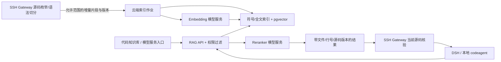

# v1.1 扩展：代码 RAG、产物/设备调试与工程环境分支

返回 [总方案](index.md)。版本1.1，2026-09-12；本章为一期必做范围，已同步到任务、契约与验收。
本章定义新增实现；不是宣称本仓已具备这些云平台能力。

## 1. 三项新增目标

| ID | 目标 | 用户可见入口 |
|---|---|---|
| FR13 | 云端部署代码检索增强服务，供 DSH 和本地 codeagent 理解源码 | 代码知识库 → 数据源/索引/检索；管理 → 模型服务 |
| FR14 | 发现本地与 SSH 端设备及构建产物，匹配后调试并关联证据 | 工作区 → 调试中心；run → 产物与设备 |
| FR15 | 创建工程第一步区分 OpenHarmony / HarmonyOS，按分支编译、测试、部署、发布 | 工程初始化向导 → 代码类型 → 环境证据 → 产品/组件/设备 → 分支预检 |

环境确认是工程创建的前置步骤；RAG 命中和设备名称都不能替代用户对代码类型的确认。

## 2. 代码 RAG：云端服务与 Agent 入口

### 2.1 架构



一期使用现有 PostgreSQL 扩展 pgvector 存向量，另建符号/路径与全文索引；
检索采用符号精确匹配、词法召回和语义召回融合，再重排。
pgvector 提供向量检索基础；PostgreSQL 提供全文检索，但这两者不会自动理解 OHOS 架构。
源码分块、版本/权限过滤、语义评测由本平台实现。
[pgvector官方](https://github.com/pgvector/pgvector) · [PostgreSQL全文检索](https://www.postgresql.org/docs/current/textsearch.html)

不在一期另建复杂图数据库。先抽取文件所属组件、类/函数/声明、include/import、
BUILD.gn target、SA/IDL/NAPI线索和测试引用。语法树切分可使用Tree-sitter，
解析失败保留降级状态，不能声称宏/动态绑定产生的完整调用图已识别。
[Tree-sitter官方](https://tree-sitter.github.io/tree-sitter/)

DSH 注册平台自定义工具 code.search、code.explain_context、code.index_status；
本地两个 codeagent 通过 Connector 的受限 MCP 代理使用同一检索服务。
本地代理只持当前task/workspace的检索范围凭据，不能检索其他工程。
DSH 工具注册接入按固定版本适配，不把本章工具名当作上游现成API。
[DSH工具接口](https://deepseek-harness.github.io/deepseek-harness/en/reference/subsystems/tools)

### 2.2 模型分工与一期选型

| 角色 | 一期默认候选/决定 | 配置与实测要求 |
|---|---|---|
| Embedding | Qwen/Qwen3-Embedding-0.6B，默认1024维 | 固定权重revision/tokenizer/推理服务版本；先测本仓C++/ArkTS/GN与中文问题 |
| Reranker | Qwen/Qwen3-Reranker-0.6B | 对融合召回候选重排；单独超时和算力预算 |
| 回答/解释 | 复用当前DSH或本地codeagent模型 | 检索给证据，生成模型给解释；不强制额外常驻大模型 |
| 向量存储 | PostgreSQL + pgvector | 按embedding模型revision与维度分版本，禁止混索引 |

模型卡说明该embedding系列面向包括代码检索在内的任务，0.6B版本支持最高1024维；
本方案将它作为初始候选，不据模型卡分数保证本仓识别效果。
[Embedding模型卡](https://huggingface.co/Qwen/Qwen3-Embedding-0.6B) ·
[Reranker模型卡](https://huggingface.co/Qwen/Qwen3-Reranker-0.6B)

“RAG模型”在产品中显示为RAG配置，包含embedding、reranker和可选回答模型三个字段；
这些字段不与“实施模型Qwen3.8”混用。更换embedding模型必须重建新索引；
reranker变化需重新评测但不必重算原向量，仍记录retrieval_profile_digest。

在同一计算云优先独立容器运行小模型服务并限并发。CPU可以先验证正确性；
达到响应目标是否需要GPU由T22基准决定，不承诺固定显存即可承载任意OHOS仓。
若使用外部模型服务，必须再次确认源码片段的数据出站范围。

### 2.3 索引来源与权限

默认只索引用户为当前workspace明确允许的组件和只读文档范围：

- C/C++、头文件、ArkTS/TS、IDL、GN/GNI、配置与设计文档。
- 本仓稳定知识导航可做独立数据源，标 source_kind=knowledge_navigation。
- 测试代码可索引；构建生成文件按需要单独显式允许。
- 排除out、二进制、密钥、个人配置、pipeline签名secret、临时日志和其他用户输入。
- 不因代码类型是OpenHarmony就推定所有本地改动可以公开；
  HarmonyOS默认private_approved_subset，仍由用户明确授权范围。

用户初始化workspace时选择 cloud_approved_subset / local_only / disabled：
前者将授权片段送云索引；local_only保留同一入口但由SSH端检索适配提供结果，
云上不建立该私有源码向量库，结果仍按该次任务的数据策略传输；
disabled走直接源码工具。不得在禁用上传时仍偷偷上传embedding（向量也属于派生数据）。

权限在召回之前按tenant/workspace/data_source/ACL过滤，不能先查全库再过滤。
Embedding/Reranker输入、检索结果、查询缓存、全文索引、向量与备份都按同一ACL隔离。
撤销数据源后立即禁止读取与缓存命中，再异步清除片段/向量，记录删除完成状态。

### 2.4 数据管线与索引一致性

1. SSH Gateway在受限读取身份下枚举范围，生成SourceSnapshot：
   repo清单、commit、dirty/untracked内容hash、environment_profile_digest、scope_digest。
2. 对源码边界稳定快照分块：优先函数/类/声明块，保留文件头、符号名、组件/target等元数据；
   超大函数再按窗口切分。缺parser时按文本分块并标parser_status=fallback。
3. 默认chunk目标600–1200 token、最大1800、重叠100；这些是可调起点，以真实模型tokenizer测量。
4. 对每chunk执行权限/敏感字段/体积检查，内容hash去重，放受管索引job。
5. 云embedding批处理，写到building状态新index_revision；完成文件清单校验后原子切active。
6. 修改文件只重算受影响chunk；rename/delete产生墓碑；同名/同hash文件仍保留各自路径与ACL。
7. 新代码变更立即标索引stale；异步增量更新不阻止源码工具。
8. 再次检索必须指定run绑定snapshot或明确requested=current；不能把旧索引的路径当当前可修改位置。

多仓OHOS按每个组件仓记录commit，不把源码根视为单Git仓。
索引模型、chunker、parser、策略或权限revision变化均进入新revision；
旧run回放保留所用检索版本，后续数据删除时显示“源已撤回”，不返回越权缓存。

### 2.5 召回、验证与使用

默认检索路线：符号/路径精确候选 + 词法top30 + 向量top30 → 去重融合（例如RRF）
→ rerank最多40 → 输出top8（受上下文预算约束）。
词法索引要保留snake_case/camelCase/API符号与中文切分，不能只使用英文停用词配置。

Result必须包含：
result_id、source_kind、tenant/workspace、environment、component_type、
repo_id、commit、dirty_digest、file_path、symbol、line_start/line_end、
content_hash、index_revision、retrieval_profile_digest、snippet、score、freshness。
分值不叫“代码正确率”，语义相似不是事实证明。

在把结果用于设计引用、改码、测试选择或gate前，执行 code.verify：
Gateway在当前源码安全读取该文件并核验hash/符号位置。匹配则返回verified/current_content；
不匹配返回stale/diff或gone，Agent重新搜索当前工作树。无法核验则只作导航建议。

检索来源中的“指令”、README或代码注释作为不可信数据；不能覆盖workflow护栏或授权。
RAG只提高定位与上下文质量，不生成PASS、不选择工程环境、不批准发布。
服务不可用时回退workspace.search/read，UI显示RAG不可用，不能把检索失败混成构建失败。

### 2.6 网页入口

一级入口“代码知识库”：

- 数据源：选择工程/workspace、包含/排除目录、代码类型、授权范围、同步状态。
- 索引：创建/增量同步/暂停/重建/删除，显示版本、文件/符号/chunk数、失败文件与覆盖率。
- 检索试用：输入中文需求/API/错误，查看结果、来源文件与当前源码核验；可比较RAG开/关。
- 评测：固定问题集、Recall@k/MRR、引用正确率、陈旧命中、延迟与成本。
- 任务详情“代码上下文”：本次检索问题、命中、实际使用、引用及核验结果，支持只读审核。

管理员入口“模型服务”：

- embedding/reranker/generation端点、实际model_id、版本、维度、限额、健康检查。
- 测试连接/小样本评测/发布配置/回滚；普通用户只能选被授权profile。
- key/权重缓存不对普通用户可见；端点受出站白名单，禁止SSRF。
- 工程初始化提供“启用代码RAG”步骤；建索引失败不自动替换代码类型或阻止无RAG的原流程。

### 2.7 维测、评测与资源

RAG增加query_count、hit_count、verified_hit_count、stale_hit_count、fallback_count、
index_lag、indexed/eligible_files、parser_coverage、embed_tokens、rerank_pairs、
retrieval_latency_ms、index_job_duration、模型版本与source_snapshot。
DSH/codeagent token与embedding token分列；reranker无法提供token时计pair/输入字节或null，
不能计成0个token，也不与生成token简单比较。

一期固定不少于60个经源码核对的问题，覆盖三种环境/符号/跨仓/中文需求/错误定位/测试关联；
没有HarmonyOS授权源码时相应评测标blocked，不能用OHOS样本代替。
80%用于调参，20%冻结验证；统一与“直接文本/符号搜索”基线比较。
建议冻结验证集Recall@10≥0.85、有效引用hash核验通过率100%、跨租户泄漏0、
正常top-k查询p95≤3s（排除大模型生成）。阈值需在T22报告实测与样本分布，
不能为达标删除失败题；未达标继续调chunk/召回/模型或明确限制。

云资源预算单独测算：1024维float32向量裸数据约4096字节/chunk，
10万chunk约0.41GB十进制裸向量；表元数据/文本/HNSW/备份会额外占用，
不能把裸向量当总存储。首发每workspace默认10万chunk软配额，可经容量验证扩展；
全量OHOS首次索引分组件、可取消且不阻塞任务调度。

## 3. 工程初始化必须先区分系统

### 3.1 向导与状态

用户流程：

```text
绑定本地 Connector / SSH代码根
→ 自动发现源码标志（只读，展示事实与歧义）
→ 用户选择并确认：
   OpenHarmony / HarmonyOS-系统组件 / HarmonyOS-芯片组件
→ 选择版本化环境profile、组件/target、产品/ABI、测试种类
→ 发现构建产物目录与设备，核验兼容性
→ 可选开启RAG及授权索引范围
→ 预览实际编译/测试/部署/发布分支
→ advance.py init（写状态）
→ gate_env_init.py（真实预检）
→ advance --phase 0（签名PASS后推进）
```

UI状态依次：
unbound → detecting → awaiting_environment_confirmation → profile_incomplete/ready_to_probe
→ probing → ready/blocked。
“保存配置/生成PDIR”只代表initialized_state，不显示“环境就绪”。

检测输入包括源码根标志、真实构建入口、repo manifest/组件信息与配置；
单看build.sh、Git remote域名或设备显示名称不能判定系统。
检测不明确/两种标志并存显示ambiguous；不执行默认分支。用户确认结果与探测摘要共同保存，
冲突时解决冲突或建立经确认的新profile，不能静默强行覆盖。

### 3.2 三条分支矩阵

以下编译入口来自本仓当前实现，仅代表本仓支持的profile，不宣称适用于所有HarmonyOS工程。

| 维度 | OpenHarmony | HarmonyOS系统组件 | HarmonyOS芯片组件 |
|---|---|---|---|
| environment | openharmony | harmonyos | harmonyos |
| component_type | null | system | chip |
| 用户必填 | git_dir/build_target/part及确认产品 | 同左+device_type与完整profile | 同系统且确认芯片产品/ABI |
| 本仓build入口 | build.sh，当前默认rk3568 | build_system.sh | build_vendor.sh |
| 本仓其他参数 | --product-name rk3568 --ccache --build-target | ABI/device_type/root variant等由profile生成 | ABI/device_type/user variant及GN/内核等由profile生成 |
| 产物根 | 当前out/rk3568 | 真实工程out_dir，当前源码占位待补 | 真实工程out_dir，当前源码占位待补 |
| 根标志 | build.sh + developer_test | 根据真实仓确认；当前占位 | 根据真实仓确认；当前占位 |
| native UT | profile.product_form + 原developer_test路径 | 独立确认product和runner，不能沿用rk3568 | 独立确认product和runner |
| ArkTS测试 | contract声明kind后选择对应runner | 同原则，使用本环境runner | 同原则，使用本环境runner |
| 真机验证 | 已确认产品/ABI/系统与产物匹配 | 系统组件profile对应部署/加载/用例 | 芯片组件profile对应部署/加载/用例 |
| 发布/验证 | GitCode PR + SHA绑定CI | Gerrit Change/Patchset + 本项目审核/验证规则 | Gerrit Change/Patchset + 本项目审核/验证规则 |

P5按contract中的测试kind选择native/ArkTS或混合，不能仅按“系统名称”猜用例框架。
P6/P7继续复用nonce、真实运行marker、主机/设备产物hash、实际加载与行为证明，
只是runner/路径/产品/阈值按已绑定profile解析。
不支持某种runner即PROFILE_INCOMPLETE，不静默跳过。

### 3.3 源码核实的缺口与必须修改处

| 现有文件 | 当前事实 | 必须实施的改造 |
|---|---|---|
| `skills/ohos-ar-dev-phases/scripts/lib/environments.py` | HarmonyOS的product/out_dir/root_markers仍UNSET，编译模板已存在 | 增加按workspace绑定的版本化profile解析；由真实工程证据填值，不把样例值变默认 |
| `skills/ohos-ar-dev-phases/scripts/gate_env_init.py` | 第163–166行仍固定检查build.sh；编译probe已有envs.build_argv | 构建入口存在性也按profile解析，HarmonyOS不能被build.sh误挡或误放 |
| 同上 | .build-probe-ok只检查存在，写入目标字符串 | 缓存键增加环境/profile/产品/ABI/入口hash/工具链/target/工作区身份；旧标记不可跨profile继承 |
| `skills/ohos-ar-dev-phases/scripts/advance.py` | init要求environment及HarmonyOS subtype/device_type | 平台不允许缺省；保存人工确认记录/profile digest，后续阶段一致检查 |
| `skills/ohos-ar-dev-phases/scripts/gate_test_ut.py` | 已有kind分支；ArkTS runner配置仍可UNSET | profile分别提供真实runner/report规则，全部契约用例真实执行 |
| `skills/ohos-ar-dev-phases/scripts/gate_upload_ci.py` | Gerrit分支明确未实现并失败退出 | 实现真实Gerrit发布/状态查询、预检审批和patchset revision绑定；禁止退回GitCode |
| `skills/ohos-ar-dev-phases/scripts/lib/device.sh` | 已有HDC/WSL/远端/唯一序列号解析 | 包装为结构化设备探测，不丢失原错误和唯一选择规则 |
| `skills/ohos-ar-dev-phases/scripts/gate_device_func.py` | 已校验主机/设备sha256和运行时证据 | 调试界面与证据链复用这套结果，不能新造“设备PASS” |
| `skills/ohos-ar-dev-phases/scripts/gate_build.py` | 当前P4成功横幅是诊断信息；exit0/无错误横幅/产物等才是实际判定 | UI保留真实gate理由，不硬编码“无成功横幅即失败”；P0编译probe仍有自己的横幅要求 |

原environments.py部分注释比实现旧；以实际代码与真实工程为准。
本次只是方案更新，不修改上述运行代码，不填入未核实的HarmonyOS值。

### 3.4 Profile契约与统一路由

EnvironmentProfile新增字段：
profile_id/version/digest、environment、component_type、source_root_markers、
build_entry、build_argv_template、success/error diagnostics、product、device_type、
abi、variant、out_dir、native_test_runner、arkts_runner、
artifact_rules、device_compatibility、deployment_strategy、
quality_rules、upload_backend、upload_validation_policy、probe_cache_policy。

profile由管理员发布或项目维护人受控配置，字段严格schema，运行时参数只做argv字面替换。
源码目录不可提供任意可执行profile来提升权限；模板由受信服务固定版本读取。
它只是环境参数权威，不替代AR验收contract或gate。

只有一条profile解析路径：
已绑定profile → environments.py accessor → gate/advance/test/deploy/publish。
云/UI/Connector仅读取同一签名profile摘要，不另维护if HarmonyOS字符串拼命令。
旧单机run缺environment可保持原兼容路径，但首次挂云必须显式确认，
不能把legacy默认值当成已经确认的事实。

创建run锁定profile_digest。更改环境、product、ABI、test runner、关键部署目标或工作区
必须停止旧作业，重新工程预检，并创建新run或执行被审核的迁移；
原P0、编译probe、产物匹配、设备验证、审核回执和RAG源绑定均失效。
不得只repair回P2然后继续使用旧P0。

### 3.5 Gerrit分支的一期完成条件

Gerrit真实地址、目标分支、认证与项目验证规则从注册profile取得，
不把Verified/Code-Review的固定数值当成所有Gerrit项目通用标准。
发布对象采用泛型PublicationRef：
backend、target/project、branch、commit_sha、change_or_pr_id、patchset_or_head、
verification_status、policy_digest、evidence_refs。

预检绑定完整diff、Gerrit目标与预期Change-Id；人工同意后允许对应发布操作。
回包丢失先按Change-Id/commit查询，确认patchset绑定及项目CI/审核规则，再由gate最终判定。
后续patchset更新会使旧审核/CI证据失效。正常流程提交评审不等于自动merge；
是否需merge由既有AR/profile要求明确，不能自行扩大发布动作。

## 4. 本地调试中心：设备和产物识别

### 4.1 设备发现与绑定

设备可能插在用户Windows、用户Linux/WSL或SSH代码主机。
Connector和Gateway各运行自己的discover，云只聚合已认证来源：

1. 检查hdc二进制与daemon、连接来源和有效权限。
2. 使用现有device.sh解析规则获取targets。
3. 0台→no_device；1台→候选并探测；多台→必须选择，不能随机选第一台。
4. 读取可用的OS/build/产品/ABI/连接状态；属性读取失败标unknown。
5. 按已确认EnvironmentProfile及部署规则核验compatibility，不仅比设备序列号。
6. 绑定device_ref、观察来源、session/boot标识、profile digest与设备资源锁。
7. 每次部署/重启/重连后重新探测，不因缓存序列号相同认为仍是同一系统镜像。

DeviceObservation：
device_ref、owner_device_id/gateway_id、transport(usb/tcp/bridge)、state、
serial_ref、observed_os、product、abi、build_id、boot_id_or_uptime、
observed_at、probe_evidence_ref、compatibility=compatible/incompatible/unknown。
属性名与读取命令按设备实际能力探测并固化适配器，不能硬编码未验证的系统属性API。

网页展示友好名称、连接电脑、系统/产品/ABI、在线状态、兼容结果和具体问题。
序列号与IP只给授权调试者；指标使用不透明ID。
0台/多台/Unauthorized/Offline各自提示下一步，不全部显示“Agent失败”。

### 4.2 产物识别与匹配

来源：SSH编译输出、本地已有构建产物、受控下载到本地的产物。
优先从签名ar-contract.build_artifacts、P4产物索引和profile.out_dir枚举；
导入本地产物时保留origin=local_imported/unverified，不能计为本run编译产物。

BuildArtifactObservation：
artifact_id、kind(elf/so/ko/image/hap/hsp/other)、origin_location、
repo/commit/dirty digest、build_operation_id、profile_digest、product/abi/variant、
sha256、size、build_id、toolchain_metadata、signature_metadata、
intended_device_path、verification_status、evidence_ref。

先根据内容/可信metadata解析类型与架构，再结合文件名；不能仅凭.so/.img后缀判定可部署。
ko还需内核/签名匹配，镜像需板型/分区/部署策略，HAP/HSP需对应签名/安装能力。
这些信息不可得时标unknown并阻止自动部署，不由RAG或模型猜测补齐。

匹配对象ArtifactDeviceBinding：
artifact digest + build/source/profile digest + device identity/product/ABI/current build
+ deployment strategy + destination + validation evidence。
“文件存在”→“候选产物”→“构建来源已核验”→“设备兼容已核验”→“部署并加载已证明”
分别呈现，不混为一个绿色状态。

### 4.3 本地设备配合SSH代码

两种可选执行路径使用同一Operation协议：

- 设备在SSH端：Gateway直接执行部署/验证。
- 设备在用户端：默认Connector执行本地设备命令，Supervisor管进程和设备锁；
  产物从SSH端按hash受控传输到本地，校验后才部署。
  原Python设备gate需要远端运行时，可启用受限hdc代理/SSH隧道；
  只转发注册device/daemon端点，不能提供任意TCP代理。
  不能完成所需gate协议映射时标capability unsupported，不把本地调试日志当远端gate PASS。

默认优先现有gate兼容的HDC隧道路线完成正式P6/P7；
Connector独立调试作业可用于探索，但正式证据必须回到受管gate验证链。
隧道对公网不开放通用hdc端口；Windows/WSL桥接配置由Connector管理。
所有路径记录artifact传输前后hash、真实设备命令退出码和nonce/uptime。

### 4.4 调试操作与审核

入口功能：刷新设备、扫描产物、查看兼容性、选择设备/产物、
预览部署动作、开始调试、看hilog/崩溃/运行时加载、停止、导出报告。

发现/扫描是只读；刷写/替换系统文件/安装/重启等按已授权部署策略和具体操作审批，
不能由点击“识别设备”连带触发。P6结果人工审核仍保留；
有硬件或分区变更的部署授权与P6结果审核是两个不同决定。

调试会话debug_session_id绑定run/phase_epoch/operation/profile/artifact/device，
完整展示“源码版本→编译作业→产物hash→设备部署hash→运行进程加载→用例/结果”的关系。
本地手动导入或探索调试标advisory，只有签名gate及必要consent/advance决定P6/P7通过。

### 4.5 维测

增加设备发现耗时、0/多设备次数、断连/重连次数、产物扫描/解析耗时、
传输字节/耗时、匹配失败code、部署/加载/测试时长、原始故障证据。
人工选择设备属于intervention kind=device_selection，按场景映射required_workflow
或blocked_unplanned；同一次用户操作只计一次，不再另记重复“修复”。

## 5. 新接口、事件与数据表

全部接口继承主契约的鉴权、Idempotency-Key、expected_revision、
workspace绑定、正文/产物权限和签名回执规则。

| 接口 | 用途 |
|---|---|
| POST /v1/projects | 绑定workspace，建立初始化草案 |
| POST /v1/projects/{id}/detect-environment | 只读识别，返回证据及歧义 |
| POST /v1/projects/{id}/confirm-environment | 真实用户确认代码类型/subtype/profile_digest |
| POST /v1/projects/{id}/preflight | 按profile真实P0预检，返回operation |
| GET /v1/environment-profiles | 已发布的三类profile及完整性 |
| POST /v1/environment-profiles | 授权维护人提交/验证/发布，不接受任意脚本权限 |
| GET/POST /v1/rag/model-profiles | 模型profile列表/管理员配置 |
| GET/POST /v1/rag/sources | 数据源范围/ACL/出站授权 |
| POST /v1/rag/sources/{id}/index-jobs | 创建/增量/重建索引作业 |
| POST /v1/rag/index-jobs/{id}/cancel | 停索引，不破坏已active版本 |
| DELETE /v1/rag/sources/{id} | 撤销访问并排程清除，返回删除状态 |
| POST /v1/rag/search | query/workspace/snapshot/profile/top_k，服务端加ACL过滤 |
| POST /v1/rag/results/{id}/verify | 回SSH当前源码核验引用 |
| POST /v1/workspaces/{id}/devices/discover | 指定local/ssh/both的已注册观察点 |
| POST /v1/workspaces/{id}/build-artifacts/scan | 指定允许的产物根/contract，不接受任意本地盘扫描 |
| POST /v1/debug/bindings | 产物/设备/profile兼容匹配，无部署副作用 |
| POST /v1/debug/sessions | 引用匹配和部署策略/审批，建立受管debug operation |
| GET /v1/debug/sessions/{id} | 日志/产物/设备/证据关联 |
| POST /v1/debug/sessions/{id}/cancel | 停作业、确认进程树/设备资源释放 |

新增tenant表：
projects、environment_profiles、environment_confirmations、preflight_results、
rag_model_profiles、rag_sources、rag_index_revisions、rag_chunks、rag_vectors、
rag_index_jobs、rag_queries、rag_result_verifications、
device_observations、build_artifact_observations、artifact_device_bindings、debug_sessions。

新增事件：
project.environment_detected/confirmed、project.profile_incomplete、project.preflight_passed/failed、
rag.index_started/progress/completed/failed、rag.query/retrieval_verified/stale/fallback、
device.discovered/selected/disconnected、artifact.recognized/matched/mismatch、
debug.started/deployed/runtime_verified/ended。
事件ACL与设备签名规则沿用原协议；RAG派生事件不能生成stage.completed。

## 6. 新验收重点与实施顺序

新增T21–T25，ID保留旧任务号但按依赖拓扑执行：
先T21工程环境再T11正式AR；T22/T23完成RAG；T24完成调试识别；
T25补齐HarmonyOS/Gerrit真实分支；T15/T16/T19/T20不得早于所依赖新增能力。

正式验收至少覆盖OpenHarmony、HarmonyOS-system、HarmonyOS-chip三种profile的独立真实run，
并使两种本地codeagent均至少完成一条完整run。无需默认执行全部2×3组合，
但报告必须列出实际覆盖矩阵，未测组合不得泛化宣称已通过。
RAG/设备负向测试和环境错配必须覆盖三类；缺授权HarmonyOS源码或设备时标blocked，
不能把已有OpenHarmony结果当HarmonyOS验收。

本次新增工作量在原74–116人日之外单独估算，详见更新后的任务清单与总方案。
