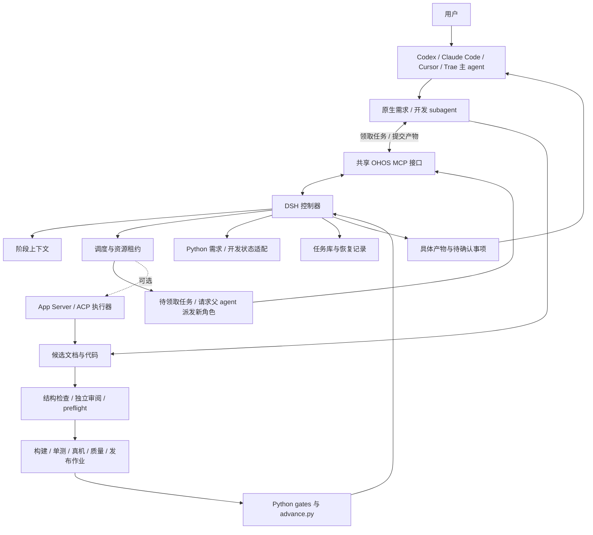

# DSH 化详细改造方案：跨宿主领域 subagent

日期：2026-09-06。状态：实施中，收益尚未验证。本文将此前 [收益优先方案](./dsh-maximum-benefit-design.md) 的 Codex 专用范围扩展为 Codex、Claude Code、Cursor、Trae 等宿主。本文为当前实施依据；接口名、模块名和未完成的配置示例仍是项目契约，不应误认为 DSH 上游原生能力。

## 1. 目标与设计决策

将两条 workflow 改为不同通用 agent 都能调用的领域 subagent：`ohos-requirement` 和 `ohos-delivery`。宿主原生 agent 负责模型推理；DSH 负责业务任务调度、上下文、资源和恢复；Python 负责确定性的业务状态转换与门控。

核心选择是“共享业务内核 + 宿主原生 subagent + MCP 任务领取协议”。默认由宿主执行模型任务，沿用宿主自身登录与可用模型；外部执行器只是可选增强。DSH 不需要额外主管模型，也不要求任务使用 DeepSeek 模型。使用原生模型不等于无限额度或零成本，实际计费仍由宿主的账户、套餐和设置决定。

| 决策 | 具体方案 | 原因 |
|---|---|---|
| 宿主 | Codex / Claude Code / Cursor / Trae 的主 agent | 对外统一领域能力，接入配置分别适配 |
| 默认模型执行 | 宿主原生 subagent 领取阶段任务，使用宿主模型 | 登录和模型调用留在各宿主中，不把套餐转成 API |
| 可选模型执行 | 经验证的 App Server / ACP / 官方 CLI 后端 | 为无人值守和更完整的过程观测提供扩展，不作为通用接入前提 |
| 适配边界 | HostAdapter 处理接入；TaskExecutor 处理执行生命周期 | 接入方式与模型后端可独立演进 |
| DSH 组合 | 自定义 profile 加项目插件，通过 `dsh` 启动 | 使用插件服务和工具生命周期，不 fork 上游核心 |
| 业务编排 | 版本化代码与有限的任务依赖图 | 模型建议任务，程序决定是否允许执行 |
| 需求状态 | 新增 Python requirement controller，唯一写入 `requirement_state.json` | 与开发证据隔离，继续支持文件式迁移 |
| 开发状态 | 继续使用 `pipeline.json`、签名 manifest 和 `advance.py` | 不复制 PASS 判定逻辑 |
| 调度状态 | 本机服务数据库记录 task、operation、lease、event | 保存业务执行过程，不覆盖业务真相 |
| 第一部署环境 | 单控制节点，明确选择本机/WSL/Linux 执行适配器 | 先解决完整闭环，再扩展多主机 |
| 并行策略 | 独立文档/检索/审阅可并行；同工作区写入、构建输出、设备独占 | 防止指纹与实验环境污染 |
| 发布策略 | 先预检与展示具体产物，再消费适用授权 | 保持 P8 的证据绑定确认 |

DSH 支持 profile/bundle 与服务、工具等插件组合；本方案的领域服务需要自行实现。通过自定义应用插件接入 MCP；不另写一个绕过 DSH 启动流程的可执行应用。[DSH Architecture](https://github.com/deepseek-ai/deepseek-harness/blob/master/docs/architecture.md)

与当前 workflow 的主要差异：

| 当前仓库方式 | 本次改造点 | 预期改善与边界 |
|---|---|---|
| 需求阶段主要依赖长 SKILL 调度，维测不是状态机 | 新增 R1–R9 权威状态、产物校验、依赖失效与恢复 | 减少漏步骤、条件丢失和重做；业务决策仍须真实输入 |
| 开发已有强门控，主 agent 循环衔接执行 | 保留 Python gate，增加任务协议、preflight、统一锁和作业恢复 | 减少错误参数、重复推进和断线损失，不把既有门控算成 DSH 新能力 |
| 运行上下文与主会话关联较紧 | 每阶段输入包、独立角色、按需日志、持久产物引用 | 降低重复探索和上下文污染；节省量须包含新增调度开销 |
| 技能和工具能力随宿主不同而变化 | 一份领域角色定义、四种原生入口适配、能力分级 | 新宿主复用相同业务规则，不保证所有宿主控制能力相同 |
| P7 质量报告主要检查存在并导入 | 服务采集原始测量、绑定源码/产物/工具/阈值 | 提高证据可信度；更严格的验收可能增加必要耗时 |
| 长外部操作的结果可能因连接中断而不明 | P8 检查点、幂等与远端对账 | 减少重复上传和人工核对，不取消原有确认 |

收益优先顺序为：门控正确性 → 合格完成率与可恢复性 → 减少重复推理/无效作业 → 可验证的并行加速。DSH 提供插件化运行基础；上述 OHOS 状态、恢复与证据能力都需要本项目开发，不能当作安装 DSH 后自动获得。

## 2. 总体架构



对用户暴露两个领域入口；implementer、tester、reviewer 是内部任务角色。宿主主 agent 负责派发原生 subagent，DSH 提供确定的阶段任务。需要独立 reviewer 或清空阶段上下文时，返回 `dispatch_needed` 给主 agent，由主 agent 创建新角色上下文；不假定所有宿主允许子 agent 再生子 agent。

原生任务可以出现在宿主自己的活动树中；可选外部执行器的任务未必可以，统一以领域 run ID 查询。MCP 是任务和工具接口，不是通用的反向模型调用、subagent 创建或宿主唤醒接口；首版不依赖 MCP sampling。

DSH profile 内以项目插件组合服务、工具和生命周期，领域调度不强行借用要求 parent Agent 的上游 workflow 接口。若接入该接口，须实现符合真实 Agent 契约的 driver；不能伪造 parent 对象，也不能把进度 phase 当成业务 PASS。

## 3. 现有文件如何改

| 文件/目录 | 动作 | 具体改造 |
|---|---|---|
| `skills/ohos-req-intake-orchestration/SKILL.md` | 分步瘦身 | 保留入口、交互、产物说明；阶段路由迁入 requirement controller |
| `skills/ohos-req-intake-orchestration/scripts/requirement_metrics.py` | 保留 | 继续仅负责维测，不能成为状态源 |
| `skills/ohos-req-intake-orchestration/scripts/requirement_state.py` | 新增 | init/status/next/submit/revise/record-decision/reconcile |
| `skills/ohos-req-intake-orchestration/scripts/validators/` | 新增 | 跨文档编号、条件项、proposal/SR、handoff、AR 检查 |
| `skills/ohos-req-review-gate/` | 保留并适配 | 独立 reviewer 输出仍用原 schema；运行引用放外层，不擅自添加 schema 内字段 |
| `skills/ohos-ar-dev-workflow/SKILL.md` | 分步瘦身 | DSH 模式下调用领域服务；迁移期保留 legacy 执行说明 |
| `skills/ohos-ar-dev-phases/scripts/advance.py` | 扩展 | 结构化命令结果、统一运行锁、纯读取查询、服务模式授权验证 |
| `skills/ohos-ar-dev-phases/scripts/lib/gatelib.py` | 扩展 | 锁/操作标识/版本校验、签名与确认边界；保留已有指纹逻辑 |
| `skills/ohos-ar-dev-phases/scripts/lib/runlock.py` | 新增 | 跨进程运行锁、同操作重入和资源生命周期 |
| `skills/ohos-ar-dev-phases/scripts/lib/service_context.py` | 新增 | 验证受信任操作上下文，拒绝 worker 直接变更受保护状态 |
| `skills/ohos-ar-dev-phases/scripts/gate_*.py` | 渐进扩展 | 统一执行入口、preflight、operation ID、结构化结果 |
| `gate_integration.py` 与新质量 schema | 加强 | 从报告存在性检查扩展到采集来源、数值与阈值校验 |
| `schemas/stage_packet / handoff_packet / repair_packet / completion_receipt` | 复用 | envelope 引用这些包，不再复制一套阶段字段 |
| `refresh_todo.py`、`render_report.py`、`archive_product.py` | 保留 | 作为服务调用的确定性人读产物工具 |
| 代码生成、构建诊断、测试、设备、CI skills | 保留 | 根据当前任务按需加载 |

本轮确认：`cmd_advance()` 已对 P1 设计 consent 强制校验；`cmd_next()` 写快照、`cmd_status()` 可能刷新维测；`copy_quality_reports()` 主要检查文件存在并复制；`make_consent_record()` 使用同一个 run secret。上述现状决定改造边界，不照搬历史文档里的旧阶段编号和未完成标记。

## 4. 新运行时的模块划分

当前已落地的业务分层为 `src/core/`、`src/workflows/requirement/` 与 `src/workflows/ar-delivery/`。
下列 profile、独立执行器等仍属于规划能力，实际目录与验收状态以 [runtime README](https://gitcode.com/mgce1/AI-AR-workflow/blob/main/runtime/dsh-ohos/README.md) 为准。

```text
runtime/dsh-ohos/
  package.json
  profiles/ohos-service/        # DSH profile/bundle 组合，版本锁定
  src/plugin.ts                # 服务注册、依赖和退出清理
  src/controller.js            # 兼容入口、workflow 注册
  src/core/                    # 公共任务、租约、凭证和存储
  src/workflows/requirement/   # R1-R9 状态、结构校验、人工决策、业务工具和 agent
  src/workflows/ar-delivery/   # P0-P8 状态、Python 适配、业务工具和 agent
  src/scheduler/               # task DAG、预算、租约、取消
  src/context/                 # 任务包、索引、按需读取
  src/hosts/                  # 原生 agent 定义导出、能力适配
    codex/
    claude-code/
    cursor/
    trae/
  src/executors/host-native/   # 领取/提交，执行仍归宿主管理
  src/executors/codex/         # 可选 App Server 协议适配
  src/executors/cursor-acp/    # 可选 ACP 协议适配
  src/executors/process/       # 本机/WSL/Linux 作业适配
  src/artifacts/               # 快照、hash、候选产物导入
  src/verification/            # preflight、质量采集、审阅路由
  src/approval/                # 待确认事项和授权记录
  src/mcp/                    # 外部领域接口
  src/core/store/             # 公共数据库 migration；需求专用 schema 归需求模块
  src/telemetry/              # 维测桥接、事件、usage
  schemas/                   # 本项目协议 JSON Schema
  tests/unit/
  tests/contract/
  tests/integration/
  tests/recovery/
  tests/hosts/                # 四种宿主接入和迁移验收
agents/ohos/                  # 共享角色定义及按宿主导出的模板
evals/dsh-ohos/               # 固定样本、故障注入和对照配置
```

模块之间使用项目接口，DSH 专用类型集中在 plugin/adapter 边界。这样可以在测试中替换执行后端，而不复制门控或为每个测试启动真实模型。

```typescript
// 项目内部接口草案，不是 DSH SDK 声明。
interface BusinessStateAdapter {
  inspect(runId: string): Promise<BusinessSnapshot>;
  next(runId: string): Promise<ActionPlan>;
  execute(action: AuthorizedAction): Promise<ActionReceipt>;
  reconcile(runId: string): Promise<BusinessSnapshot>;
}
interface HostAdapter {
  renderAgents(spec: DomainAgentSpec): Promise<HostConfigBundle>;
  probe(binding: HostBinding): Promise<CapabilityReport>;
  makeDispatch(task: TaskEnvelope): Promise<ParentDispatchRequest>;
}
interface TaskExecutor {
  capabilities(): ExecutionCapabilities;
  dispatch(task: TaskEnvelope): Promise<DispatchReceipt>;
  inspect(executionId: string): Promise<ExecutionSnapshot>;
  requestCancel(executionId: string): Promise<CancelReceipt>;
}
```

Python adapter 必须从固定操作枚举生成 argv 数组；不能把模型返回的 `next_gate` 文本直接交给 shell。所有进程设置明确 cwd、环境变量白名单、输出目录和资源归属。

`host-native` 的 dispatch 只入队并生成父 agent 派发请求，不能谎报进程已经启动。外部 executor 的 dispatch 才可以通过已验证协议主动启动模型任务。两种实现复用任务、产物和取消结果契约，不强求具有相同控制能力。

角色源文件只维护一次：领域目标、触发条件、输入输出、可用技能、权限需求、退出条件；renderer 分别生成宿主格式。宿主规则文件只放触发/派发/恢复说明，SKILL 保留领域知识，DSH 保存业务路由。不可将完整阶段编排复制进四套提示词。

两个入口之外按需导出内部 reviewer 模板：它使用同一角色源中的独立审阅契约，读取已冻结产物，禁止实现修改。宿主不支持隐藏内部角色时可使用明确名称；不为了维持“只显示两个 agent”而让作者在原上下文兼任 reviewer。

## 5. 数据模型和权威边界

| 数据 | 权威写入者 | 作用 |
|---|---|---|
| `requirement_state.json` | Python requirement controller | R1–R9 状态与已接纳产物引用 |
| `pipeline.json` + signed manifest | 原有 Python 状态机和 gates | 开发阶段与可校验 PASS |
| 调度库 | DSH controller | 任务、执行尝试、租约、待决操作与事件 |
| 阶段包/receipt/索引 | 由业务状态派生 | 指导执行，不授予 PASS |
| `workflow_metrics.json` | 原有 recorder 经服务调用 | 有效耗时、技能、人工介入 |
| 宿主会话 | 对应宿主，或可选外部 executor | 模型执行历史，不作为跨宿主恢复的权威数据 |

调度库建议采用本机磁盘数据库；第一版可用 SQLite，以事务和唯一约束实现领取与幂等。数据库不得放在共享源码目录或不受支持的跨主机文件系统；远端 executor 通过控制协议回报，不直接访问数据库。

主要表：

| 表 | 关键字段与约束 |
|---|---|
| `runs` | ID、workflow、业务状态路径、输入 digest、模式、固定版本、状态投影 |
| `tasks` | run、业务 revision、phase、role、依赖、input digest、状态 |
| `attempts` | task、attempt 序号、host binding、execution mode、executor ID、不透明会话引用、结果 |
| `host_bindings` | 宿主种类/版本/运行环境、验证过的能力、适配器版本、策略、会话角色授权 |
| `operations` | operation ID、幂等键、参数 digest、intent/result、外部资源引用 |
| `leases` | resource key、owner、递增 epoch、heartbeat、expires、隔离状态 |
| `artifacts` | ID、类型、内容 hash、storage ref、来源 task/operation |
| `input_requests` | 问题、关联产物 hash、回答来源、适用范围、失效状态 |
| `events` | run、单调序号、类型、时间、脱敏 payload、因果 operation ID |

区分四个版本：业务 revision、task attempt、资源 lease epoch、协议版本。修复次数不冒充业务版本；worker 提交必须同时匹配允许的 task、revision 和 lease epoch。

产物先写草稿目录，服务验证后导入不可变版本路径并计算 hash，再更新已接纳引用。正式 Markdown 可以是当前版本的人读投影；用户外部编辑后先检测变化、形成新 revision，再重新校验，不能悄悄改已签内容。

## 6. 对外接口和任务协议

MCP 对外提供业务操作和任务领取/提交。常驻服务持有状态与确定性长作业；宿主持有原生模型任务。启动接口返回 run ID，不让单次 MCP 请求阻塞数小时。

| 拟新增接口 | 输入重点 | 返回 |
|---|---|---|
| `ohos_host_capabilities` | 已注册 binding、适配版本 | 经验证的能力、限制及可执行任务类型 |
| `ohos_requirement_start` | 需求引用、docs root、可选源码引用、幂等键 | run ID、状态、缺失输入 |
| `ohos_requirement_validate` | run/task、revision、幂等键 | 产物结构校验、待人工输入、返工或下一任务 |
| `ohos_requirement_decide` | task/revision、快照 hash、实际用户来源文件、结构化结论 | 已绑定文档的决策与后续任务 |
| `ohos_requirement_sync` | run ID、幂等键 | 文档变更、租约、中断后的恢复位置 |
| `ohos_requirement_reset` | run/revision、已到达的目标阶段、原因 | 下游确认失效、修订后任务或停止写入者请求 |
| `ohos_delivery_start` | AR 引用、environment profile、源码/组件配置、幂等键 | run ID、P0 状态 |
| `ohos_delivery_validate` | run/task、预期 revision、幂等键 | Python 签名门控结果、返修/确认/下一任务 |
| `ohos_delivery_consent` | run/task、阶段、人工 token、幂等键 | 证据绑定确认记录与下一任务 |
| `ohos_delivery_sync` | run ID、幂等键 | 与 Python 阶段/证据/确认/reset 对账后的状态 |
| `ohos_run_status` | run ID、已知事件 cursor | 阶段、实际进度、阻塞和新增事件 |
| `ohos_run_resume` | run ID、预期 revision、幂等键 | 对账后的状态和后续动作 |
| `ohos_run_cancel` | run ID、原因、幂等键 | 取消请求状态；退出确认后再报告已取消 |
| `ohos_run_artifacts` | run ID、类型/阶段 | 有界产物索引和摘要 |
| `ohos_run_answer` | request ID、答案、绑定 hash、来源引用 | 接纳/拒绝/过期结果 |
| `ohos_task_claim` | run ID、角色、预期 revision、幂等键 | 一个任务 envelope，或 dispatch_needed / awaiting_host / needs_input |
| `ohos_task_submit` | task/attempt、revision、lease epoch、产物引用、幂等键 | 接纳/拒绝、校验状态；不直接授予 PASS |
| `ohos_task_heartbeat` | task/attempt、租约引用 | 续租结果、取消请求、状态变化 |
| `ohos_task_release` | task/attempt、未完成原因、产物引用 | 释放或隔离状态，保留待恢复信息 |

`ohos_run_answer` 的文字答案不天然证明真人身份。拟按父级会话与 worker 暴露不同工具集，并以服务端颁发的任务凭证限定角色、run、revision、资源与有效期；不能信任模型填写的 host/role 字符串。原生宿主不能实现独立 MCP 权限时，必须以服务端校验补足；无法隔离高权限凭证的部署只能声明协作级权限，不能声称 worker 被强制禁止自我批准。签名和发布权限仍放在独立服务中。

用户业务问题返回持久对象；具体执行权限请求按宿主实际支持的批准通道处理。无法可靠转交时保持 blocked，不伪造允许。已有用户明确授权且仍适用时复用其记录。

任务 envelope 示例：

```json
{
  "schema_version": 1,
  "run_id": "delivery-example",
  "task_id": "p2-implementation-01",
  "phase": "P2",
  "role": "implementer",
  "revision": 3,
  "attempt": 1,
  "lease_epoch": 8,
  "host_binding_ref": "host:registered-session-01",
  "execution_mode": "host_native",
  "context_ref": "artifact:context-p2-r3",
  "input_digest": "sha256:example-input-digest",
  "workspace_ref": "workspace:component-candidate-01",
  "output_ref": "artifact-area:p2-01",
  "policy_ref": "policy:delivery-p2-v1"
}
```

资源引用由服务映射为当前执行主机的绝对路径。任务参数不能任意指定服务文件路径；映射后校验规范化路径、符号链接、路径穿越和读取授权。

worker 返回只表示工作结果：

```json
{
  "schema_version": 1,
  "task_id": "p2-implementation-01",
  "attempt": 1,
  "revision": 3,
  "lease_epoch": 8,
  "status": "produced",
  "artifact_refs": ["artifact:candidate-diff-01"],
  "summary": "候选实现已生成，等待服务校验",
  "input_request_ref": null
}
```

`produced`、宿主任务结束和业务 PASS 是三个不同事实。worker 不提交 `PASS`，也不提交可执行命令作为下一步。提交后服务异步验证，重复提交同一幂等键必须返回同一结果。

通用错误至少包含 `code / retryable / run_id / phase / operation_id / detail_ref`。错误码覆盖 stale_revision、lease_lost、invalid_output、needs_input、quota_blocked、permission_blocked、environment_blocked、gate_failed、external_state_unknown。错误信息必须有可处理动作，不能把所有失败归为“请重试”。

## 7. 需求 workflow：R1–R9 逐阶段改造

| 阶段 | 宿主 subagent 工作 | 程序检查与转换条件 | 用户输入 |
|---|---|---|---|
| R1 需求导入 | 归一化事实、FR/NFR/AC 草案、聚合问题 | 必填项、来源引用、占位项、RR 状态；不完整则 needs_input | 未知业务事实和目标 |
| R2 可行性 | 当前源码检索、依赖和风险分析 | 引用版本/路径有效，证据受限声明，条件项有来源 | 补充资料或明确无资料、必要澄清 |
| R3 方案决策 | 给出候选、取舍、建议 | 必须有适用的用户选定方案记录 | 方案及兼容性取舍 |
| R4 Feature | 按方案生成范围、AC、拆分 | FR→AC、模块、影响类型、工作量边界 | 拆分结果确认 |
| R5 独立 Gate | 隔离 reviewer 输出既有 Gate JSON | 原 schema、输入 hash、条件项及结构校验；Not Ready 返工 | 必要的阻塞信息 |
| R6 评审决策 | 从纪要提取决定与条件 | 接纳/不接纳/重新评审必须可追溯至用户输入 | 评审会议结论 |
| R7 IR/proposal/SR | 生成 IR 与独立 proposal、SR | GA、proposal/SR 对应、编号与条件项传播 | 尚缺的责任人与决策 |
| R8 handoff | 汇总交接 | 路径、条件项、决策、拆解、角色完整性 | 缺失交接事实 |
| R9 AR | 按已评审范围生成 AR | 来源闭环、原编号、未关闭条件、当前源码待重验说明 | 无新缺失则完成 |

需求 state 支持 `pending / working / needs_input / ready / rejected / invalidated / completed`。表中的 ready 表示该阶段产物可被 controller 接纳，不能混用 reviewer 的 Ready 枚举。

记录输入依赖：当 R3 选定方案变化，R4–R9 及其依赖该方案的确认失效；当 R7 单个 proposal 修改，只失效相关 SR 与汇总交接。若无法可靠判定影响范围，保守失效后续阶段。失效保留旧版本用于审计，不删除历史决策。

结构化字段与 Markdown 配套输出，验证二者关键编号、决策、条件项一致。保留未知值与来源不足，不能为让 schema 通过伪造事实。R5 原 schema 不加 task/hash 字段，另保存 reviewer result envelope。

R9 输出交接索引，包含 AR hash、需求 run/revision、源文档引用、未关闭条件。开发以该索引初始化新 run，P1 独立重验源码，需求通过不能映射为开发 PASS。

## 8. 开发 workflow：P0–P8 逐阶段改造

| 阶段 | 新增执行管理 | 原有门控与出口 |
|---|---|---|
| P0 | 绑定源码根、组件、环境、构建主机、设备 profile；探测能力 | `gate_env_init.py` → advance P0 |
| P1 | 阶段上下文、依赖 preflight、必要独立审阅 | `gate_design.py` → 有效设计 consent → advance P1 |
| P2 | 隔离候选实现、允许范围检查、可复现导入 | `gate_develop.py` → advance P2 冻结功能指纹 |
| P3 | 测试 worker、测试路径限制、AC 用例矩阵 | `gate_test_develop.py` → advance P3 |
| P4 | 参数预检、构建资源租约、日志归属、取消 | `gate_build.py` → advance P4 |
| P5 | 目标/套件发现、运行报告隔离、失败定位 | `gate_test_ut.py` → advance P5 |
| P6 | 独占设备、已验证部署/触发参数、结果摘要 | `gate_device_func.py` → 结果 consent → advance P6 |
| P7 | 实测质量采集、来源 schema、聚合与审阅 | `gate_integration.py` → 结果 consent → advance P7 |
| P8 | 发布操作分段记录、预检确认、远端对账 | `gate_upload_ci.py` → 最终 PASS 与预检 consent 复验 → advance P8 |

P0 缺环境和编译部件时依现有要求收集输入；不静默使用 hiview 默认值。HarmonyOS 配置未填完整时返回 environment_blocked，第一版先验证仓库已有可工作的 OpenHarmony 路径。

P2 导入候选修改前比较起始工作区 digest；外部修改出现则拒绝覆盖、要求重基线。导入必须保留新文件、删除、重命名、可执行位和二进制等变化；文本 diff 只是人读展示，不作为完整修改载体。

只读审阅可以并行，功能修改最终串行导入。在 OpenHarmony 多仓环境记录组件基线清单，build 根与组件 git 根分别管理。首版按单组件交付验证，不把组件级 worktree 拼成一个未经验证的全源码树。

P3 测试可认领 P2 已按 TDD 写出的测试，避免重复生成。后续功能代码变化遵循 repair/reset 与指纹规则，不因“服务认为影响很小”复用旧 PASS。

P7 质量报告新增版本化采集契约，至少记录 run/operation、源码与部署产物指纹、工具版本、配置、采集窗口、原始样本 hash、单位、统计方式、样本量、阈值及其授权来源。采集服务从真实工具输出计算结果，worker 只能解释。检测到缺设备、缺原始数据或不可比较基线时阻塞，不自动使用兼容选项跳过要求。

P8 在现有上传脚本内增加可恢复检查点或明确子操作接口：precheck、commit、push、PR/Issue 关联、review、CI 查询。服务不在脚本之外再重复实现一条上传路径。每步记录预期 HEAD 与外部标识，断线后查询实际结果再决定续跑。

## 9. 多宿主接入与套餐执行

### 9.1 接入矩阵

以下为官方文档支持的接入方向，不代表本仓库已经完成适配。发行地区、IDE/CLI/云端形态与具体版本分别验收，尤其不能用 TraeCode 中文文档推断所有 Trae 产品完全相同。

| 宿主 | 原生入口适配 | 模型执行策略 | 实施核验点 |
|---|---|---|---|
| Codex | 输出 `.codex/agents/*.toml`，挂载 OHOS MCP | 原生 subagent 使用该实例的登录与模型策略 | agent 发现、实际模型、MCP 权限、取消与会话隔离 |
| Claude Code | 输出 `.claude/agents/*.md`，配置角色所需 MCP | 原生 subagent 按支持的配置继承模型，登录由 Claude Code 持有 | tools / mcpServers 配置、独立上下文、组织限制 |
| Cursor | 输出 `.cursor/agents/*.md`，默认 `model: inherit` | 原生 subagent 使用宿主执行路径 | 本地/CLI/云端差异、模型回退、MCP 可见性 |
| Trae | 输出 `.trae/agents/*.md` 与 `.traecli/agents/*.md`，绑定白名单 MCP | 省略 model，沿用父 Agent 当前选择 | Beta/项目 MCP 开关、IDE/CLI 差异、上下文隔离和模型是否可观测 |
| 其他宿主 | 实现 HostAdapter，执行能力探测 | 优先原生执行，外部后端单独验证 | 只有 MCP 工具调用时仅标记工具兼容，不能标记原生 subagent 兼容 |

依据：[Codex subagents](https://learn.chatgpt.com/docs/agent-configuration/subagents)、[Claude Code subagents](https://code.claude.com/docs/en/sub-agents)、[Cursor subagents](https://cursor.com/docs/subagents)、[Trae 自定义智能体](https://docs.trae.cn/ide_agent)。Cursor 文档明确说明模型可能受套餐或管理策略影响而回退；实际不可观测时记为 unknown，不能把“请求继承”当成“已验证相同模型”。

适配器导出到用户明确选择的项目/个人配置位置，先生成可审阅文件，不覆盖同名自定义角色。每个包带版本、共享角色源 hash、所需 MCP 版本和 capability 要求；重复导入需检测已有内容是否被用户修改。Trae 首版可提供导入说明与角色文件，不为追求自动安装而依赖未公开的 IDE 配置或数据库。

### 9.2 默认路线：宿主原生执行、DSH 领取协议

一次业务运行的完整顺序：

1. 宿主主 agent 调用 start，DSH 校验输入并返回 run ID、下一角色和任务摘要。
2. 主 agent 使用本宿主原生派发能力调用 `ohos-requirement` 或 `ohos-delivery`，仅传 run、角色、输入引用，不复制整段对话。
3. subagent 调用 `ohos_task_claim`，服务核验身份、能力、revision、资源和授权，原子领取一个任务。
4. subagent 获取阶段包，使用宿主模型和工具完成当前任务，只写候选区域。构建、设备和发布等长作业交给服务操作，不由 worker 另起一套不可追踪进程。
5. subagent 调用 submit 提交产物引用，服务核验来源、内容和状态；需要确定性门控时调用 Python。
6. 同角色的小范围修复可在当前上下文继续；阶段更换、独立审阅或权限变化时返回 `dispatch_needed` 给主 agent，请求新上下文。
7. 需要用户决定时返回 needs_input 及具体产物；主 agent 转达现有用户意见或收集缺失输入。确认有效后继续领取。
8. 宿主停止当前 turn 或退出时保存运行；后续模型任务处于 `awaiting_host`。用户在任一已接入宿主恢复 run 后重新派发。

这条路线不要求 DSH 获取宿主 OAuth、调用私有模型端点或运行额外推理主管。原生套餐额度由宿主处理；DSH 设置 `billing_mode=host_native` 表达期望，不能以配置字段保证外部账户实际计费。默认不配置自动 API/跨提供商回退，额度不足返回 quota_blocked。

“通用”指同一业务协议可由多个原生宿主执行，不要求一种 subagent 文件通吃所有产品。DSH 派发建议也不是宿主已执行的证明，必须以 claim/submit 和可核验产物闭环。

### 9.3 能力分级与降级

`probe/doctor` 记录宿主、版本、运行形态、适配器版本、测试日期及能力来源；用户配置、自述与实测结果分开。最低检查项：MCP 可用、原生角色发现、独立上下文、可访问候选目录、工具权限、实际模型/usage 可见性、结束/取消通知、后台继续能力。

| 能力缺失 | 处理 |
|---|---|
| 无原生 subagent，仅可调用 MCP | 工具兼容模式，主 agent 可执行普通阶段；不计入完整 subagent 支持 |
| 无并行派发 | 普通任务串行，业务规则不变 |
| 无独立 reviewer 上下文 | 对要求独立审阅的 R5 等任务阻塞；可由父 agent 新开已验证隔离会话补足，不能由作者自评冒充 |
| 无模型或 usage 可观测接口 | 标为 unknown / unavailable；不报精确 token 节省或模型一致性 |
| 无外部唤醒或后台模型执行 | 模型任务 awaiting_host；服务已托管的构建/CI 可继续 |
| 无强制取消控制 | 先返回 cancel_requested；确认停止或隔离候选目录前不把资源交给新 writer |
| 无可靠权限/工作区隔离 | 协作级模式；受保护签名/发布仍需独立服务边界，强隔离场景拒绝使用 |

任务须声明 `required_capabilities`，满足条件才可 claim。通用化不能通过取消独立审阅、放宽门控或假报停止来实现。原生长推理未必能及时 heartbeat：租约按活动类型配置，到期后进入待核验隔离，不自动判定工作已结束。

### 9.4 可选路线：服务主动调用外部执行器

外部执行器适用于确有无人值守需求、且官方协议和账户路径均已验证的部署。它与原生入口可以组合，但每次 attempt 固定一种执行模式，避免双重派发和重复计费。

| 后端 | 实现方向 | 约束 |
|---|---|---|
| Codex App Server | 初始化、thread/turn、批准、取消、真实结束状态和 usage 适配 | 独立核验该进程 ChatGPT 登录；不自动继承父任务临时配置 |
| Cursor ACP | 官方 `agent acp` 的初始化、认证、session/prompt、事件、权限和取消 | 单独核验登录、套餐和 MCP 配置，不能把事件通知当反向派发接口 |
| Claude 官方 CLI/SDK | 按选定官方运行方式另做技术与认证验证 | 原生 Claude Code 登录和开发者 SDK 接入不可混为一谈，不代理用户订阅凭据 |
| Trae CLI 等 | 目标版本存在适用官方协议后再接 | 不从 IDE 自定义 agent 能力推断 headless 与套餐支持 |

官方依据：[Codex App Server](https://learn.chatgpt.com/docs/app-server)、[Codex Authentication](https://learn.chatgpt.com/docs/auth)、[Cursor ACP](https://cursor.com/docs/cli/acp)、[Claude Code 认证使用说明](https://code.claude.com/docs/en/legal-and-compliance)。Claude Code 文档区分用户登录原版客户端与开发者产品接入；本项目优先保持登录在原生客户端内。

上游 `dsh-subagent-codex` 可用于单次任务验证，但当前不覆盖本项目需要的完整恢复和过程观测，不能因已有 provider 就承诺无人值守闭环。[DSH Codex provider](https://github.com/deepseek-ai/deepseek-harness/blob/master/packages/subagent/subagent-codex/README.md)

协议客户端统一处理请求 ID、事件、断线、未知请求、取消与版本差异；业务代码不得散落宿主特有调用。用户业务决定与工具权限批准分开：旧进程/会话请求失效后，不重放旧 request ID。进程复用在单任务和恢复验收后再开启。

模型不会因换 harness 自然变强。首轮对照保持同宿主、同模型与 reasoning 设置；模型路由作为单独实验。任何后端切换都记录实际执行方式，不将 API 消耗包装成套餐复用。

## 10. 上下文、调度与失败处理

每份 context 包含稳定角色指令、当前目标、必要约束、输入索引、允许修改范围、真实失败摘要和退出协议。context 是导航，关键前置条件由服务在执行时重验。

固定前缀保持角色契约一致；动态段只包含当前任务事实。原始日志和源码保留路径与 digest，worker 可按需扩大读取；重要限制不能为满足字符预算被截掉。知识库提供导航，当前代码事实从当前源码获得。

缓存内容仅限可验证的派生信息，例如按源码 digest 和工具版本缓存检索索引。涉及未提交修改时必须进入 key；读取结果经过路径和版本检查。signed PASS、device nonce 结果、CI 状态和用户授权不作为跨 run 缓存。

调度器状态：

```text
queued → awaiting_host → leased → executing → validating → accepted
                    │               ├→ retry_pending
                    │               ├→ repair_pending
                    │               └→ regenerate_pending
                    ├→ needs_input
                    ├→ blocked
                    └→ cancelling → cancelled
```

accepted 表示产物或操作结果被接纳。DSH 根据 Python 返回的权威动作继续，而不是自行计算阶段号。对命令输出、业务状态和 evidence 引用不一致的情况进入 reconcile。

主 agent 只读取阶段摘要和需要派发/确认的事项；完整日志留在服务与当前任务上下文。宿主并行能力必须先经过探测；独立检索/只读审阅可并行，工作区写入仍由服务控制串行导入。对原生宿主无法拦截的工具调用，应如实记录观测缺口，不把 DSH guard 描述成所有宿主工具的全局拦截器。

建议初始化预算为每类可重试错误最多 2 次额外重试、每个设计 revision 最多 2 轮自动实现修复；这是新策略的初始建议值，落地前统一现有计数器语义，再由同一配置派生给脚本和提示词。不要让入口“3 次”和控制包“2 次”继续使用不清楚的口径。

未知错误先做一次有界诊断；只有得到新的可验证输入或修复方案才继续。额度、认证、授权、缺设备不是反复请求模型即可解决的问题。熔断后禁止新任务领取，需新输入或适用的预算变更才能恢复。

资源租约按 `source-checkout`、`build-output`、`device`、`publish-target` 分别管理，多个资源按固定顺序申请。到期不等于旧进程已停止：先取消、确认退出或隔离资源，再允许新 owner 使用；通过递增 epoch 拒绝旧 owner 回写。

## 11. 锁、进程崩溃和外部对账

Python 顶层业务操作使用跨进程 run 锁，覆盖读取状态、计算链尾、写证据、更新状态及相应控制快照。`save_state()` 改用唯一临时文件并确保适当落盘；仅替换文件不能代替事务锁。

DSH 只做串行任务派发，不能持有同一 OS 锁再启动会再次获取锁的 Python 子进程。嵌套 gate/helper 调用统一携带服务核验的 operation 身份，按已设计的重入协议处理；Windows 与 Linux 均测试死锁和崩溃释放。现有 legacy CLI 顶层入口也必须参与锁协议。

长 gate 持有运行修改权时，查询接口返回服务已提交的状态投影及当前 operation，不并发调用会写文件的 next/status。拟新增 `inspect --json` 为纯读；刷新导航和维测作为明确的独立动作。

执行步骤采用：记录 intent → 执行 → 采集 receipt → 核验实际证据 → 记录 result → 提交状态投影。每个 mutation 有幂等键与输入 digest；相同键不同输入拒绝。

| 崩溃位置 | 恢复动作 |
|---|---|
| 领取任务后、尚未启动 | 确认无运行进程，释放失效租约，重新排队 |
| worker 写了部分文件 | 保留候选目录，核验完整性；不导入半成品 |
| gate 完成但服务没收到结果 | 核验对应 manifest 条目与产物，重建 operation receipt |
| advance 完成但数据库未更新 | 重读 pipeline 和签名链，更新投影，不重复 advance |
| 宿主退出或外部 executor 断线 | 核对任务与可见进程；无法证明旧 writer 停止时隔离目录，模型任务 awaiting_host |
| 构建进程仍存活 | 接回作业或显式取消；未确认退出前不释放构建资源 |
| push/PR 响应丢失 | 查询目标 HEAD、PR/Issue 标识；存在则接续，不重做 |
| 数据库损坏 | 从备份恢复操作账本并与业务状态对账；来源不明的外部操作保持 blocked |

新增 operation ID 对签名记录的绑定需版本化；旧条目保留原始字节与验证方式，不能补字段后重新签名假装原始记录。迁移边界后由新格式记录新执行。

## 12. 权限和人工确认

分三个权限域：宿主 worker 访问候选源码和任务输入；控制服务访问业务状态与执行参数；证据/发布服务持有签名密钥、受保护脚本和所需外部操作凭据。可先单机分 OS 身份落地；仅使用不同目录不算强隔离。

宿主的 shell/文件能力由实际沙箱和 OS 权限约束，DSH 工具 guard 只限制经过自身接口的操作。模型可写的脚本不能被证据服务当作受信任 gate 加载。受信任操作上下文不能用一个可由 worker 自行设置的环境变量冒充。原生上下文隔离也不等于文件、进程或凭据隔离；每种宿主分别验收。

业务确认记录至少包含：request ID、run、phase、输入 revision、证据引用与 hash、范围、用户意见来源、处理时间、决策值和验证方式。批准前校验审阅对象未变；变化后旧决定失效。

P1、P6、P7、P8 沿用既有确认含义。目标部署中普通 worker 无 `record-decision/consent/publish` 服务权限。宿主登录与机器证据签名是不同用途的凭据，不共用、不回传；无法验证权限分离的环境不能宣称满足强隔离验收。

对本地用户经宿主主 agent 明确表达的意见，可保存宿主记录并按原有业务要求执行；其保证级别是可追溯转述。需要身份级审计时另接可信 UI/身份入口，不宣称 arbitrary token 字符串证明真人批准。

## 13. 环境配置与部署

配置中区分本方案仓库、skills 根、OHOS build 根、组件 Git 根、runtime data 根、宿主运行环境、可选 executor 主机和设备主机。路径都由已注册 profile 解析，不能从主 agent 当前目录推导全部环境。宿主配置只引用服务连接和角色定义，不保存证据服务密钥。

第一版部署约束：控制服务与调度数据库在同一节点；executor 以明确适配器访问本机或 WSL；构建运行在实际支持的 OHOS 环境。Windows 与 WSL 的路径映射在入口和返回产物时双向验证，禁止简单字符串替换路径。

新服务 data root 与候选修改目录不提交 Git，正式报告经原有脱敏归档器处理。保留运行必需的原始证据用于本地验签；日志查询只返回有界摘要与经授权的原件引用。

DSH 服务常驻时可以继续持有构建/CI 作业；服务被关闭后不会凭空自动恢复，重新启动时运行 reconcile。原生模式下宿主退出会暂停新的模型任务，首版通过 status/resume 接回；宿主自动唤醒与独立通知通道须另行实现和验证。

拟新增项目命令 `ohos-host export/doctor`，用于生成适配配置和记录探测结果；这些不是 DSH 官方命令。部署流程为固定版本 → 启动服务 → 导入对应宿主入口 → 运行无副作用探测 → 用临时目录验证一次 claim/submit → 验证角色、模型路径与权限 → 开放真实任务。无法测量套餐消耗时标记待验证，不用账户登录成功替代计费验证。

## 14. 迁移与回退

执行模式每个 run 固定为 `legacy` 或 `dsh-managed`，不允许运行中同时由两套控制器写入。

1. **先新增、后替换入口。** 新 runtime 与测试落地时保留原脚本使用方式；新 run 显式选择模式。
2. **先接新 run。** 新协议与权限隔离在新任务验证，不批量改老证据。
3. **接管老 run 前检查。** 确认无运行进程，检查阶段 scheme、签名链、密钥可用性、工作区指纹和环境；verify-all 可能回退状态，应作为会修改状态的受控动作记录。
4. **明确迁移记录。** 备份状态/账本，记录起始 manifest 引用、支持的契约版本、输入 digest 与模式切换；对缺乏语义决策的需求文档不能推断全阶段已通过。
5. **收缩 SKILL.md。** DSH 模式经过回归后，将长调度说明移到 legacy 参考文档；入口保留用户交互和状态解释。依赖 skills 保持可单独使用。
6. **失败回退。** 先停止服务和 worker、对账外部动作，再导出可读状态；兼容 run 可回 legacy。新证据/授权版本不兼容旧脚本时使用匹配版本 runtime，不能降级抹掉约束或重新签旧证据。

跨宿主接续与 legacy 模式迁移分开：保持 dsh-managed run，先停止或隔离旧 attempt，核验未提交候选与资源，再由新 host binding 领取新 attempt。迁移的是业务状态、任务输入与产物，不迁移登录、隐式对话或宿主权限。新宿主能力不足时阻塞对应任务；旧确认是否继续适用由输入 hash 与授权范围判断，不能仅因换宿主就全部重问或全部沿用。

## 15. 测试设计

| 层级 | 覆盖内容 | 通过条件 |
|---|---|---|
| 纯协议测试 | schema、输入版本、路径、幂等、任务图、预算 | 拒绝未知字段/非法路径/过期结果，必要的扩展字段有明确版本规则 |
| Python 回归 | 既有指纹、签名链、consent、repair/reset、resume | 现有语义不退化，新服务模式不绕开旧门控 |
| DSH 集成 | 插件启停、服务依赖、task 取消、事件投影 | 退出时不遗留未知 owner，重复事件不重复执行 |
| 四宿主原生接入 | 配置导出、角色发现、MCP、claim/submit、父级派发、模型路径 | 相同业务契约，不要求相同配置格式；模型/计量缺失明确记录 |
| 可选外部执行器 | 握手、结束状态、批准、未知请求、断线、取消、usage | 对锁定 schema 行为一致，未完成任务不当成功 |
| 跨宿主恢复 | 旧 writer 存活、能力减少、切换账户、重复领取 | 不复制凭据、不双写、不因切换而复用过期确认 |
| 故障注入 | 第11节各崩溃点、重复提交、双 writer | 恢复正确，不能重放 stale PASS 或重复外部动作 |
| 权限测试 | worker 读取密钥、改 gate、调用 consent、递归启动任务 | 被真实权限边界拒绝，不能只靠提示词自觉 |
| 真实环境验收 | 当前源码、构建、设备、质量采集、CI | 真实日志和产物满足门控；mock 结果不能作为端到端通过 |

现有回归入口重点包括 `test_advance_next.py`、`test_advance_consent.py`、`test_manifest_chain.py`、`test_contract_v3_and_observability.py`、`test_reset_clears_controls.py`、`test_resume_active.py` 和需求维测测试。

新增关键反例：worker 自报成功但无产物；产物写完后 revision 变化；同一 manifest 同时追加；取消后旧进程继续写；质量报告填合法数字但没有原始数据；AR 条件遗漏；P8 已 push 但客户端超时。

每种宿主至少执行同一组案例：需求正常/返工/待用户输入；开发设计确认→候选实现→门控；独立 reviewer 新上下文；额度不足；退出后恢复；旧结果重交；权限不足；从另一宿主接续。兼容性报告区分“官方文档可行”“已通过本项目测试”“受限支持”。四种入口完成安装演示不等于四种完整 workflow 已验收。

方案文档检查与真实运行测试分开，本次不运行模型/设备/CI 测试，也不宣称以上测试已经通过。

## 16. 实施任务与交付门槛

| 批次 | 实施内容 | 依赖 | 可审阅交付与完成条件 |
|---|---|---|---|
| PR1 | runtime/profile、HostAdapter/TaskExecutor、claim/submit、能力协议、固定样本 | 无 | 自定义 DSH 服务可启动/关闭，模拟原生执行跑通单任务 |
| PR2 | Codex 与 Claude Code 原生入口、角色导出、MCP 和套餐路径核验 | PR1 | 两宿主真实领取/提交；独立上下文、失败/取消、模型路径有证据 |
| PR3 | Python 服务结果、run 锁、纯查询、operation 绑定 | PR1 | 并发、崩溃、签名与旧 CLI 回归通过 |
| PR4 | delivery P0/P1/P2、上下文、确认与候选导入 | PR2+PR3 | 设计→确认→实现→门控→中断恢复闭环 |
| PR5 | requirement controller、R1–R9 校验和交接 | PR1+PR2 | 固定需求样本与返工场景通过，AR 可交接 |
| PR6 | P3–P6、preflight、构建/设备租约与修复 | PR4 | 真构建/单测/设备验证，重复失败正确熔断 |
| PR7 | P7 质量采集与证据 schema | PR6 | 原始样本可核验，伪造报告被拒 |
| PR8 | P8 检查点、授权、远端对账 | PR6+PR7 | 受控真实发布验收，响应丢失后不重复执行 |
| PR9 | Cursor 与 Trae 原生适配、四宿主验收、跨宿主接续、旧 run 迁移、入口瘦身 | PR2 与前述闭环；适配开发可提前 | 四宿主完整案例与能力限制公开，接管/回退演练通过 |
| PR10 | 缓存、上下文裁剪和必要并行优化 | 有稳定基线 | 启用每项优化都有净收益证据 |
| PR11（可选） | Codex App Server / Cursor ACP 等主动执行器 | PR1 和对应账号/协议验证 | 无宿主活动 turn 时模型任务可按授权运行，恢复/计费/权限独立验收 |

这些是实施工作包，不是在本次任务中实际创建 PR 或后台任务。人员建议为一名 runtime/协议开发、一名 OHOS 门控开发，测试及设备环境由熟悉现有流程的人员配合。排期在 PR1/PR2 集成验证后再估算，主要不确定性是四宿主差异、强隔离部署、质量采集工具和真实 CI 环境。

第一个可用版本截止 PR4：两种宿主可提交 AR，完成环境检查、设计与确认、实现和门控，并能从中断恢复。完整多宿主交付版本截止 PR9，须同时完成需求与开发的四宿主验收；Trae 等存在版本限制时如实声明受限范围，不能称已全量兼容。PR10 以测量结果决定优先级，PR11 不阻塞原生路线发布。

## 17. 收益验证与推广条件

保留三组：A 当前流程；B 同业务规则的轻量 controller；C DSH controller。每个宿主内分别比较，使用相同模型、输入、源码、初始改动、缓存/设备条件和验收标准。A→C 测整体改造，B→C 测 DSH 额外价值；当质量门控加强时，所有比较组执行相同最终验收。不能用 Codex 的 A 与另一个宿主、另一个模型的 C 直接计算 DSH 收益。

| 指标 | 试点目标，不是预测 | 采集方式 |
|---|---|---|
| 非计划人工解阻/合格交付 | 减少50% | 既有 blocked_unplanned，另报 user_correction |
| 需求有效耗时 | 减少25% | 排除人工等待，按同复杂度配对 |
| 开发可优化开销 | 减少30% | 分类记录重复探索、错误参数作业、恢复与流程返工 |
| 总 token/合格交付 | 减少15% | 累计主 agent、worker、reviewer 和失败尝试；缺失值不可按0算 |
| 完成率 | 相同预算不降低 | 全部尝试作分母；失败成本计入消耗 |
| 错误放行、未授权动作 | 验收集中0次 | 明确测试范围，任何一例阻断推广 |

维护成本、启动开销和新增服务故障也纳入评估。账户额度变化会包含并发的其他任务，不能用账户前后差值当作该 run 的精确 token 消耗；优先用执行任务级 usage，不可获得时标记不完整。

“开发可优化开销减少30%”不等于“总交付时间减少30%”。例如仅作计算示例：若重复探索和返工占有效耗时40%，其中减少30%，其他耗时不变且暂忽略新增开销，则总有效耗时减少12%；实际还须扣除服务和调度开销。构建/真机必要执行与规定的用户确认不能计为应被消除的浪费。

skills_used 记录实际调用证据而非分派清单。模型自行声明已用 skill 但无过程证据时标记 declared，不能冒充 observed。业务等待、权限等待、模型执行、资源排队、构建/设备执行分别计时，汇总阶段 wall-clock 时不把并行子任务耗时相加当作墙钟。

先覆盖固定故障样本，再选10–20项代表性需求/开发任务进行小规模配对试点，报告中位数、差异分布、失败个案和不确定性。未达速度目标但质量改善时单列权衡，不宣称原目标已达成。

另测跨宿主工程收益：适配器新增/升级工时、核心业务代码修改量、同一套契约案例通过率、接续成功率。目标是增加第五种宿主只增加适配与测试，不修改 R/P 阶段定义。该目标不代表任何未来宿主都无需能力补齐。

## 18. 当前实现状态与后续起点

已新增 [`runtime/dsh-ohos`](https://gitcode.com/mgce1/AI-AR-workflow/blob/main/runtime/dsh-ohos/README.md)：使用 Node 内置 SQLite 实现 host binding、run、task、attempt、幂等 operation 和 event；实现 MCP stdio、parent/worker 工具分面、任务领取/上下文/心跳/提交/释放，以及 revision/lease/capability/task credential 校验；增加 DSH bundle 元数据、Cordis tool plugin 边界，以及 Codex、Claude Code、Cursor、Trae 原生入口生成器。生成器不固定模型：Codex 与 Trae 省略模型字段，Claude Code 与 Cursor 使用 `model: inherit`。

AR delivery 已实现 P0-P8 的 DSH 任务图，其中 P8 拆成预检和发布两个任务；`PythonDeliveryAdapter` 调用现有 `advance.py`，只读 bridge 校验 HMAC 证据链，P1/P6/P7/P8 在有效证据后进入人工确认。`ohos_delivery_sync` 可接管在途 Python pipeline，跳过已具有效证据的阶段，并对校验中断、Python 已推进、完成或 reset 后回退进行对账。过期 task lease 会在下一次领取时回收；构建、设备和发布能力按源码工作区或设备引用互斥，避免同资源并发写入。DSH 的 worker 提交仍只代表 produced；只有父级调用 Python 真相层后才能 accepted。

当前自动测试覆盖完整 P0-P8 逻辑闭环、四个人工确认点、P8 双检查点、门控失败返修、已有流水线接管、完成态接管、中断恢复和 reset 对账；真实 Python 子进程冒烟测试已验证 init/inspect/拒绝无证据推进。核心测试还覆盖 DSH tool definition、真实 stdio 进程握手和四种宿主配置渲染。现有 Python 全量测试在本 Windows 环境仍受仓库既有 ruleset coverage 过期、符号链接权限和 GBK 输出问题影响，不能标记为全绿。

Requirement workflow 已增加独立的 `RequirementWorkflow` 和 R1-R9 阶段契约，覆盖材料输入、架构候选/定稿、独立 R5、评审接纳/关闭/退回、IR/proposal 的 GA 确认、逐 proposal SR、handoff 与 AR 出口。SQLite 保存文档哈希、确认来源与 revision，前置变更会使下游失效；过期需求任务进入待对账状态，reset 先要求活动写入者停止。新增 parent 工具为 requirement validate/decide/sync/reset，四种宿主导出均携带这些工具及需求 skill 根路径。完整调用格式见 [需求运行契约](https://gitcode.com/mgce1/AI-AR-workflow/blob/main/runtime/dsh-ohos/docs/requirement/contract.md)。

业务代码现已分别集中到 `workflows/requirement/` 和 `workflows/ar-delivery/`：AR 的启动、校验、确认与恢复已抽为 `DeliveryWorkflow`；`core/TaskController` 通过注册接口获取业务策略，不直接依赖任何 workflow。业务工具、agent 指令、需求专用 schema、Python bridge、测试及调用文档均按归属放置。`controller.js` 保留旧接口转发，MCP 名称、参数 schema、workflow ID 和现有数据库数据保持兼容。AR 调用说明见 [开发运行契约](https://gitcode.com/mgce1/AI-AR-workflow/blob/main/runtime/dsh-ohos/docs/ar-delivery/contract.md)。

需求校验器核对结构、编号追溯、12 项 Gate 内部一致性、RR/Feature ID、GA 证据绑定及条件传播，不证明所有自然语言质量要求。R5 的隔离能力和 context_id 仍依赖宿主据实提供；人工来源文件哈希也不等同于身份认证。本地回归使用合成文档覆盖正常链路及拒绝、退回、篡改、恢复、过期租约和权限分面，不代表已用真实模型完成需求评审。

尚未安装/启动 DSH 上游，生成配置也尚未进入四个真实宿主会话；真实 DSH profile 兼容性、套餐扣量、多宿主接续以及 OHOS 构建/真机/P8 远端发布仍需具备对应环境后验收。下一步是 DSH profile boot 与真实宿主需求/开发案例验收；不复制四套 workflow，也不把外部执行器当成套餐复用的必经路径。
