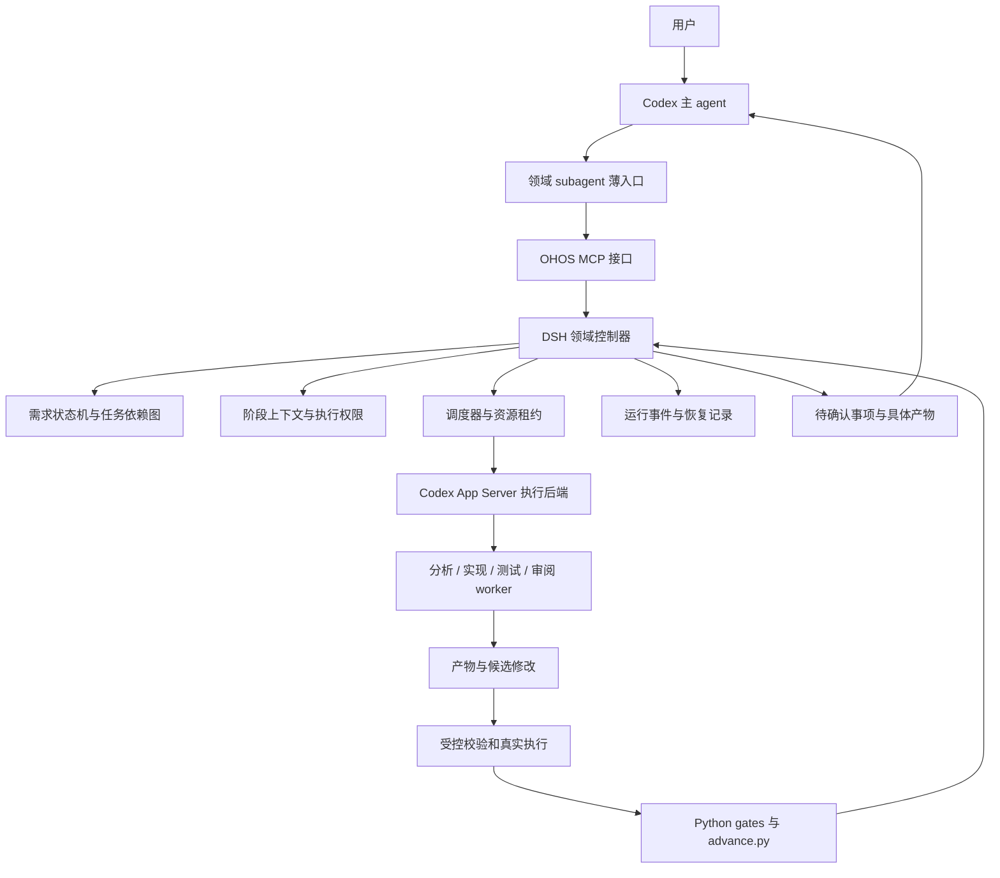

# DSH 收益优先方案：OHOS 领域执行器

日期：2026-09-05。状态：架构提案，待实现和基准验证。

范围更新：本文保留 Codex 专用收益路线的历史分析。当前 [跨宿主详细实施方案](./dsh-implementation-plan.md) 已覆盖 Codex、Claude Code、Cursor、Trae，以宿主原生 subagent 领取/提交为默认路线，外部执行器为可选增强；实施以该文档为准。

本文承接 [基础接入方案](./dsh-codex-subagent-design.md)。目标是在“宿主是 Codex、模型执行使用 Codex 套餐”的约束下，尽量降低每次合格交付的总成本与非计划人工介入，并提高可恢复完成率。这里的“最高”指设计目标，不表示已通过实验证明全局最优。

## 1. 方案选择

让 DSH 运行一个由代码控制的 OHOS 领域执行器，承担任务分解、上下文准备、资源调度、校验、恢复和观测。需要分析、设计、编码或审阅时，通过 Codex App Server 派发有明确边界的任务。

对外保留两个领域能力：`ohos_requirement`、`ohos_delivery`。Codex 主 agent 负责用户交互和任务入口；DSH 控制领域运行；Codex worker 完成模型工作；Python 门控决定开发阶段是否可以推进。

与基础方案的主要差别：把阶段之间的执行责任交给常驻控制服务，并把最容易返工的部分前移到结构化输入、工具执行前检查和真实证据采集。

优化优先顺序：

1. 保持验收强度和授权边界，降低错误放行。
2. 提高相同预算下的合格完成率，减少非计划人工救场。
3. 降低重复推理、无效构建和失败恢复成本。
4. 在前三项不退化时缩短交付时间。

## 2. 总体架构与身份



薄入口可使用 Codex 原生 subagent，从而保留用户熟悉的分派形式；内部 DSH worker 属于领域运行，不能承诺自动出现在 Codex 原生 subagent 活动树中。无原生角色注册能力时，主 agent 直接使用同一 MCP 接口，领域执行语义不变。

DSH 控制器由代码运行，不增加一个持续思考的主管模型。复杂方案规划也只是一次受限 Codex 任务，规划输出须由代码验证后才能成为任务图。确定性路由、轮询和构建命令执行不消耗模型调用。

这里有两种控制循环：DSH 管理业务阶段，Codex 管理一次 worker 任务内部的模型和工具循环。DSH 不把 Codex 当成无状态 LLM API，也不能假设能改写 Codex 的内部提示词组装。

## 3. 六个主要收益来源

### 3.1 将文档中的约束落实为执行规则

现有阶段包说明 allowed/forbidden actions，很多约束仍依靠模型遵守。新增版本化策略从签名契约、阶段状态和有效用户授权派生执行能力：

| 角色或作业 | 输入 | 可执行行为 | 明确禁止 |
|---|---|---|---|
| 需求分析 worker | 原始需求、指定源码证据 | 检索与修改需求草稿 | 修改产品代码、写用户决策 |
| 设计 worker | AR、当前源码、依赖证据 | 产出设计与测试计划 | 发布、签发 consent |
| 实现 worker | 已签设计、当前实现任务 | 在候选 checkout 修改允许路径 | 操作证据账本、正式上库 |
| 测试 worker | AC、接口契约、测试范围 | 修改独立测试路径 | 为使测试通过而改变产品行为 |
| reviewer | 输入快照、候选 diff、验收项 | 输出 finding 与引用 | 修改被审阅代码、自行消除 finding |
| 构建/设备/CI 作业 | 服务验证后的结构化参数 | 执行白名单程序并采集结果 | 接收任意模型 shell 字符串执行 |

DSH 的工具管线支持执行前策略与 guard，可用于拒绝非法阶段、过期租约和超预算调用；它只能约束经过该管线的调用。[DSH Tools](https://github.com/deepseek-ai/deepseek-harness/blob/master/docs/subsystems/tools.md)

Codex 内部 shell、文件读写不能仅靠 DSH guard 约束。实际部署使用 Codex 支持的沙箱/权限配置，并配合 OS 用户或容器隔离、独立 checkout 与受控产物导入。隐藏工具名称、写提示词禁止访问，都不等于硬隔离。

服务持有签名密钥与受保护的 gate 代码；worker 没有访问这些资源的路径和权限。Git 推送凭据、设备操作能力只交给指定执行服务。正常源码任务仍保留完成工作需要的工具。

收益：减少提前进入下阶段、越界修复、自签确认和超预算循环。权限不足要返回可解释阻塞，不能为了吞掉报错自动扩大权限。

### 3.2 将当前阶段需要的信息组成任务上下文

复用 `stage_packet`、`handoff_packet`、`repair_packet`、memory card，新增统一任务 envelope，避免每个子任务读取整个 workflow。

上下文按三层装配：稳定角色规则；当前任务摘要与必要约束；带路径/hash 的按需证据索引。保留 source root、组件 HEAD、工作区变更指纹、契约版本、允许修改范围和退出条件。

按风险控制信息量，而非固定裁剪重要内容：

- 首次实现任务获得相关 AC、接口和依赖证据；需要扩大检索时可申请更多文件。
- 修复任务获得失败分类、相关日志切片、候选原因、已有尝试、允许修复范围和必须重验项。
- 独立 reviewer 获得验收与客观产物，不继承作者自评结论和全部聊天历史。
- 大日志保留全文原件与定位索引，摘要不能成为唯一证据。
- 契约 revision 或源码依赖变化时重新组包；超长上下文时重建会话，不能盲目延续。

缓存 key 至少包含源码 HEAD、相关工作区内容 hash、输入文档 hash、工具/策略版本。源码检索缓存只作为定位加速，关键事实在执行点重验；真机结果、CI PASS 和旧 consent 不作为可通用复用缓存。

收益：减少反复读规则、上下文污染和修复时从头探索。使用同一角色的稳定前缀有利于保持请求一致性，但不承诺模型侧缓存命中率。

### 3.3 把昂贵失败前移到廉价检查

现有验收基线扩展成可追溯的执行索引：

```text
FR / NFR → AC → 当前源码依赖 → 实现任务
        → GN 目标 / 构建产物 → 测试用例 / 设备断言 → 真实结果
```

索引按签名契约派生，不把现有 advisory bundle 直接提升为 PASS 来源。模型可以建议映射，确定性检查验证编号、路径、目标、来源和覆盖义务；“语义上是否合理”仍交给审阅与真实测试。

增加分阶段 preflight：

| 时点 | 检查 | 避免的浪费 |
|---|---|---|
| P1 设计签名前 | 路径、接口、GN target、依赖及 AC 可执行性 | 把不可实现设计传到后段 |
| P4 编译前 | 目标解析、构建环境、输出路径、资源状态 | 参数错误导致整轮构建失败 |
| P5 测试前 | target/suite/part、实际测试发现、报告隔离目录 | 编完才发现没有跑到目标测试 |
| P6 设备前 | serial、连接、部署目标、产物一致性、触发步骤 | 部署错产物或连错设备 |
| P8 上传前 | repo/branch/base/head 归属、diff revision、Issue 目标 | 发布到错误目标、重复操作 |

明确 preflight 只降低无效尝试，不能代替完整 build、test、device、CI 门控。

### 3.4 按失败类型执行恢复

服务消费现有失败分类及 repair packet，并记录每次尝试的原因与变化：

| 失败 | 动作 |
|---|---|
| 输入/参数缺失 | 修复任务输入，不启动昂贵作业 |
| 临时网络或设备连接故障 | 有上限的退避；不改功能代码 |
| 编译/测试指出契约内实现问题 | 创建受限 repair 任务，按当前 repair 规则回 P2 |
| 需求、接口、行为或依赖变化 | reset 回 P1，重新验证设计和确认 |
| 失败重复且没有新证据 | 停止派发，返回需人工处理事项 |
| 额度、权限或环境不可用 | 保存状态，等待可恢复条件；不改用付费 API |

熔断在调度服务执行：达到预算后，拒绝继续领取任务和运行 gate。原始 CLI 入口必须参与同一协议或在部署时禁止 worker 直接调用，否则硬限制会被绕开。

同一阶段、同一 revision 的短修复可复用 Codex 会话；换角色、跨阶段、契约变化时新建。统一预算包含总任务数、失败次数、token（可获得时）、模型执行时间和昂贵作业次数，避免只控制一个维度。

保留当前功能指纹和重验规则。依赖图可以排序诊断和廉价检查，但第一版不能据此跳过现有强制门控。将来如要精确裁剪重验范围，必须单独版本化修改门控、验证变更分类并证明不会漏测。

### 3.5 在最容易产生错误的地方增加独立验证

不让每次任务都经过多轮同质 reviewer。把审阅资源放在 R5、P1、接口/安全敏感修改、失败反复和 P7 结果解释上。

- R5：独立 reviewer 审查需求材料，程序验证结构、来源和条件项闭环。
- P1：检查 AC 是否存在可观察的成功与失败判定，测试方案是否会因恒真 marker 或无效断言而失真。
- P2/P3：作者实现、测试角色从 AC 推导用例，reviewer 检查遗漏边界；相同模型的不同上下文仍可能共享盲点，不能当作独立概率证据。
- P7：性能、功耗、稳定性由真实执行采集，模型只解释结果、定位问题。

本次确认 `gate_integration.py::copy_quality_reports()` 主要检查报告路径并复制文件。收益版增加质量采集适配器和有版本的报告 schema：关联 run、源码/产物指纹、执行工具版本、配置、原始数据引用、单位、统计口径、样本数和适用阈值。门控校验来源与计算，条件不满足返回 blocked/FAIL；不接受模型自填数字作为实测。

短验证不能替代长时间稳定性实验。允许先跑廉价实验以发现明显失败，最终仍执行已确认的验收时长与条件。

### 3.6 并行真正独立的工作，串行昂贵共享资源

R2 可以并行收集无依赖源码证据；R7 可以并行独立 proposal/SR；P1/P7 可以并行互不依赖的审阅。P0–P8 的阶段屏障保持串行。

默认只设置小规模 worker 池，实际并发取账户容量、宿主限制和任务独立性允许的最小值。实现任务在独立候选 checkout 工作，由服务验证并导入修改；不能让多个 agent 同时写同一个工作区。

OpenHarmony 是多仓源码树：候选 checkout 必须记录 repo manifest/各组件 SHA 与未提交变更；不能把顶层目录误当单 Git 仓。构建输出目录和设备都用独占租约，避免并发构建污染和性能测试相互干扰。

取消后保存已产生副作用，服务确认进程退出或隔离资源后才释放租约。模糊的上传结果先查远端实际状态，不能因为客户端超时重做 push/PR。

收益主要来自降低关键路径上的重复等待和返工，不能按 worker 数量推算线性提速。

## 4. 两条业务流程的最终形态

### 需求执行器

```text
输入归一化 → 缺失事实与问题聚合 → 当前源码证据收集
→ 可行性与候选方案 → 用户方案决策 → Feature
→ 独立审阅与结构检查 → 用户评审决策
→ proposal 子任务图 → SR → handoff 校验 → AR
```

新增 `requirement_state.json` 作为业务状态，不复用统计文件。文档正式版本记录源输入和决策引用；修改上游输入后使受影响的下游任务失效。多个已知答案可批量确认，缺失业务事实不能用推断填满。

需求执行器输出 AR 后停止。只有用户或已经获授权的上层编排显式启动 delivery，才复制交接引用进入新开发 run。开发 P1 重验当前源码，两个状态域独立。

### 开发执行器

```text
P0 环境契约
→ P1 设计、依赖检查、验收可执行性审阅、确认
→ P2 候选实现、廉价检查、导入、门控与功能冻结
→ P3 独立测试开发与编写覆盖门控
→ P4 构建作业
→ P5 单测作业
→ P6 真机实验、证据核验与确认
→ P7 质量采集、必要审阅与确认
→ P8 发布预检、确认、上传及绑定 HEAD 的 CI
```

P2 可提前写测试以支持 TDD；P3 仍负责正式测试范围闭合，保持当前流程契约。失败按现有回退规则恢复；服务负责继续派发下一阶段，不依赖 worker 在回复里记住“不要停”。

## 5. DSH 和 Codex 的实现边界

DSH 的 workflow engine 可为一次运行指定子任务 provider，但它的阶段描述和执行完成不等于业务放行。采用受版本控制的 OHOS 执行逻辑，不让模型临时生成的任意脚本拥有签名、授权或发布权。[DSH Workflow](https://github.com/deepseek-ai/deepseek-harness/blob/master/docs/subsystems/workflow.md)

DSH 的 Agent 接口和默认 agent loop 是分离的。需要新增专用 driver/consumer 来承接外部 run 并驱动领域逻辑；如使用原生 workflow engine，必须提供其要求的真实 parent Agent 与正确生命周期，不能靠伪造一个 parent 字段绕过。该无额外推理 driver 属于需验证的自定义集成。[DSH Core](https://github.com/deepseek-ai/deepseek-harness/blob/master/docs/subsystems/core.md)

执行后端分两步：

1. 使用上游 `dsh-subagent-codex` 做有界、无需中途交互的任务验证。
2. 收益版自建 `ohos-codex-executor`，通过官方 App Server 支持进程复用、阶段会话映射、事件、取消、必要输入/权限请求转交和可用的 usage 数据。复用进程不等于跨任务复用会话。

上游现成 provider 目前是单次临时任务，不能把恢复、过程事件、任务级能力控制假设为现成功能。[现成 provider](https://github.com/deepseek-ai/deepseek-harness/blob/master/packages/subagent/subagent-codex/README.md)

模型请求由 Codex 及其托管 ChatGPT 登录处理；不复制登录 token 到 DSH 模型配置。启动后检查账号认证模式，模型与 reasoning 配置来自明确的运行配置；不能假设父任务临时配置会跨进程继承。遇到额度耗尽保存状态并返回，不自动切换 API key。[App Server](https://learn.chatgpt.com/docs/app-server)

首版保持相同模型以便比较收益。只有用户配置了模型路由策略后，才允许为不同角色选择账户可用的其他模型。

## 6. 持久化、可信执行和用户确认

DSH 会话日志用于过程观察；新增服务运行数据库保存任务、租约、外部作业和恢复映射；开发阶段 PASS 仍读取 Python 签名证据。三者职责分开，禁止凭数据库中的 completed 替代门控结果。

每个工作项包含：`run_id / workflow / phase / task_id / revision / attempt / lease_id / input_digest / policy_version / output_refs / executor_session_ref`。状态由服务维护：

```text
queued → leased → executing → validating → completed
                      ↘ needs_input / blocked / failed / cancelled
```

外部 gate 和数据库无法天然原子提交。采用执行前意图记录、幂等键、结果记录和恢复时对账；进程在 gate 后崩溃时，先检查 manifest 与外部实际结果，避免重复动作。这里只保证可恢复与防重复设计，不宣称跨设备/CI 的 exactly-once。

同 run 状态与 manifest 写入串行化，输入变化递增 revision，迟到结果拒收。单靠 `.tmp + replace` 不解决并发事务。

用户确认绑定具体设计或结果 hash、作用范围和决策来源；相关输入变化后失效。用户已经明确授权的同一动作可复用适用授权，不重复提问。业务 consent 和 Codex 工具批准分别验证。

普通 worker 不能签发 consent。若宿主只能让主 agent 转述用户答复，界面必须如实标识为“宿主记录的确认”，不能宣称密码学证明了真人身份；高保证部署另接受信任的人工确认入口。

## 7. 模块与仓库改造清单

下列结构包含已落地的业务分层和仍在规划的 profile/执行器等能力，不是 DSH 官方包。
实际源码与验收范围以 [runtime README](https://gitcode.com/mgce1/AI-AR-workflow/blob/main/runtime/dsh-ohos/README.md) 为准。

```text
runtime/dsh-ohos/
  profiles/                 # 锁定版本的领域服务组合
  src/host.ts               # DSH 启动和领域 driver
  src/controller.js         # 兼容入口和 workflow 注册
  src/core/                 # 公共任务、租约、凭证和存储
  src/workflows/requirement/ # R1–R9 状态、文档校验、工具与 agent
  src/workflows/ar-delivery/ # P0–P8 状态、Python 适配、工具与 agent
  src/context/              # 阶段任务包、输入索引和缓存失效
  src/executors/codex/      # 官方 App Server 适配
  src/executors/ohos/       # 构建、设备、CI 作业
  src/verification/         # preflight 与质量采集
  src/approval/             # 用户决策与具体证据绑定
  src/mcp/                  # 两个领域能力的外部接口
  src/telemetry/            # 事件、耗时、usage 和比较报告
  tests/                    # 契约、故障注入、集成测试
evals/dsh-ohos/              # 固定样本与对照运行配置
```

现有 Python 代码修改范围：增加统一写入锁、服务执行模式、必要 preflight 和质量报告真实性校验；保持门控和状态推进单一权威。新要求用协议版本区分，旧 run 明确迁移或只读保留，不能把旧证据默认为满足新要求。

现有两个入口 SKILL.md 收缩为触发、输入、用户交互与结果说明；阶段技能继续作为 worker 的知识和方法。构建脚本、测试生成、设备命令、知识库导航等已有能力继续复用。

发布包锁定 DSH、Codex 协议基线和策略版本；后端升级先跑契约测试再替换。业务策略更新不能自动修改正在执行的 run。

## 8. 落地顺序：每步都有独立收益

| 里程碑 | 交付内容 | 验收 |
|---|---|---|
| M0 基准与集成验证 | 固定代表性输入、ChatGPT 登录 Codex worker、DSH 外部 run driver | 确认执行路径、结果/取消/错误语义；不增加 DSH 模型调用 |
| M1 控制与恢复 | run/租约/任务包、P1→确认→P2、服务持钥 | 越界、过期结果、无授权操作被拒；不同崩溃点可恢复 |
| M2 需求状态机 | R1–R9、依赖失效、独立审阅、AR 交接 | 上游变化正确触发返工；必需用户决策不可由 worker 填写 |
| M3 降低执行浪费 | preflight、上下文准备、分类修复、强制预算、构建/设备租约 | 无效参数不启动昂贵作业；重复失败不无限派发 |
| M4 质量与完整交付 | P7 真实采集、P8 对账、必要审阅、完整 P0–P8 | 报告来源可核验；无未授权上库与重复外部动作 |
| M5 优化执行后端 | App Server 进程复用、阶段内续跑、观测和缓存 | 以数据证明净收益后默认启用 |

首个完整试点选需求清晰、单组件、具备现成测试环境的变更。多仓协作、长时间功耗稳定性实验和大规模并行随后接入，避免把所有环境问题混入首次效果评估。

## 9. 收益目标与实验

以下百分比是用于决定是否继续投入的试点目标，不是预测结果，也不是 DSH 官方性能数据。

| 指标 | 试点目标 | 口径 |
|---|---|---|
| 非计划人工解阻 | 比现有流程减少至少 50% | 每项合格交付的 blocked_unplanned 次数，并单列用户纠偏 |
| 需求有效耗时 | 减少至少 25% | 相同需求与质量标准，排除人工等待 |
| 开发中的可优化开销 | 减少至少 30% | 重复探索、错误参数作业、流程返工和恢复耗时；不冒充总工时 |
| 额度/token 效率 | 每项合格交付净消耗降低至少 15% | 包含主 agent、worker、reviewer、失败尝试；缺 usage 则标不可测 |
| 恢复可靠性 | 定义好的故障注入场景全部恢复到正确状态 | 覆盖产物写完、gate 后、advance 后、上传结果未知等位置 |
| 错误放行与未经授权动作 | 测试集中 0 次 | 不推断真实世界风险为 0；任何一例都阻断推广 |

全链路耗时另报，不承诺翻倍。假设可优化开销只占总有效耗时的 30%，且该部分降低 30%，总有效耗时最多先得到约 9% 的节省，再扣除新增开销。

比较三组：A 当前流程；B 相同业务改造但使用轻量控制器；C 本方案 DSH 实现。A→C 衡量整体改造，B→C 衡量 DSH 额外价值。不能把补门控、增加测试的收益全部记到框架名下。

先用固定故障场景验证逻辑，再选择约 10–20 项有代表性的需求/开发任务做配对试点并重复部分随机性较强的任务。小样本只用于方向判断；报告中位数、离散程度、失败个案和维护成本。固定模型、源码、工具版本、初始改动、构建缓存及设备条件，并保持各组验收标准一致。

使用仓库现有 `workflow_metrics.json` 口径记录有效耗时和人工介入，另增 executor usage 与资源等待。不要仅统计成功任务：失败成本计入总消耗，合格完成率以全部尝试为分母。

## 10. 与现有材料的关系

复用 `advance.py`、`gatelib.py`、schemas、需求 skills 和 [维测规范](../workflow/observability-usage.md)。已有 [弱模型阶段化设计](https://gitcode.com/mgce1/AI-AR-workflow/blob/main/products/20260723-weak-model-optimization/weak_model_optimization_design_spec.md) 提出了阶段任务包和恢复方向，本方案负责将这些约束落实到执行服务。

[历史残余审计](https://gitcode.com/mgce1/AI-AR-workflow/blob/main/products/20260727-workflow-hardening/weak_model_residual_audit.md) 用于选择故障场景，不把其中旧行号、旧阶段名或未完成标记直接当作当前事实。本轮再次确认的代码点包括 `copy_quality_reports()` 的路径检查/复制，以及证据与 consent 共用 `load_secret()`；实施时对其他历史问题逐项重新定位。

本提案只新增设计文档。DSH 服务、Codex 执行后端、权限隔离和效果数据均待实现与验证。
