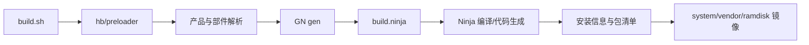
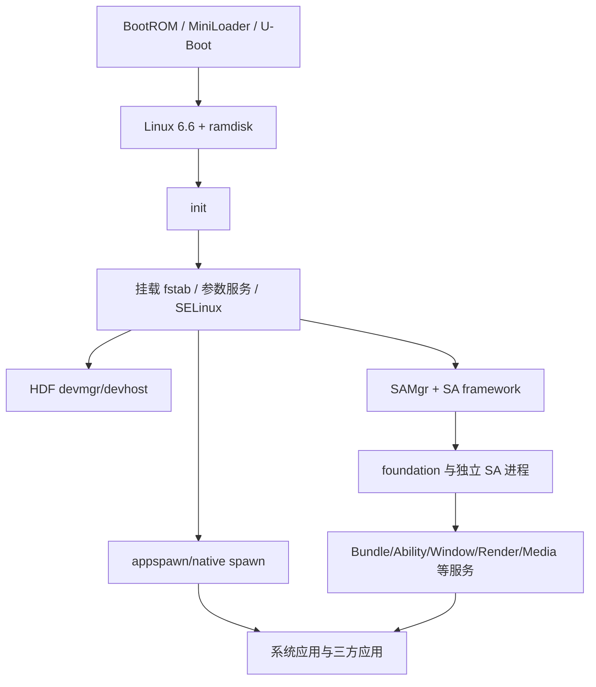
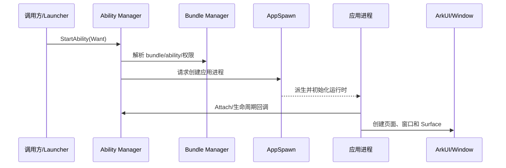

# 构建与运行链路

## 构建输入

OpenHarmony 构建由多层配置共同决定：

```text
repo manifest
  -> product config / inheritance
  -> subsystem + component metadata
  -> GN target graph
  -> Ninja actions
  -> package/image assembly
```

### 1. Manifest

`.repo/manifests/default.xml` 选择 `ohos/ohos.xml` 和 chipset manifests，决定源码仓集合与默认修订。它回答“有哪些仓”，不回答“产品编译哪些部件”。

### 2. 产品配置

[vendor/hihope/rk3568/config.json](../../../vendor/hihope/rk3568/config.json) 定义产品、板级路径、系统类型、CPU、继承关系、子系统、组件和 feature 覆写。

当前继承：

```text
productdefine/common/inherit/rich.json
productdefine/common/inherit/chipset_common.json
```

Preloader 合并并输出：

| 文件 | 作用 |
| --- | --- |
| `out/preloader/rk3568/build_config.json` | 产品、设备、CPU、工具链、系统类型 |
| `parts.json` | 最终有效 `subsystem:component` 列表 |
| `parts_config.json` | 各部件解析后的配置 |
| `features.json` | feature 值和部件到 feature 映射 |
| `subsystem_config.json` | 子系统路径与配置 |
| `systemcapability.json` | 产品系统能力集合 |

### 3. 组件元数据

`bundle.json`/`ohos.build` 声明：

- 组件所属子系统和适用系统类型。
- 依赖的其他组件和三方库。
- `sub_component` 生产构建入口。
- `inner_kits` 跨部件接口。
- 测试构建入口。
- features 和 SysCap。

当前全树 552 个 `bundle.json` 全部可由标准 JSON 解析。

### 4. GN 模块

`BUILD.gn` 将组件展开为真实目标，例如：

```text
ohos_executable
ohos_shared_library
ohos_static_library
ohos_source_set
ohos_prebuilt_etc
ohos_sa_profile
ohos_unittest / ohos_moduletest / fuzztest
```

`deps` 表示目标级依赖；`external_deps` 表示跨部件依赖。组件级依赖图不能替代 GN 图。

## 构建执行

入口：

```text
build.sh -> build/build_scripts/build.sh
build.py -> build/build_scripts/build.py
.gn      -> build/core/gn/dotfile.gn
```

标准流程：



常用命令：

```bash
./build.sh --product-name rk3568
./build.sh --product-name rk3568 --ccache --build-target <target>
```

当前 `out/rk3568/args.gn`：

```text
product_name = "rk3568"
target_cpu = "arm"
is_standard_system = true
device_name = "rk3568"
build_variant = "root"
```

当前输出来自局部目标构建，而不是完整镜像构建。`out/preloader` 和 GN 输出可用，但 `packages/phone/images` 为空。

## 内核构建

rk3568 内核入口为 [device/board/hihope/rk3568/kernel/BUILD.gn](../../../device/board/hihope/rk3568/kernel/BUILD.gn)。当前默认 Linux 6.6：

1. 将 `kernel/linux/linux-6.6` 复制到 `out/kernel/src_tmp/linux-6.6`。
2. 应用 RK3568 patch。
3. 注入 HDF、TEE、XPM、QoS、统一采集、代码签名等公共模块。
4. 合并 standard、form、arm64、产品和 base defconfig。
5. 使用 arm64 内核配置编译内核与资源镜像。
6. 将 `boot_linux.img`、`resource.img` 等复制到产品镜像目录。

板载 CPU 是 Cortex-A55/ARMv8-A；产品用户态工具链标签为 `ohos_clang_arm`，内核配置为 arm64。维护时必须区分用户态 ABI 与内核架构。

## 打包与镜像

完整标准系统构建通常输出到：

```text
out/rk3568/packages/phone/images/
```

镜像内容受以下配置共同影响：

- `vendor/hihope/rk3568/image_conf/`
- `vendor/hihope/rk3568/preinstall-config/`
- `device/board/hihope/rk3568/cfg/fstab.rk3568`
- 各 GN 目标的 `install_images`、`module_install_dir`、`relative_install_dir`
- SELinux、参数、SA profile 和 init cfg 安装目标

局部目标编译成功只证明目标图可构建，不证明它已被安装进镜像或启动配置可用。

## 系统启动链

标准 rk3568 启动可以抽象为：



### init

[base/startup/init](../../../base/startup/init) 读取公共与板级 cfg，处理启动阶段、参数触发器、服务守护和权限。rk3568 板级 cfg 位于：

```text
device/board/hihope/rk3568/cfg/init.rk3568.cfg
device/board/hihope/rk3568/cfg/init.rk3568.usb.cfg
vendor/hihope/rk3568/hdf_config/uhdf/hdf_peripheral.cfg
```

### 关键进程

产品关键重启名单包含：

```text
samgr, foundation, param_watcher, appspawn, render_service,
storage_daemon, storage_manager, hdf_devmgr, accountmgr,
accesstoken_service, privacy_service
```

这些进程死亡会显著影响系统可用性，产品配置为其设置了重启频率窗口。

关键源码入口：

| 运行实体 | 入口 |
| --- | --- |
| init | [services/init/main.c](../../../base/startup/init/services/init/main.c) |
| early init | [standard/main_early.c](../../../base/startup/init/services/init/standard/main_early.c) |
| SAMgr | [samgr native main.cpp](../../../foundation/systemabilitymgr/samgr/services/samgr/native/source/main.cpp) |
| foundation/SA framework | [safwk main.cpp](../../../foundation/systemabilitymgr/safwk/services/safwk/src/main.cpp) |
| AppSpawn | [appspawn_main.c](../../../base/startup/appspawn/standard/appspawn_main.c) |
| Render Service | [render_server/main.cpp](../../../foundation/graphic/graphic_2d/rosen/modules/render_service/main/render_server/main.cpp) |
| HDF Device Manager | [device_manager.c](../../../drivers/hdf_core/adapter/uhdf2/manager/device_manager.c) |
| HDF DevHost | [devhost.c](../../../drivers/hdf_core/adapter/uhdf2/host/devhost.c) |

## System Ability 运行链

一个典型 Native SA 包含：

```text
IXXX 接口
XXXProxy
XXXStub::OnRemoteRequest
SystemAbility 实现
sa_profile/<id>.json
BUILD.gn 中 ohos_sa_profile
init cfg 或共享 foundation 进程
```

启动方式：

- `run-on-create=true`：进程启动后主动注册。
- `run-on-create=false`：客户端请求时由 SAMgr/SA framework 按需拉起。

Profile 生成最终进程级 `/system/profile/<process>.json`。当前局部构建没有完整镜像 profile 输出，因此源码 profile 数不能等价为当前设备实际注册 SA 数。

## IPC 调用链

Native 调用：

```text
Client
  -> SystemAbilityManager 获取 IRemoteObject
  -> iface_cast 为业务 Proxy
  -> Proxy 写 MessageParcel + SendRequest
  -> Binder driver
  -> Stub::OnRemoteRequest
  -> 权限/参数校验
  -> 业务实现
  -> reply 返回
```

跨设备时，DBinder 与 SoftBus 参与寻址和传输。单次 Binder 数据约 1 MiB 上限，大对象应使用共享内存、FD 或文件。

安全上，Stub 是信任边界：必须校验接口 token、调用者身份、权限、用户、长度、FD 和回调对象。

## 应用启动链



应用代码通过 ArkTS/ETS、JS、Native、Rust 或仓颉接口进入框架。系统服务访问最终通常落到 IPC/SA。

## 图形显示链

```text
ArkUI/应用绘制
  -> Window Manager / Scene session
  -> Surface / BufferQueue
  -> Render Service
  -> Graphic 2D / GPU / Vulkan
  -> Display HDI
  -> RK3568 display driver
```

rk3568 显式启用 EGLImage、Texgine 和升级版 Skia，并包含 Vulkan loader/headers 与 3D 图形部件。

## 测试链

### 部件测试

```text
BUILD.gn test target
  -> build.sh --build-target <suite>
  -> out/rk3568/tests/...
  -> developer_test/start.sh
  -> xdevice + hdc
  -> 设备执行
  -> XML/HTML 报告
```

### XTS

- ACTS：应用兼容性。
- DCTS：设备兼容性。
- HATS：硬件/接口相关测试。
- Device Attest：设备认证相关验证。

### CI

OpenHarmony PR CI 通常包含 DCO、静态检查、部件编译、产品编译和冒烟/TDD。由于公共组件依赖面大，CI 产品矩阵可能发现本地 rk3568 局部构建无法覆盖的问题。

## 变更验证决策

| 变更范围 | 最低验证 |
| --- | --- |
| 单一私有实现 | 目标编译 + 对应 UT |
| Inner API/公共库 | 目标编译 + 依赖部件编译 + API/ABI 检查 |
| SA/IPC | UT + Stub 安全测试 + 真机注册/调用 + 异常输入 |
| init/参数/SELinux | 全量产品生成 + 启动验证 + 权限/标签检查 |
| HDF/内核 | 内核/模块编译 + 刷机 + 设备功能/稳定性 |
| 产品 config | preloader diff + 全量镜像 + 开机/预装/SysCap |
| 高入度组件 | 多产品 CI + 回归矩阵，不应只做局部编译 |
