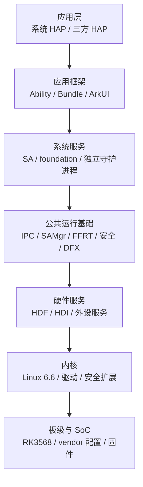

# 全局架构

## 分层模型

OpenHarmony 当前源码仍遵循四层模型，但标准系统实际运行时应理解为七个协作层：



框架层和系统服务层在目录上并不严格分离。`foundation`、`base` 中既有服务端进程，也有客户端 SDK、NAPI/ANI、配置和测试。

## 内核与板级层

### 内核

代码入口：

- [kernel/linux](../../../kernel/linux)：Linux 5.10/6.6 源码、配置、补丁和公共模块。
- [kernel/liteos_a](../../../kernel/liteos_a)、[kernel/liteos_m](../../../kernel/liteos_m)：小型/轻量系统内核。
- [kernel/uniproton](../../../kernel/uniproton)：UniProton 实时内核。

当前 rk3568 默认 `linux_kernel_version="linux-6.6"`。构建不是直接在源码树内编译，而是复制到 `out/kernel/src_tmp/linux-6.6`，注入 HDF 与 OpenHarmony 公共模块补丁，合并标准系统/板级/产品 defconfig 后构建。

### 板级与 SoC

- [device/board/hihope/rk3568](../../../device/board/hihope/rk3568)：板级启动配置、内核入口、fstab、USB、音频、相机 VDI 和 loader。
- [device/soc/rockchip/rk3568](../../../device/soc/rockchip/rk3568)：RK3568 SoC HAL 路径与硬件实现选择。
- [vendor/hihope/rk3568](../../../vendor/hihope/rk3568)：产品裁剪、预装应用、HDF 配置、资源调度、窗口、镜像和安全名单。

板级代码决定“硬件如何工作”，vendor 产品配置决定“系统选择哪些能力以及如何打包”。

## 驱动与硬件服务层

HDF 将驱动拆为三类：

| 区域 | 作用 |
| --- | --- |
| [drivers/hdf_core](../../../drivers/hdf_core) | 驱动框架、devmgr/devhost、内核适配 |
| [drivers/interface](../../../drivers/interface) | HDI 接口定义，连接上层服务与设备实现 |
| [drivers/peripheral](../../../drivers/peripheral) | 音频、相机、显示、传感器、USB、认证等外设实现 |

rk3568 有效部件中 HDF 占 71 个，是除第三方依赖外最大的子系统。典型路径：

```text
上层系统服务
  -> HDI client/interface
  -> HDF IPC/驱动服务
  -> userspace devhost 或 kernel driver
  -> RK3568 外设
```

产品的 `hdf_config/uhdf/*.hcs` 与 `hdf_peripheral.cfg` 决定用户态驱动 host 和设备节点装载。

## 公共运行基础

### IPC/RPC

[foundation/communication/ipc](../../../foundation/communication/ipc) 提供：

- 设备内 Binder IPC。
- 跨设备 DBinder/RPC。
- `IRemoteBroker`、Proxy、Stub、MessageParcel 等 Native/Rust/JS 接口。

声明依赖图中 `ipc` 被 258 个组件引用。它是系统服务、Ability、HDF 服务和分布式能力的共同通信底座。

### System Ability

- [samgr](../../../foundation/systemabilitymgr/samgr)：System Ability 管理和发现。
- [safwk](../../../foundation/systemabilitymgr/safwk)：SA 生命周期、发布、依赖监听和 profile 装载框架。
- [selectionfwk](../../../foundation/systemabilitymgr/selectionfwk)：系统能力选择框架。

当前源码有 175 个 `sa_profile` JSON。典型服务链：

```text
init 根据 cfg 拉起服务进程
  -> SA framework 根据 profile 加载 lib*.z.so
  -> SA Publish 到 SAMgr
  -> Client 按 SA ID 获取 Proxy
  -> Binder/DBinder 到 Stub
```

### 并发与资源调度

[foundation/resourceschedule](../../../foundation/resourceschedule) 提供 FFRT、资源调度服务、QoS、内存管理、后台任务、设备待机、Work Scheduler 和 SoC 性能控制。rk3568 选择全部 10 个主要部件。

FFRT 已成为跨子系统公共并发基础，bundle 依赖图中被 81 个组件引用。

### 公共库

[commonlibrary](../../../commonlibrary) 包含 `c_utils`、ETS 工具、内存工具与 YLong Rust 网络/运行时库。`c_utils` 被 279 个组件引用，仅次于 `hilog`。

## 系统服务层

系统服务以 SA、独立 daemon 或插件进程形式存在。

### 应用与包管理

- [ability_runtime](../../../foundation/ability/ability_runtime)：AMS/AppMgr、Ability 生命周期、应用进程管理和多语言运行环境。
- [bundle_framework](../../../foundation/bundlemanager/bundle_framework)：HAP/HSP 安装、解析、查询、权限与包状态。
- [appspawn](../../../base/startup/appspawn)：按模板孵化应用、Native、仓颉和混合进程。
- [os_account](../../../base/account/os_account)：多用户/帐号边界。

`ability_runtime` 声明 75 个组件依赖，是出依赖最多的组件之一；它连接应用、窗口、包管理、安全、资源调度、DFX 和运行时。

### 图形、窗口与输入

- [graphic_2d](../../../foundation/graphic/graphic_2d)：渲染服务、合成、2D 图形和显示链路。
- [window_manager](../../../foundation/window/window_manager)：窗口、SceneBoard/窗口会话和显示管理。
- [multimodalinput/input](../../../foundation/multimodalinput/input)：输入事件采集、分发和注入。
- [arkui/ace_engine](../../../foundation/arkui/ace_engine)：ArkUI 声明式 UI 与组件运行框架。

典型交互链：

```text
触摸/按键 -> HDF Input -> Multimodal Input -> Window/ArkUI
ArkUI 布局与绘制 -> Window Surface -> Render Service -> Display HDI/HWC
```

### 通信与分布式

[foundation/communication](../../../foundation/communication) 包含 IPC、SoftBus、Wi-Fi、蓝牙、网络管理、网络栈和 DHCP。分布式上层包括：

- [distributedhardware](../../../foundation/distributedhardware)：分布式相机、音频、屏幕、输入和设备管理。
- [distributeddatamgr](../../../foundation/distributeddatamgr)：关系型数据库、KV、DataShare、UDMF、剪贴板等。
- [dmsfwk](../../../foundation/ability/dmsfwk)：分布式任务调度与跨设备 Ability。
- [deviceprofile](../../../foundation/deviceprofile)：设备信息/Profile。

跨设备路径通常为：业务框架 -> 分布式服务 -> SoftBus/DBinder -> 远端服务。

### 多媒体

[foundation/multimedia](../../../foundation/multimedia) 在 rk3568 中选择 13 个部件，覆盖音频、相机、编解码、播放器、媒体基础、图片、DRM、AVSession、媒体库和视频处理。其下层依赖 HDF Audio/Camera/Codec/Display，上层提供 Native、NAPI/ANI 和系统服务。

### 数据与文件

- [foundation/distributeddatamgr](../../../foundation/distributeddatamgr)：数据库与数据共享。
- [foundation/filemanagement](../../../foundation/filemanagement)：存储服务、文件 API、分布式文件、磁盘和应用文件服务。
- [base/global/resource_management](../../../base/global/resource_management)：资源包与多语言资源访问。

这些服务受帐号、AccessToken、沙箱和 SELinux 多重边界约束。

## 框架与语言运行时

### Ark 编译运行时

[arkcompiler](../../../arkcompiler) 当前 rk3568 选择 6 个部件：

- `ets_frontend`：ETS/ArkTS 前端与 ets2panda。
- `ets_runtime`：动态语言运行时与方舟虚拟机能力。
- `runtime_core`：公共/静态运行时核心。
- `toolchain`：调试、诊断、调优工具链。
- `ace_js2bundle`：前端构建转换。
- `taihe_ffi_gen`：多语言 FFI 生成。

应用构建阶段将 ArkTS/ETS 转为字节码/模块；运行阶段由 Ark Runtime 执行，并通过 NAPI、ANI、仓颉包装或 IPC 进入 Native 系统能力。

### API 桥接

代码树同时存在：

- C/C++ Inner API。
- NAPI JS/ArkTS 接口。
- ANI ETS 接口。
- Rust IPC 和库接口。
- 仓颉包装与 FFI。

`interface/` 聚合 SDK/API 定义，具体实现通常仍位于所属组件仓。接口变化应同时检查 SDK 声明、Native 实现、权限、SysCap 和兼容性测试。

## 应用层

[applications/standard](../../../applications/standard) 包含设置、权限管理、认证控件、日历数据、相机、桌面等系统应用；产品最终预装集合由 vendor 的 install list 和 `prebuilt_hap` 决定，不等于源码目录下所有应用。

应用运行主链：

```text
Bundle Manager 安装/解析 HAP
  -> Ability Manager 接收启动请求
  -> AppSpawn 派生应用进程
  -> Ark Runtime 加载模块
  -> Ability/ArkUI 建立页面
  -> Window/Render/Input 提供交互
  -> IPC 调用系统服务
```

## 横切能力

### 安全

[base/security](../../../base/security) 与 [base/accesscontrol](../../../base/accesscontrol) 覆盖 AccessToken、应用验签、HUKS、证书、设备认证、代码签名、DLP、安全守护和沙箱。产品同时启用 SELinux 与 seccomp。

安全检查点分布在：

- 应用安装和签名。
- IPC Stub 权限校验。
- 多用户/帐号隔离。
- 文件沙箱和 SELinux 标签。
- HDF/设备节点访问。
- 高权限进程启动配置。

### DFX

[base/hiviewdfx](../../../base/hiviewdfx) 在 rk3568 中选择 10 个部件：hilog、hisysevent、hiappevent、hiview、faultloggerd、hidumper、hitrace、hicollie、hichecker、api_metrics。

`hilog` 是组件依赖图入度最高的节点。DFX 不只负责日志，还参与故障采集、事件上报、性能跟踪、卡死检测和系统可观测性。

### 测试

- [developer_test](../../../test/testfwk/developer_test)：按部件执行 UT/MST 等测试。
- [xdevice](../../../test/testfwk/xdevice)：设备测试调度基础。
- [XTS](../../../test/xts)：ACTS、DCTS、HATS 和设备认证。
- [Wukong](../../../test/ostest/wukong)：稳定性/随机测试。

测试代码约占可见文件的 20%，并包含大量生成用例和资源，说明本工作区不仅是系统源码，也是完整验证仓集合。

## 依赖风险中心

按 `bundle.json` 被引用次数，以下组件具有较大全局影响面：

```text
hilog, c_utils, ipc, init, samgr, hisysevent, access_token,
hitrace, bounds_checking_function, napi, safwk, ability_base,
ability_runtime, hdf_core, cJSON, eventhandler, runtime_core
```

修改这些节点时，局部编译成功不足以证明安全，应至少增加：跨部件依赖检查、标准产品编译、接口兼容检查和关键服务真机启动验证。
