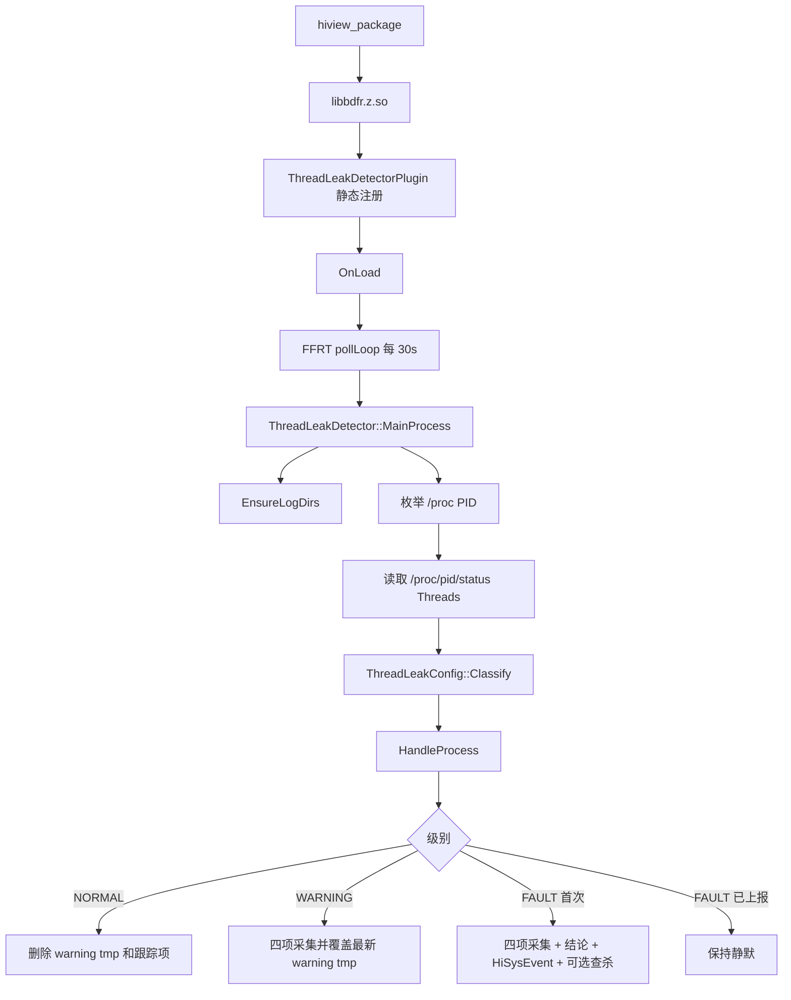

# 线程泄漏检测插件深析

[返回 Reliability 能力域](../../README.md) | [运维指南](operations.md)

归属：`hiviewdfx -> hiview process -> reliability -> thread-leak-detector`

## 目标与当前实现

模块路径：

```text
base/hiviewdfx/hiview/plugins/reliability/thread_leak_detector
```

目标是周期检查系统进程线程数，在 WARNING/FAULT 阈值触发维测采集，形成结论文件、上报 HiSysEvent，并在故障进程属于后台应用时执行查杀。

当前实现包含 19 个模块内文件，另修改 3 个 Hiview 集成文件。它是一个独立的 Hiview 静态插件，自行维护 `pid -> ProcessTrackInfo` 状态表。

> 重要：AR 要求“复用 `fault_detector_manager` + `leak_detectors/base` 状态机框架”，但当前代码没有接入该框架。现有实现只在功能语义上参考了 leak detector，不在类继承、管理器调度或状态对象上复用它。

## 文件职责

| 文件 | 职责 |
| --- | --- |
| [thread_leak_common.h](../../../../../../../../../../base/hiviewdfx/hiview/plugins/reliability/thread_leak_detector/thread_leak_common.h) | 阈值、参数名、日志目录、进程信息、跟踪状态和严重级别 |
| [thread_leak_plugin.cpp](../../../../../../../../../../base/hiviewdfx/hiview/plugins/reliability/thread_leak_detector/thread_leak_plugin.cpp) | 插件注册、FFRT 轮询任务、加载/卸载生命周期 |
| [thread_leak_config.cpp](../../../../../../../../../../base/hiviewdfx/hiview/plugins/reliability/thread_leak_detector/thread_leak_config.cpp) | 读取系统参数、线程数分级 |
| [thread_leak_detector.cpp](../../../../../../../../../../base/hiviewdfx/hiview/plugins/reliability/thread_leak_detector/thread_leak_detector.cpp) | 扫描调度、状态决策、日志合并、事件上报和后台查杀 |
| [thread_leak_collector.cpp](../../../../../../../../../../base/hiviewdfx/hiview/plugins/reliability/thread_leak_detector/thread_leak_collector.cpp) | 基本信息、hidumper、线程状态/CPU、调用栈四类维测采集 |
| [thread_leak_util.cpp](../../../../../../../../../../base/hiviewdfx/hiview/plugins/reliability/thread_leak_detector/thread_leak_util.cpp) | procfs 访问、目录/路径、受限文件读取、文件名净化 |
| [config/thread_leak_threshold](../../../../../../../../../../base/hiviewdfx/hiview/plugins/reliability/thread_leak_detector/config/thread_leak_threshold) | 安装到 `/system/etc/hiview` 的参考配置，运行时代码不解析它 |
| [test/unittest](../../../../../../../../../../base/hiviewdfx/hiview/plugins/reliability/thread_leak_detector/test/unittest/thread_leak_detector_unit_test.cpp) | 分级、纯决策、procfs 工具和命名测试，共 9 例 |
| [test/moduletest](../../../../../../../../../../base/hiviewdfx/hiview/plugins/reliability/thread_leak_detector/test/moduletest/thread_leak_detector_module_test.cpp) | 真实 2000/3000 阈值的 warning -> fault 端到端模块测试 |

## 装载与调用链



生产装载顺序：

1. `plugins/plugin_build/BUILD.gn` 将 `thread_leak_detector` source set 链入 `bdfr`。
2. `bdfr_plugin_config` 将插件数改为 3，并注册 `ThreadLeakDetectorPlugin[thread:thread_leak]:0 static`。
3. Hiview 加载 `libbdfr.z.so` 时，`REGISTER(ThreadLeakDetectorPlugin)` 使插件进入工厂。
4. `OnLoad()` 设置插件名和版本，并提交一个 FFRT 长循环任务。
5. 循环立即执行一次 `MainProcess()`，之后每 30 秒再执行。
6. `OnEvent()` 不消费事件，始终返回 `true`；本插件完全由定时轮询驱动。

## 配置模型

默认值：

| 配置 | 默认值 | 运行时来源 |
| --- | ---: | --- |
| WARNING 阈值 | 2000 | `persist.hiviewdfx.threadleak.warn` |
| FAULT 阈值 | 3000 | `persist.hiviewdfx.threadleak.fault` |
| 轮询间隔 | 30 秒 | 固定常量，不读取参数或配置文件 |
| 聚焦 PID | 0，表示全量扫描 | `persist.hiviewdfx.threadleak.focuspid` |

阈值参数在每次 `Classify()` 时重新读取，因此不需要重启 Hiview。轮询间隔在 `OnLoad()` 时读取一次，但当前函数始终返回常量 30。

`config/thread_leak_threshold` 会参与构建安装，但仅作为参考文本。修改该文件不会改变运行时行为，除非同步修改常量或系统参数。

## 数据模型

### `ProcessBasicInfo`

触发采集时创建，包含：

- `pid`、`uid`、`threadCount`
- `processName`、`bundleName`
- `foreground` 和 `foregroundKnown`

进程名优先使用 `CommonUtils::GetProcFullNameByPid()`，为空时退化到短进程名。包名和前后台状态来自 `AppMgrClient::GetRunningProcessInfoByPid()`。

### `ProcessTrackInfo`

按 PID 保存在 `trackMap_`：

- `level`：上一次观测级别。
- `warningTmpFile`：最近一次 WARNING 快照路径。
- `faultReported`：当前故障段是否已经上报。

状态只存在内存中，Hiview 重启后清空。

### `ThreadLeakDecision`

`Decide()` 返回纯逻辑决策，用于 UT：

- `collect`
- `refreshWarningLog`
- `generateConclusion`
- `reportEvent`
- `dropTracking`

生产路径目前只直接使用 `dropTracking` 和 `collect`；其余三个字段由 `HandleWarning()`/`HandleFault()` 的固定副作用隐式实现。这意味着 UT 验证了“决策意图”，但没有完全约束真实副作用接线。

## 状态机实际语义

| 上次状态 | 当前状态 | 实际动作 | 下次跟踪状态 |
| --- | --- | --- | --- |
| 任意/无记录 | NORMAL | 删除已有 WARNING tmp，移除 PID 跟踪 | 无记录 |
| 任意 | WARNING | 每轮执行完整四项采集；写新 WARNING tmp；删除旧 WARNING tmp；`faultReported=false` | WARNING |
| NORMAL/无记录 | FAULT | 完整采集；生成仅含 FAULT 的结论；上报；可选查杀 | FAULT + reported |
| WARNING | FAULT | 完整采集；合并最近 WARNING + 当前 FAULT；上报；可选查杀；删除 WARNING tmp | FAULT + reported |
| FAULT + reported | FAULT | 不采集、不写结论、不上报 | FAULT + reported |
| FAULT + reported | WARNING | 重新采集 WARNING，清除 reported；后续再次进入 FAULT 会重新上报 | WARNING |

“故障只触发一次”的边界是连续 FAULT 区间，而不是从 WARNING 开始直到回落 NORMAL 的完整 episode。

## 一次轮询

`MainProcess()` 的顺序：

1. 确保根目录和 `tmp` 目录存在，失败则整轮跳过。
2. 读取 `focuspid`。
3. 枚举 `/proc` 下所有数字目录，并先记入 `livePids`。
4. 若设置聚焦 PID，只对该 PID 做阈值处理。
5. 读取 `/proc/<pid>/status` 的 `Threads:`。
6. 使用当前系统参数进行 NORMAL/WARNING/FAULT 分级。
7. 在 `HandleProcess()` 中持有 `mutex_`，执行对应采集和副作用。
8. 扫描结束后删除已经死亡 PID 的跟踪状态及 WARNING tmp。

常态路径只进行 procfs 读取。触发路径会同步执行 IPC、线程采集、栈抓取和文件写入，当前轮询任务会一直阻塞到该进程采集完成后才继续扫描其他 PID。

## 四项维测采集

### 1. 进程基本信息

来源：CommonUtils + App Manager。

降级行为：App Manager 不可用时仍保留 procfs 可获得的信息，并将应用状态标记为 unknown。

### 2. hidumper 线程维测

执行路径：

```text
SystemAbilityManager
  -> DFX_HI_DUMPER_SERVICE_ABILITY_ID
  -> IDumpBroker::Request(args, fd)
```

参数构造成等价 `hidumper -p <pid> --thread` 的形式。输出先写入：

```text
/data/log/reliability/resource_leak/thread_leak/tmp/.hidumper_<pid>.dump
```

读取上限 512 KiB，随后删除隐藏临时文件。SA 不可用、IPC 失败或结果为空时，在报告中写入降级说明。

### 3. 线程运行态与 CPU 指标

- `/proc/<pid>/task/<tid>/stat` 提供线程名和调度状态字符。
- `ThreadCpuCollector::CollectThreadStatInfos(true)` 提供 `cpuUsage` 和 `cpuLoad`。

输出列为：

```text
tid  state  cpuUsage  cpuLoad  name
```

注意：字段是 CPU 使用率/负载，不是累计 CPU 运行时间。代码注释、PR 描述和需求中的“运行时间”与实际数据存在语义差异。

### 4. 调用栈

`LogCatcherUtils::DumpStacktrace(fd, pid, ...)` 将文本调用栈写入：

```text
/data/log/reliability/resource_leak/thread_leak/tmp/.stack_<pid>.dump
```

同样最多读取 512 KiB，之后删除隐藏临时文件。失败时保留错误说明，不中止整份报告。

## 文件生命周期

目录：

```text
/data/log/reliability/resource_leak/thread_leak/
├── thread_leak_<process>_<pid>_<seq>.txt       # 结论文件
└── tmp/
    ├── thread_leak_warning_<pid>_<seq>.txt     # 最新 warning 快照
    ├── thread_leak_fault_<pid>_<seq>.txt       # fault 快照
    ├── .hidumper_<pid>.dump                    # 采集中间文件，完成后删除
    └── .stack_<pid>.dump                       # 采集中间文件，完成后删除
```

生命周期规则：

- WARNING 每轮生成新文件并删除上一个 WARNING 文件。
- 回落 NORMAL 或进程死亡时删除 WARNING 文件。
- 进入 FAULT 后，WARNING 内容被读入结论并删除 WARNING 文件。
- FAULT tmp 当前不会删除。
- 结论文件和 FAULT tmp 没有配额、轮转或过期清理。
- `seq_` 是 Hiview 进程内单调计数，重启后从 0 开始；文件名仍含 PID 和进程名，但不能保证跨重启绝对唯一。

合并时只限制读取 WARNING 文件最多 1 MiB；FAULT 报告直接拼接，因此最终结论可能明显超过 1 MiB。已有真实阈值证据约 1.1 MiB。

## HiSysEvent 上报

当前提交复用 [hisysevent.yaml](../../../../../../../../../../base/hiviewdfx/hiview/hisysevent.yaml) 已存在的 `THREAD_LEAK` schema：

```text
domain: RELIABILITY
event: THREAD_LEAK
type: FAULT
```

实际写入字段：

- `MODULE`
- `PID`
- `UID`
- `THREAD_NUM`
- `SUMMARY`
- `LOG_PATH`

schema 还定义了 `VERSION`、`FINGERPRINT`、`HAPPEN_TIME`，当前代码未写入。第一次 CI 失败正是因为中间版本重复新增了 `THREAD_LEAK` 定义，最终提交已移除重复 schema。

## 后台查杀

仅当以下条件同时满足时调用 `KillApplication`：

- 当前进入 FAULT 首次处理路径。
- App Manager 成功返回状态，即 `foregroundKnown=true`。
- 进程不在前台或焦点态。
- `bundleName` 非空。

调用固定为：

```cpp
KillApplication(bundleName, false, 0, "THREAD_LEAK_FAULT")
```

这按 bundle 查杀，而不是按当前 PID 精确终止；`appIndex` 固定为 0，未携带用户/克隆实例上下文。

## 构建依赖

内部依赖：

- `hiviewbase`
- `eventlogger_adapter_logcatcher`
- `libucollection_utility`
- 配置预置目标

外部组件：

- `ability_runtime:app_manager`
- `c_utils:utils`
- `faultloggerd:libdfx_dumpcatcher`
- `ffrt:libffrt`
- `hidumper:hidumper_client`
- `hilog:libhilog`
- `hisysevent:libhisysevent`
- `init:libbegetutil`
- `ipc:ipc_core`
- `samgr:samgr_proxy`

安全构建选项包含 `pac_ret` 和 CFI/cross-DSO CFI。

## 测试覆盖

UT 直接覆盖：

- 2000/3000 边界和负数线程数。
- 系统参数覆写。
- NORMAL/WARNING/FAULT 决策。
- 连续 FAULT 去重。
- 当前进程 procfs 读取。
- 文件名净化和路径拼装。

模块测试设计覆盖：

- fork 外部 victim，避免对测试进程自身抓 3000 线程栈。
- 先增长到约 2100 线程，验证 WARNING 无结论。
- 再增长到约 3100 线程，验证 WARNING + FAULT 合并和四项报告结构。

未被现有 UT 直接验证的生产副作用：

- 文件写入失败分支。
- HiSysEvent 参数和失败处理。
- App Manager 查询与查杀策略。
- hidumper SA 参数兼容性和超时。
- `OnLoad()`/`OnUnload()` 并发和退出时延。
- PID 复用。
- 日志配额和长期清理。

## 需求与实现差异

| 主题 | 需求/描述 | 当前代码 |
| --- | --- | --- |
| 状态机框架 | 复用 `fault_detector_manager` 和 `leak_detectors/base` | 独立插件、自有 map 和纯决策函数 |
| WARNING 触发 | “超过阈值触发一次”可理解为跨越时触发 | 在 WARNING 区间每 30 秒完整采集一次，以保留最后快照 |
| 线程 CPU 数据 | 线程在 CPU 上的运行时间 | 输出 `cpuUsage`/`cpuLoad`，不是累计运行时间 |
| 配置文件 | 安装阈值配置 | 文件不参与运行时解析 |
| HiSysEvent | 完整 schema 字段 | 只写 6 个字段，未写 version/fingerprint/time |
| 样例日志 | PR 描述称仓内附样例 | 当前提交没有该文件，样例只存在流水线 evidence |
| 模块测试验证 | PR 描述为真机模块测试通过 | 当前有真实阈值产物和历史执行记录，但正式 gate 汇总主要记录 UT 与自定义真机场景 |

## 风险清单

### 高优先级

1. **PID 复用会继承旧状态。** `trackMap_` 只以 PID 为键，不记录 `/proc/<pid>/stat` start time。旧进程退出后 PID 在两次扫描之间被新进程复用时，可能错误合并旧 WARNING、抑制新 FAULT 或对错误应用执行副作用。
2. **结论写入失败仍上报并查杀。** `HandleFault()` 不检查 fault tmp 写入结果；结论保存失败后仍使用目标路径上报 HiSysEvent，并继续后台查杀，导致事件引用不存在文件。
3. **插件停止标志存在 C++ 数据竞争。** `isLoopContinue_` 是普通 `bool`，由插件线程写、FFRT 任务读，没有原子或锁；同时 `OnUnload()` 最坏需等待当前采集加 30 秒睡眠结束。
4. **架构未遵循指定复用边界。** 独立实现增加另一套 leak 状态机、调度和清理逻辑，未来与 `fault_detector_manager` 的开关、限流和统一策略容易分叉。

### 中优先级

1. **WARNING 重复重采集开销大。** 进程长期处于 2000~2999 线程时，每 30 秒执行 hidumper、全线程 CPU 采集和全栈抓取，不是轻量更新。
2. **日志无长期治理。** FAULT tmp 和结论文件不删除、不轮转、不限数量，重复 episode 会持续占用 `/data/log`。
3. **参数缺少关系和范围校验。** 未校验 `warning < fault`，超大数经 `unsigned long -> uint32_t` 可能截断；`focuspid` 再转为 `int32_t`。
4. **查杀粒度可能过宽。** 以 bundle + `appIndex=0` 查杀，不保证只影响触发 PID，也未显式处理多用户或克隆应用。
5. **CPU 指标与需求术语不一致。** 维护人员可能把使用率误读为累计运行时间，影响故障分析。
6. **纯决策测试与副作用接线不闭环。** `generateConclusion`、`reportEvent`、`refreshWarningLog` 没有驱动生产分支，后续修改可能出现测试仍过但实际行为漂移。

### 低优先级

1. `EnsureLogDirs()` 只判断路径存在，不确认是否为目录及权限是否正确。
2. 隐藏中间文件只按 PID 命名；若未来出现并行采集，同 PID 任务会互相覆盖。
3. 插件轮询间隔配置文件与代码常量形成两个事实来源。
4. 系统参数测试会写入 `persist.*`，用例结束只恢复默认值，不恢复执行前原值。

## 建议演进顺序

1. 为跟踪键加入进程 start time，并将 side-effect 成功状态纳入状态迁移。
2. 将停止标志改为原子或可取消等待，并降低卸载最坏时延。
3. 明确 WARNING 是跨越采集还是周期刷新；若要保留最后快照，可拆成轻量更新与一次重采集。
4. 增加文件配额/轮转，保证事件只引用成功生成的结论。
5. 决定是否迁移到既有 leak detector 框架；若保留独立实现，应更新 AR/设计说明。
6. 补齐副作用测试、PID 复用测试、参数非法值测试和多用户查杀策略测试。
