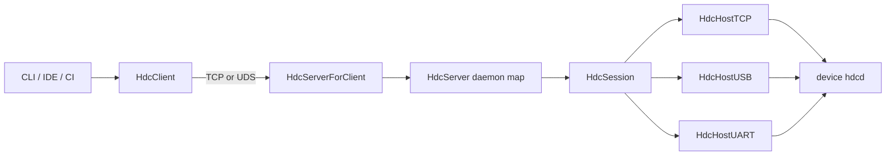
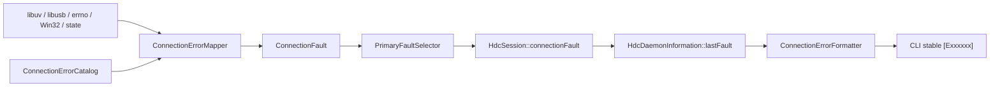
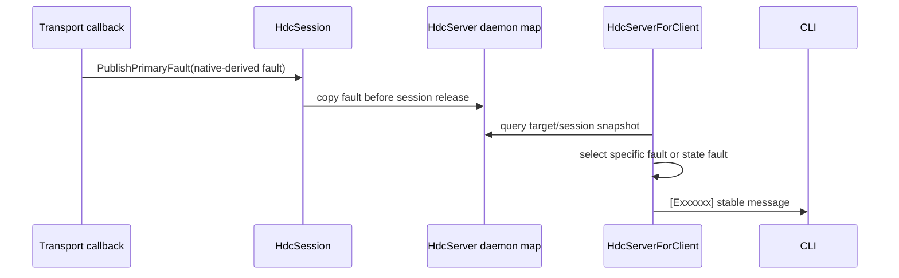

# Architecture Design

## 1. Architecture Summary

- Change: `20260829-requirement-add-hdc-connection-error-diagnostics`
- Architecture impact: `medium`
- Decision: 在 host 层新增无 I/O 的连接错误目录、mapper 和 `ConnectionFault` 值对象；现有 client/server/TCP/USB/UART call site 只负责采集原始状态并发布 fault，不再各自拼接不稳定字符串。
- Compatibility: 不修改 host–hdcd wire protocol，不改变成功输出，不删除既有码。

## 2. Current Context



当前问题：

- libuv callback 的 `status` 在 client 重试后丢失，只输出 `Connect server failed`。
- TCP 把 native error 转成字符串写入 `HdcSession::faultInfo`，没有稳定编号。
- USB `libusb_submit_transfer` 失败时错误地读取 transfer status，而不是 submit 返回值。
- target 不存在、offline、session null/dead 和 handshake false 使用通用文案。
- session 释放前没有把结构化根因复制到 daemon map，历史 fault 容易丢失。
- USB/UART 的多个确定错误归并为 `ERR_GENERIC/ERR_IO_FAIL`。

## 3. Target Design



### 3.1 模块边界

新增 host 模块：

```text
src/host/connection_error.h
src/host/connection_error.cpp
```

职责：

- 声明所有 stable code、stage、transport、native domain；
- 提供 descriptor 查询和短格式输出；
- 提供纯函数 `MapUvError`、`MapLibusbError`、`MapUsbTransferStatus`、`MapUartError`、`ClassifyTargetState`；
- 提供 primary fault 优先级和 first-fault 合并；
- 不直接访问 socket、USB device、session map 或日志系统。

现有模块职责保持：

- `HdcClient`：采集本机 TCP/UDS connect status 和重试耗尽事件；
- `HdcHostTCP`/`HdcTCPBase`：采集 transport connect/read/protocol 状态；
- `HdcHostUSB`：采集 libusb API return、transfer status 和枚举阶段；
- `HdcHostUART`：采集 key/open/config/read/write/protocol 状态；
- `HdcServerForClient`：根据 target/session 状态选择用户可见 fault；
- `HdcServer`：在 session 释放前保存 last fault。

### 3.2 错误目录分段

| 范围 | 语义 | 处理 |
|------|------|------|
| `E000xxx` | 已有认证/握手暂态 | 数值和原文兼容 |
| `E0010xx` | target/session/handshake | 新增状态分类 |
| `E0011xx` | TCP | 新增 native/stage mapper |
| `E0012xx` | USB | 新增 libusb/transfer mapper |
| `E0013xx` | emulator/tmode | 保留，不占用 |
| `E0014xx` | UART | 新增跨平台 mapper |
| `E0021xx` | local server/channel | 新增 process/libuv/channel mapper |

编号以显式 `enum class ConnectionErrorCode : uint32_t` 声明。注册表 descriptor 至少包含 symbol、message、retryable 和 priority。未知编号查询返回 `UNKNOWN_ERROR`，不抛异常。

## 4. Core Data Model

```cpp
enum class ConnectionErrorCode : uint32_t;
enum class ConnectionStage : uint8_t;
enum class ConnectionTransport : uint8_t;
enum class NativeErrorDomain : uint8_t;

struct ConnectionFault {
    ConnectionErrorCode code = ConnectionErrorCode::NONE;
    ConnectionStage stage = ConnectionStage::NONE;
    ConnectionTransport transport = ConnectionTransport::NONE;
    NativeErrorDomain nativeDomain = NativeErrorDomain::NONE;
    int nativeCode = 0;
};
```

`retryable`、message 和 priority 来自 catalog，避免在每个 fault 重复存储。结构仅保存数值，不保存 native error string、设备序列号、IP、路径或 payload。

`HdcSession` 在 `HDC_HOST` 下新增：

```cpp
ConnectionFault connectionFault;
std::mutex connectionFaultMutex;
```

`HdcDaemonInformation` 在 `HDC_HOST` 下新增 `ConnectionFault lastFault`，在 `NotifyInstanceSessionFree` step1 复制，成功握手时清理。

## 5. Mapping Interfaces

```cpp
const ConnectionErrorDescriptor &GetConnectionErrorDescriptor(ConnectionErrorCode code);
std::string FormatConnectionError(const ConnectionFault &fault, bool verbose = false);

ConnectionFault MapUvError(int status, ConnectionStage stage, ConnectionTransport transport);
ConnectionFault MapLibusbError(int status, ConnectionStage stage);
ConnectionFault MapUsbTransferStatus(int status, bool cancelledByHost);
ConnectionFault MapUartError(NativeErrorDomain domain, int status, ConnectionStage stage);
ConnectionFault ClassifyTargetState(const TargetStateSnapshot &state);

bool PublishPrimaryFault(ConnectionFault &current, const ConnectionFault &candidate);
```

所有 mapper 接受原始条件，测试不得直接注入最终 stable code 来证明 mapper 分支。

## 6. Mapping Rules

### 6.1 libuv

- `LOCAL_BIND + UV_EADDRINUSE` → `E002107`；
- `LOCAL_BIND + UV_EACCES/UV_EPERM` → `E002108`；
- `LOCAL_CONNECT + UV_ECONNREFUSED` → `E002110`；
- `LOCAL_CONNECT + UV_ETIMEDOUT` → `E002111`；
- `LOCAL_CONNECT + UV_ENOENT` → `E002114`；
- local channel 建立后 `UV_EOF/UV_ECONNRESET/UV_EPIPE` → `E002115`；
- `TCP_CONNECT` 阶段按 refused/timeout/unreachable/address-invalid 分类；
- `TCP_IO` 阶段 EOF/reset/pipe → `E001107`，其他错误 → `E001110`。

### 6.2 libusb

- init/enumeration 阶段优先生成 `E001201/E001213`；
- API return 按 ACCESS/BUSY/NO_DEVICE/TIMEOUT/PIPE/OVERFLOW/IO 分类；
- submit 失败使用 `libusb_submit_transfer` 返回值；
- callback 使用 `transfer->status`；
- host 主动 cancel 返回 NONE，非主动 cancel 返回 generic USB I/O；
- descriptor、serial、interface-not-found 由明确 stage/state 生成，不从错误字符串推断。

### 6.3 UART

- mapper 接受显式 POSIX 或 WIN32 domain；
- Linux UT 可传 Win32 数值 2/5/32/1167 验证跨平台稳定语义；
- checksum/ACK exhausted 由 protocol stage 映射 `E001406`；
- handshake deadline 映射 `E001405`；
- key parsing 和 config failure 使用显式 stage，不依赖 errno。

### 6.4 target/session

`TargetStateSnapshot` 只包含分类所需事实：是否指定 target、匹配数、connected 数、connStatus、session 是否存在/dead、handshake、deadline、version/protocol 证据和已有 auth fault。

优先级：

1. 已确认认证 fault；
2. 指定 target 不存在；
3. 自动选择多目标；
4. 无 target；
5. target offline；
6. target/session 状态错位；
7. version/protocol mismatch；
8. handshake deadline；
9. handshake 暂态。

## 7. Fault Propagation



规则：

- 第一个高质量根因保存在 session 中；
- generic EOF/cancel/close 不覆盖 access denied、timeout、refused 等已有根因；
- daemon map 保存值拷贝，不保存 session 指针内的 fault 引用；
- 成功握手更新 target 时清理旧 `lastFault`；
- `list targets -v` 可展示最近 fault，默认列表格式不变化。

## 8. Client Local Connection

`HdcClient` 新增 `lastConnectionFault`。每次新 attempt 清空；失败 callback 使用 `MapUvError(... LOCAL_CONNECT, LOCAL)` 更新；最终重试耗尽输出此 fault。UDS `ENOENT` 与 TCP refused 分别输出 `E002114/E002110`。成功 callback 清空 last fault。

本次不改变 `ExecuteCommand`/host main 的进程退出契约，避免把错误码细化与脚本返回值兼容风险耦合到一个 PR。

## 9. Feature to Component Mapping

| Feature ID | Component/Module | Design Action | Interface/Data Impact | Risk |
|------------|------------------|---------------|-----------------------|------|
| F-001 | `src/host/connection_error.*` | add | 新增 catalog 查询 | 编号冲突 |
| F-002 | `connection_error.h` | add | 新增值对象和枚举 | 结构在多平台 ABI 差异 |
| F-003 | `connection_error.cpp` | add | 新增 priority/publish API | 优先级误覆盖根因 |
| F-004 | client/server/channel call sites | change | libuv stage mapper | 平台 status 差异 |
| F-005 | `server_for_client.cpp`、daemon map | change | target snapshot classifier | 状态并发错位 |
| F-006 | `host_tcp.cpp`、`common/tcp.cpp` | change | TCP mapper/publish | EOF 阶段误分类 |
| F-007 | `host_usb.cpp` | change | libusb/transfer mapper | callback 并发和 cancel 语义 |
| F-008 | `host_uart.cpp` | change | UART mapper/publish | 可选构建覆盖不足 |
| F-009 | `define_plus.h`、`server.cpp` | change | session/daemon fault 值拷贝 | 锁顺序和生命周期 |
| F-010 | `client.h/.cpp` | change | 保存最后 local fault | 重试时陈旧 fault |
| F-011 | TCP/USB/UART call sites | change | 原始状态接入 mapper | 漏接 call site |
| F-012 | formatter、target list | change | 短格式和 verbose fault | 输出兼容/隐私 |
| F-013 | catalog、现有错误输出 | change | legacy fallback | 已有码被误改义 |
| F-014 | `test/BUILD.gn`、UT、docs/specs | add/change | 测试和资料 | 文档漂移 |

## 10. API and Data Changes

| Feature ID | API/Data | Change | Compatibility |
|------------|----------|--------|---------------|
| F-001/F-002 | host-internal C++ API | 新增 enum/descriptor/fault | 非对外 SDK API |
| F-009 | `HdcSession` host-only fields | 新增按值 fault 和 mutex | 不进入 wire format |
| F-009 | `HdcDaemonInformation` host-only field | 新增 lastFault | 仅进程内数据 |
| F-012 | 失败 CLI 文本 | 通用字符串替换为稳定 code + message | legacy code 仍保留；成功不变 |
| F-013 | host–hdcd data | none | wire protocol 零变化 |

## 11. Testability Design

- catalog/mapper/priority 是纯函数，用表驱动 UT 覆盖全部分支；
- target classifier 接受 snapshot，主动构造 connected/session-null 等状态错位；
- USB transfer mapper分别接收 API return 与 callback status；
- clock-dependent deadline 作为 snapshot 输入，不在 UT sleep；
- call-site component test 注入 native status，断言 session fault 和输出；
- mutation check 临时把一个具体 native 映射改为 generic，新增测试必须失败。

## 12. Risks and Mitigations

| Risk ID | Feature ID | Risk | Mitigation |
|---------|------------|------|------------|
| R-001 | F-001 | 建议编号与既有编号冲突 | 全仓扫描、显式列表、唯一性 UT |
| R-002 | F-003/F-009 | 并发 callback 覆盖根因或死锁 | 短临界区、按值复制、统一锁顺序 |
| R-003 | F-007 | 主动 cancel 被误报 | mapper 显式接收 `cancelledByHost` 并有反例 |
| R-004 | F-005 | daemon map 快照与 session 状态不同步 | snapshot classifier 和 A/B 错位用例 |
| R-005 | F-012 | 失败文本变化影响脚本 | 保留稳定旧编号；不同时改变 exit status；发布说明 |
| R-006 | F-013 | 新 host 与旧 hdcd 不兼容 | 不修改任何 wire field 或 handshake command |
| R-007 | F-008 | UART 构建未启用导致漏编译 | mapper 不依赖宏；UART target 编译验证 |

## 13. Rollback

- 回滚 call-site 接入即可恢复旧文本，新增 host-only catalog 不影响线协议。
- 如 session fault 生命周期引入问题，可先保留 mapper/UT，撤回 session/daemon map 字段接入。
- 已发布编号即使暂时停止输出也保持 reserved，不复用于其他语义。
- 不涉及数据文件或数据库，重启 HDC server 即清理内存态 fault。
