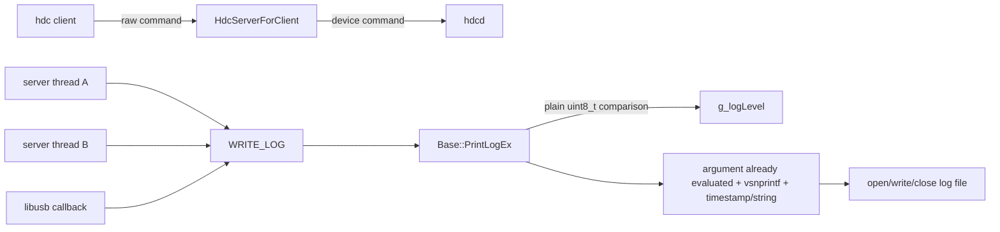
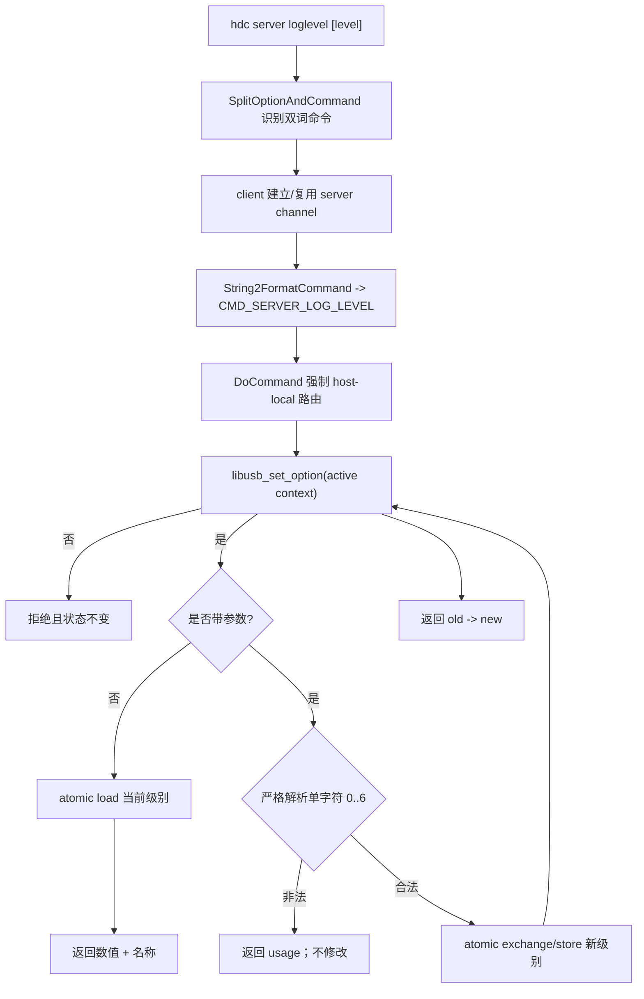
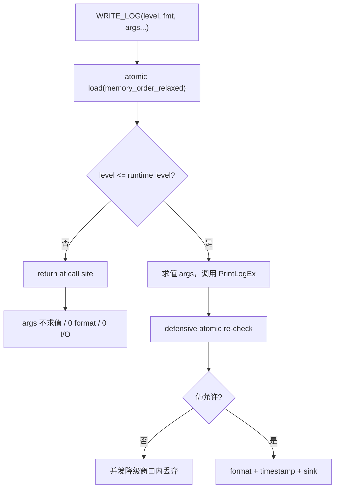
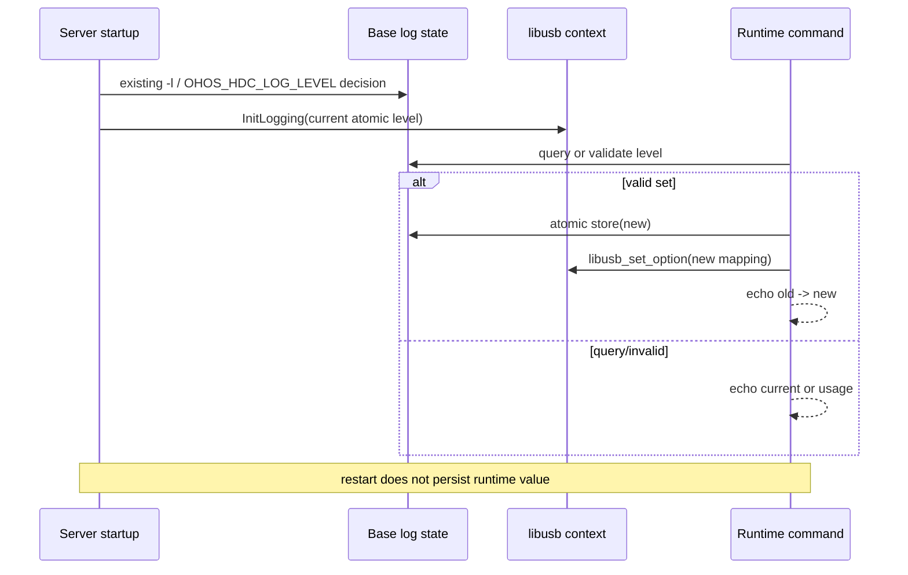
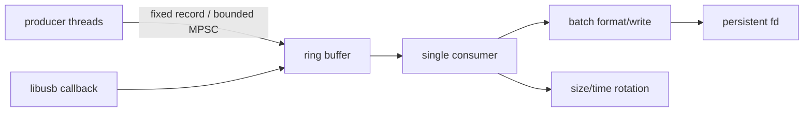

# Architecture Design

## 1. Architecture Summary

- Change: `20260829-requirement-add-host-dynamic-log-level`
- Architecture impact: `medium`
- Decision: 新增 host-local CLI 命令，以 `std::atomic<uint8_t>` 保存进程级阈值，并把最常见的 suppressed-log 判断前移至 `WRITE_LOG` 调用点；设置时同步活动 libusb context，不新增线程、锁、持久化或 daemon 协议。

这是一项“控制面 + 热路径”变更：命令低频执行，但日志判断在所有线程高频执行。因此设计优先保证热路径只有一次 relaxed 原子读取和分支，同时让命令解析、反馈和第三方日志同步保持清晰、可测试。

## 2. Current Context



### 2.1 Current limitations

1. `g_logLevel` 是普通 `uint8_t`，命令线程写、工作线程读会形成 C++ data race。
2. 当前阈值判断位于 `PrintLogEx` 内；C/C++ 在调用函数前已计算所有实参，因此被抑制的 DEBUG 日志仍会执行 `MaskString`、`ToDebugString`、临时字符串构造等工作。
3. 没有运行态 host server 查询/设置命令，`-l` 只影响新启动的 client/server 进程。
4. hdc 启动时主动设置 `LIBUSB_DEBUG`，而 libusb 规定该环境变量会固定 context 日志级别，后续 `libusb_set_option` 不生效。
5. 对真正输出的日志，现有后端仍包含时间/线程格式化、字符串分配以及同步 `open/write/close`；这是高日志量下更大的成本，但超出本次最小动态级别变更。

## 3. Target Design

### 3.1 Command control flow



### 3.2 Log hot path



### 3.3 State and memory model

```cpp
std::atomic<uint8_t> g_logLevel {LOG_DEBUG};

inline bool IsLoggable(uint8_t level) noexcept
{
    return level <= g_logLevel.load(std::memory_order_relaxed);
}
```

- 日志阈值是独立标量，不用来发布额外对象或生命周期状态，因此不需要 acquire/release；`memory_order_relaxed` 足以保证原子性和修改顺序。
- 并发切换时，一条日志可观察旧阈值或新阈值；这是日志配置的正常最终一致语义。
- 调用点检查优化 suppressed path；函数内检查保护未来直接调用 `PrintLogEx` 的代码，并关闭“调用点通过后阈值立即降低”的窗口。
- 为确保宏实参只在启用时求值，`WRITE_LOG` 使用 `do { if (...) { PrintLogEx(...); } } while (0)`，且 `level` 只计算一次。

### 3.4 Level model

| hdc value | hdc name | Meaning | libusb level |
|-----------|----------|---------|--------------|
| 0 | off | 不输出 hdc 日志 | NONE |
| 1 | fatal | 仅致命/错误 | ERROR |
| 2 | warn | fatal + warning | WARNING |
| 3 | info | + information | INFO |
| 4 | debug | + debug | DEBUG |
| 5 | all | hdc 扩展详细日志 | DEBUG |
| 6 | verbose | 最高详细度 | DEBUG |

现有 libusb 映射存在一档偏低（例如 hdc WARN 配为 libusb ERROR）；本变更在动态同步时一并校正，使 callback 经过 hdc 二次过滤后语义一致。

### 3.5 Lifecycle



hdc 不再自行设置 `LIBUSB_DEBUG`，以免把 libusb context 锁死在启动级别。若操作者在启动前显式设置该第三方变量，则 libusb 按其官方语义固定；hdc 核心日志阈值仍动态生效。

## 4. Feature to Component Mapping

| Feature ID | Component/Module | Design Action | Interface/Data Impact | Risk |
|------------|------------------|---------------|-----------------------|------|
| F-001 | `define.h`, `translate.cpp`, `server_for_client.cpp` | add | 新命令字符串、command ID、查询响应 | 命令前缀误匹配 |
| F-002 | `base.*`, `server_for_client.cpp` | change | 新增严格解析/名称接口；原子更新 | 非法输入错误修改状态 |
| F-003 | `log.h`, `base.h`, `base.cpp` | change | `g_logLevel` 类型由 `uint8_t` 改为 `std::atomic<uint8_t>` | 遗漏非原子访问导致编译或竞态 |
| F-004 | `log.h`, `base.cpp` | change | `WRITE_LOG` 变为条件宏；`IsLoggable` 内联 | 宏多次求值或 dangling-else |
| F-005 | `host_usb.*`, `main.cpp` | change | 增加 level 映射/活动 context 更新；移除 hdc 自设环境变量 | 外部 `LIBUSB_DEBUG` 仍固定 level |
| F-006 | `main.cpp`, `client.cpp`, `translate.cpp`, `server_for_client.cpp`, command event report | change | CLI 注册、no-target 分类、help/audit 识别、peer 回环校验 | 旧 server 不认识新命令（预期兼容降级） |

## 5. API and Data Changes

| Feature ID | API/Data | Change | Compatibility |
|------------|----------|--------|---------------|
| F-001 | `CMDSTR_SERVER_LOG_LEVEL` | 新增值 `server loglevel` | 纯新增 CLI |
| F-001 | `CMD_SERVER_LOG_LEVEL = 19` | 使用 core command ID 空洞 19，仅在 host 内部路由 | 不进入 daemon wire protocol |
| F-002 | `Base::ParseLogLevel` / `GetLogLevelName` | 新增纯函数接口 | 无现有调用方破坏 |
| F-003 | `Base::g_logLevel` | 公开声明改为 atomic | 源码级内部变化，数值 ABI 不对外承诺 |
| F-004 | `Base::IsLoggable` | 新增 inline 快速判断 | 现有 `WRITE_LOG` 调用无需修改 |
| F-005 | `HdcHostUSB::GetLibusbLogLevel(uint8_t)` | 显式级别映射，便于单测 | 保留无参读取当前值的重载 |
| F-005 | `HdcHostUSB::SetLibusbLogLevel()` | 更新活动 context | 只影响 host USB logging |

不新增持久化数据、配置 schema、网络 payload 或 daemon feature tag。

## 6. Code Modification Logic

1. `src/common/log.h`
   - 引入 `<atomic>`，声明 atomic level 与 `IsLoggable`。
   - 重写 `WRITE_LOG`，只在 level 允许时调用 `PrintLogEx`；保存 level 临时值保证单次求值。
2. `src/common/base.h/.cpp`
   - 将全局阈值改为 `std::atomic<uint8_t>`；Get/Set 和内部判断全部显式 relaxed load/store。
   - 增加严格 level 文本解析与稳定名称转换。
3. `src/common/define.h`、`define_enum.h`
   - 增加命令文本和 ID 19。
4. `src/host/main.cpp`、`client.cpp`、`translate.cpp`
   - 注册双词命令、标为不需要 target、解析参数、补 Usage/Verbose。
5. `src/host/server_for_client.cpp`
   - 把 ID 19 纳入 main-loop 本地命令集合。
   - 在读取或修改状态前校验 client peer；允许 UDS、`127.0.0.0/8`、`::1` 及 IPv4-mapped loopback，非上述地址和 peer 查询失败均拒绝。
   - 查询直接读取；设置先验证，再更新 core，最后 best-effort 更新 libusb；错误不改变状态。
6. `src/host/host_usb.h/.cpp`
   - 修正映射，提供显式级别映射测试入口和活动 context 更新。
   - callback 在执行 `strdup`、regex、脱敏前先调用 `IsLoggable`，避免 libusb 因外部固定级别产生无效处理成本。
7. `src/common/command_event_report.cpp`
   - 新命令加入 host command 识别列表，保持企业审计/拦截路径一致。
8. `test/unittest`
   - 先补 parser、atomic、宏实参抑制、libusb 映射和 help 测试，再写实现。

## 7. Performance Analysis and Higher-Performance Alternative

### 7.1 Cost priority

| Path | Current dominant cost | This change | Remaining cost |
|------|-----------------------|-------------|----------------|
| suppressed DEBUG/ALL | 调用前实参求值（脱敏/字符串构造）+ 函数调用 | 调用点原子判断直接消除 | 一次 relaxed load + branch |
| enabled INFO/DEBUG | format、时间、线程 ID、字符串分配 | 仅增加可忽略的防御性 load | 仍存在全部格式化成本 |
| enabled sink | 每条日志同步 open/write/close；部分路径还 stat/roll | 不改变 | 高吞吐下通常是最大瓶颈 |
| libusb suppressed | strdup + 查找 + regex + 脱敏后才进入 WRITE_LOG | callback 入口先过滤 | 启用时 regex 仍较重 |

本需求最应优化的是 suppressed path，因为动态降级的目的正是让大量 DEBUG 调用“近似免费”。若目标变为“DEBUG 全开时也要高吞吐”，性能重点会转移到 sink，而不是全局变量读取。

### 7.2 Recommended phase-2 design

更高性能的完整日志后端应采用：



- producer 只做阈值判断、时间戳/必要字段采集和有界入队；单 consumer 批量格式化/写入。
- 日志文件保持打开，按批次写，轮转检查按字节计数或低频计时执行，避免每条 open/close/stat。
- 必须先定义队列满策略（丢 DEBUG、阻塞 FATAL、丢弃计数）、崩溃可见性、flush/退出时序、fork/subserver 行为和敏感信息脱敏位置。
- 该方案对 enabled path 提升更大，但复杂度和可靠性风险显著高于本次原子阈值 + 调用点过滤，因此不应混入同一最小 PR。

## 8. Risks and Mitigations

| Risk ID | Feature ID | Risk | Mitigation |
|---------|------------|------|------------|
| R-001 | F-003 | atomic 类型变更后仍有直接比较/赋值 | 全仓 `rg g_logLevel` 审计；编译；并发单测 |
| R-002 | F-004 | 宏使实参求值次数变化或语句组合出错 | level 临时变量 + `do/while(0)`；副作用单测 |
| R-003 | F-002 | 更新 core 后 libusb 更新失败造成短暂不一致 | core 更新为主；返回仍成功并写 warning；初始化也从 current level 读取 |
| R-004 | F-005 | 外部 `LIBUSB_DEBUG` 使 set_option no-op | 不覆盖用户环境；文档明确；callback 仍受 hdc `IsLoggable` 二次过滤 |
| R-005 | F-006 | LAN 暴露时远端关闭日志或打开 verbose 造成审计规避/资源放大 | server 在状态访问前校验 UDS/回环 peer，非回环和 peer 查询失败均拒绝；隔离 LAN e2e 验证状态不变 |
| R-006 | F-004 | release/hilog 构建宏差异 | host 与 daemon 目标编译验证；保留现有 `IS_RELEASE_VERSION` 函数名策略 |
| R-007 | F-006 | 旧 server 不认识新命令 | 新命令纯增量；客户端展示 server 原始错误；不修改协议版本 |

## 9. Rollback

- 单提交可整体 revert；无数据迁移和持久化回滚。
- 回滚后重启 server 即恢复原有 `-l` 静态行为。
- 若仅 libusb 动态同步出现平台问题，可先回退 `host_usb/main.cpp` 部分，核心 atomic + command 功能仍可独立工作，但正式合入应保持测试矩阵一致。
